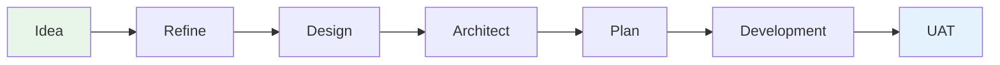

# Claude Plugins
## AI Delivery Team

A full software delivery team that runs inside Claude Code.

**10 skills. 7 pipeline stages. Zero context loss.**

> github.com/P47Phoenix/Claude-Plugins

<!--
Speaker notes:
- Welcome everyone. Today I'm walking you through Claude Plugins — specifically the delivery-team plugin.
- This is an open-source marketplace of plugins for Claude Code that gives you a complete software delivery team.
- The key pitch: it's not one tool, it's a team of specialists that coordinate through a structured pipeline.
-->

---

# The Problem

- **Manual orchestration** — developers context-switch between roles (PO, architect, QA, DevOps) losing depth in each
- **Context loss** — each new session starts from scratch; lessons learned evaporate
- **Inconsistent quality** — no enforced gates, no validation, no adversarial review
- **No structure** — ad hoc prompting produces ad hoc results

<!--
Speaker notes:
- Most teams using AI for development treat it as a single-role tool — write code, answer questions.
- But real delivery requires multiple perspectives: product thinking, architecture, testing, operations.
- When one person plays all roles, quality suffers. When context resets every session, teams repeat mistakes.
- We built this to solve all three problems at once.
-->

---

# What Is This?

An **open-source plugin marketplace** for Claude Code.

- **5 plugins** available today — install one or all
- Each plugin adds **specialized capabilities** to Claude
- Everything runs **locally** — no external services
- Config-driven — YAML, not code

```
/plugin install delivery-team
```

<!--
Speaker notes:
- Claude Plugins is a GitHub repo that acts as a marketplace.
- You install plugins with a single command. Each one loads specialized SKILL.md files that give Claude deep domain knowledge.
- The delivery-team plugin is the flagship — it bundles 10 skills into a coordinated team.
- Other plugins include a research agent, prompt engineer, agentic flow builder, and PRD quality gate system.
-->

---

# The Delivery Team — 10 Skills

| Skill | What It Does |
|-------|-------------|
| **Delivery Flow** | Pipeline orchestrator — the brain |
| **Product Delivery** | PO, Scrum Master, Data Analyst |
| **Developer** | 14 languages, paradigm-aware |
| **Architect** | 11 roles, 4 decomposition strategies |
| **Quality** | Test strategy, automation, metrics |
| **Operations** | DevOps, releases, documentation |
| **UI** | UX, UI, Game UI design |
| **Godot** | Game dev (GDScript, C#, scenes) |
| **User Feedback** | 20+ simulated test personas |
| **Alias Creator** | 13 personality themes |

<!--
Speaker notes:
- Each skill is a specialist. Delivery Flow is the orchestrator — it routes work to the right skill at the right time.
- Product Delivery handles the "what" and "why." Developer handles the "how." Architect handles structure.
- Quality validates. Operations ships. UI designs. User Feedback simulates real users.
- Godot is our game dev specialist. Alias Creator lets you give the team personality — LOTR, Marvel, Star Wars themes.
-->

---

# The Pipeline — 7 Stages



- **Auto-detect** project type: GREENFIELD, FEATURE, BUG_FIX, GAME_DEV, SPIKE, DOCS_ONLY
- Light stages execute with reduced depth — **never skipped**
- Each stage has **entry/exit criteria** and **Team DoD validation**

<!--
Speaker notes:
- The pipeline has 7 stages from Idea to UAT. Every piece of work flows through this.
- The system auto-detects what kind of work it is — a new project, a feature, a bug fix — and adjusts which stages go deep vs. light.
- Critical point: light stages still execute. Light means reduced depth, not skipped. This is a core principle.
- Each stage transition requires Team DoD — multiple validators must sign off before advancing.
-->

---

# How It Works

**User says:** "Build a user authentication feature"

1. **Delivery Flow** detects project type → FEATURE
2. **Product Delivery** writes user stories + acceptance criteria
3. **Architect** designs the solution (strategy from config)
4. **Quality** defines test strategy + cases
5. **Developer** implements (language-aware, paradigm-aware)
6. **User Feedback** runs simulated persona testing
7. **Operations** prepares release artifacts

All coordinated. All validated. All remembered.

<!--
Speaker notes:
- Here's a concrete example. You say "build auth." The pipeline takes over.
- It auto-detects this is a FEATURE, routes through all 7 stages, and each skill contributes its specialty.
- The PO writes stories. The architect designs. QA plans tests. Dev implements. Personas test. Ops ships.
- The key is coordination — each skill sees what came before and builds on it. No context loss between roles.
-->

---

# Self-Correction & Collaboration

**6 collaboration patterns:**

- **Evaluator-Optimizer** — one agent creates, another improves
- **Adversarial Review** — deliberate challenge of assumptions
- **Review Board** — multi-role sign-off
- **Decision Ownership** — clear accountability routing
- **Debate** — structured disagreement with resolution
- **Consensus** — team-wide agreement required

**Team DoD**: ALL validators must say DONE before stage advances.

<!--
Speaker notes:
- This isn't just "generate and ship." The team argues with itself.
- Adversarial review means the architect challenges the PO's assumptions. QA challenges the developer's implementation.
- The evaluator-optimizer pattern means one agent drafts, another refines. Debate forces structured disagreement.
- Team DoD is the final gate — every relevant validator must approve before moving forward. No rubber stamps.
-->

---

# Self-Learning Memory

- **Tiered chunked retrieval** from `.delivery/memory/`
- Lessons persist **across sessions** — the team remembers what worked and what failed
- **Defect tracking** feeds back into the plugin itself
- Pipeline state **saves and resumes** — pick up where you left off

```
.delivery/
├── memory/          # Tiered lessons learned
├── config.yml       # Project configuration
└── artifacts/       # Stage outputs (PRDs, designs, plans)
```

<!--
Speaker notes:
- One of the biggest problems with AI-assisted development is context loss between sessions.
- Our memory system stores lessons learned in tiered chunks. The team retrieves relevant memories based on context.
- If the pipeline finds a defect pattern, it tracks it — and can even open a PR back to the plugin repo to fix the root cause.
- Pipeline state persists too. Close your laptop, come back tomorrow, resume exactly where you stopped.
-->

---

# Alias Themes — Give the Team Personality

**13 built-in themes** with personality injection:

| Theme | Example Mapping |
|-------|----------------|
| **LOTR** | Gandalf = PO, Legolas = QA, Gimli = Dev |
| **Marvel** | Nick Fury = PO, Spider-Man = Dev |
| **Star Wars** | Yoda = Architect, Han Solo = DevOps |
| **Breaking Bad** | Walter White = Architect |
| **The Office** | Michael Scott = PO |

- Personality affects **tone**, not decisions
- Create custom themes with the Alias Creator skill

<!--
Speaker notes:
- This is the fun one. The alias system lets you give the team personality.
- Pick LOTR and your PO becomes Gandalf, your QA becomes Legolas, your developer becomes Gimli.
- The personality affects how they communicate — tone, metaphors, style — but never the substance of their decisions.
- There are 13 built-in themes, or you can create your own with the alias-creator skill.
-->

---

# Developer Skill — Deep Language Support

**14 languages** with paradigm-aware pattern loading:

<div class="columns">
<div>

- Python
- TypeScript / JavaScript
- Go
- Rust
- C# / Java
- SQL

</div>
<div>

- Bash
- R
- F# / Haskell
- Elixir / Scala
- GDScript (via Godot skill)

</div>
</div>

- **OOP + FP + Frontend + Nx monorepo** patterns
- Config-driven: set language + paradigm in `.delivery/config.yml`
- Context isolation: each language loads only its own patterns

<!--
Speaker notes:
- The developer skill isn't a generic code generator. It loads language-specific patterns based on your project config.
- If your project is Rust, it loads Rust idioms, ownership patterns, error handling conventions.
- If it's TypeScript with functional programming, it loads FP patterns — not OOP defaults.
- This is config-driven. You set it once in your YAML config, and the developer stays in that context for the whole project.
-->

---

# Quality & Enforcement

**7 hooks** across 5 event types:

| Hook | What It Catches |
|------|----------------|
| Config check | Missing or outdated project config |
| Retrospective enforcement | Session ending without team retro |
| Pipeline bypass detection | Developer skill used outside pipeline |
| Agent prompt audit | Context isolation violations |
| GDScript validation | Syntax errors in game scripts |
| Skill load verification | Skills that fail to initialize |
| Empirical validation | Acceptance criteria needing runtime proof |

<!--
Speaker notes:
- Quality isn't optional — it's enforced by hooks that run automatically.
- If you try to use the developer skill without going through the pipeline, you get a warning.
- If you try to end a session without doing a retrospective, it blocks you.
- GDScript files are validated on every write. Agent prompts are audited for context isolation.
- The empirical validation hook catches acceptance criteria that can only be verified by running the code — marking them CODE_COMPLETE instead of DONE.
-->

---

# Key Numbers

| | |
|---|---|
| **10** | Specialized skills |
| **14** | Supported languages |
| **7** | Pipeline stages |
| **7** | Enforcement hooks |
| **6** | Collaboration patterns |
| **13** | Alias themes |
| **11** | Architect roles |
| **20+** | Simulated test personas |
| **4** | Decomposition strategies |
| **0** | External services required |

<!--
Speaker notes:
- Here's the summary in numbers. 10 skills covering every delivery role. 14 languages with paradigm awareness.
- 7 pipeline stages with enforced gates. 7 hooks that run automatically to catch problems.
- 6 collaboration patterns so the team doesn't just agree with itself.
- And zero external services — everything runs locally in your Claude Code session.
-->

---

# Getting Started

**Install the plugin:**
```bash
/plugin install delivery-team
```

**Start the pipeline:**
```
delivery-team:delivery-flow
```

**Quick setup** (3 questions):
> Say "quick start" when the wizard launches

**Full setup** (10 questions):
> Configures language, paradigm, architecture, personas, themes

<!--
Speaker notes:
- Getting started takes about 2 minutes. Install the plugin, invoke delivery-flow, answer the setup wizard.
- Quick start asks just 3 questions — language, project type, and team size. Good for trying it out.
- Full setup gives you fine-grained control over architecture style, decomposition strategy, alias theme, and more.
- After setup, just describe what you want to build. The pipeline handles the rest.
-->

---

# What's Next

**Roadmap:**

- **Presentation skill** — generate Marp slide decks from pipeline artifacts (this deck is the proof)
- **Signal-driven routing** — skills communicate via typed signals, not string matching
- **GitHub Pages docs** — auto-generated documentation site
- **Plugin SDK** — make it easier for others to build plugins
- **Analytics dashboard** — pipeline metrics and team performance visualization

<!--
Speaker notes:
- We're actively developing new capabilities. The presentation skill is being validated right now — this deck was generated by it.
- Signal-driven routing will make inter-skill communication more robust and typed.
- We want to make it easy for others to contribute plugins, so a Plugin SDK is on the roadmap.
- And we're building an analytics dashboard to track pipeline metrics — cycle time, defect rates, stage durations.
-->

---

# Q&A

## Thank You

**Repository:** github.com/P47Phoenix/Claude-Plugins

**License:** Apache 2.0

**Install:**
```
/plugin install delivery-team
```

> "All we have to decide is what to do with the time that is given us." — Gandalf

<!--
Speaker notes:
- Thank you for your time. The repo is open source and contributions are welcome.
- If you want to try it, the install command is on screen. The setup wizard will guide you from there.
- Happy to take questions about the architecture, the plugin system, or how to contribute.
-->
