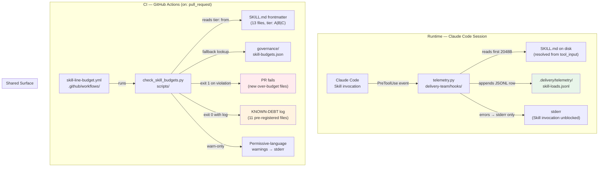

# Architecture Sketch: Skill Token-Economy Wave 0

**Status**: Accepted (Architect DoD — 2026-05-03)
**ADRs**: ADR-tk0e-001, ADR-tk0e-002, ADR-tk0e-003
**Scope**: delivery-team plugin only; no other plugins touched in Wave 0

---

## Scope Statement

Wave 0 installs two orthogonal pieces of infrastructure:

1. **W0-1 — Telemetry hook**: A PreToolUse hook that records one JSONL row per Skill invocation
   to `.delivery/telemetry/skill-loads.jsonl`, providing the measurement baseline that Wave 1–3
   optimizations will use to prove gains.

2. **W0-2 — CI budget gate**: A GitHub Actions workflow + pure-Python script that enforces
   tier-based line budgets on every PR touching a `delivery-team/**/SKILL.md` file, with 11
   pre-registered known-debt files allowed through via the `KNOWN-DEBT` bypass.

These two pieces share one binding surface: the `tier:` frontmatter field added to all 13
SKILL.md files (W0-2) is the same field the telemetry report (W0-1) uses to segment token-cost
analysis by tier in Wave 1+.

---

## Component Diagram

---

## Interaction Notes

### Hook + Telemetry (ADR-tk0e-001)

- Hook is registered in `delivery-team/hooks/hooks.json` as `PreToolUse` with matcher `Skill`.
- `prefix_hash` is computed at hook execution time from disk — the SHA256 of the first 2048
  bytes of the target SKILL.md, truncated to 8 hex chars. This is feasible because the tool
  input payload names the skill being invoked.
- Token count fields default to 0 in Wave 0 rows. PostToolUse enrichment is Wave 1 scope.
- **Early write discipline** (gate-patterns lesson 4): the JSONL row is written before any
  further processing in the hook. A rate-limit truncation cannot lose an already-written row.
- Failure isolation: all exceptions are caught; hook never blocks the Skill invocation.

### CI Gate (ADR-tk0e-002)

- Paths-filter (`**/SKILL.md`, `governance/skill-budgets.json`) is an allowlist — the job
  only runs when these files change (gate-patterns: allowlist-over-deny).
- The exempt-zone comment block in `check_skill_budgets.py` MUST be co-located with the
  permissive-language scanner. Editing the exempt list requires reviewing the scanner (and
  vice versa) — provenance comment + allowlist travel as a named pair (gate-patterns lesson).
- Known-debt entries are hard-coded; each removal is an explicit refactor PR, not a silent
  config change.

### Tier Frontmatter (ADR-tk0e-003)

- Wave 0 MUST NOT reduce any SKILL.md line counts (PRD §6 out-of-scope constraint).
- W0-2 only adds the `tier:` frontmatter line to the YAML block. No other content changes.
- The frontmatter addition is the minimal surface change that unlocks the CI gate.

---

## Dependencies on Existing Repo Infrastructure

| Dependency | Used by | Notes |
|------------|---------|-------|
| `delivery-team/hooks/hooks.json` | W0-1 telemetry hook registration | Existing file; must add new PreToolUse entry. FR-12: every `script:` path must exist before merge. |
| `.github/workflows/` | W0-2 CI workflow | New file `skill-line-budget.yml` alongside existing `workflow-injection-lint.yml`. |
| `scripts/` | W0-2 budget script | New file `check_skill_budgets.py`; repo has no other scripts here currently. |
| `.delivery/telemetry/` | W0-1 JSONL output | Directory does not exist; hook creates it with `os.makedirs(..., exist_ok=True)`. |
| `delivery-team/references/` | W0-1 schema doc | New file `telemetry-schema.md` alongside existing references. |
| `plugin-dev:hook-development` | W0-1 authoring | CLAUDE.md load-bearing routing — MUST be loaded before writing telemetry.py. |
| `plugin-dev:plugin-structure` + `plugin-dev:skill-development` | W0-2 authoring | CLAUDE.md load-bearing routing — MUST be loaded before writing CI workflow + script. |

---

## Open Risks Carried Forward

| Risk | ADR mitigating it | Status |
|------|------------------|--------|
| hooks.json phantom references | ADR-tk0e-001 + FR-12 | Hard AC; verified by pre-merge path check |
| Permissive-language false positives | ADR-tk0e-002 (warn-only) | Mitigated by warn-only + exempt zones |
| AC-10 "6 lines" vs actual 11 known-debt files | ADR-tk0e-003 (footnote) | 6 is a minimum floor; 11 is the full set; script reports all 11 |
| Token counts are 0 in Wave 0 rows | ADR-tk0e-001 (explicit) | Accepted; Wave 1 PostToolUse enrichment closes it |
