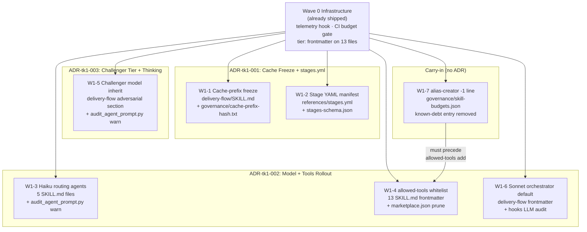

# Solution Sketch: Skill Token-Economy Wave 1

**Wave**: Wave 1 (W1-1 through W1-7)
**ADRs**: ADR-tk1-001, ADR-tk1-002, ADR-tk1-003
**Date**: 2026-05-04
**Architect**: Celebrimbor (solution_architect persona)

---

## Summary

Seven mechanically independent work items, zero inter-WI dependencies. Three ADRs cover them:

| ADR | WIs | Scope |
|-----|-----|-------|
| ADR-tk1-001 | W1-1, W1-2 | SKILL.md prefix freeze + stages.yml externalization |
| ADR-tk1-002 | W1-3, W1-4, W1-6 | Model map rollout (Haiku routing, Sonnet orchestrator) + allowed-tools whitelist + description prune |
| ADR-tk1-003 | W1-5 | Challenger model inheritance + extended thinking discipline |
| *(carry-in)* | W1-7 | alias-creator -1 line known-debt (no ADR needed; trivial compliance fix) |

---

## Work Item → ADR Grouping (Mermaid)

---

## Key Interaction Notes

### 1. W1-7 → W1-4 ordering constraint
`alias-creator/SKILL.md` is at 201 lines (over Tier-C budget). Developer MUST apply W1-7 (-1 line)
before or in the same atomic commit as W1-4 (+allowed-tools). The `allowed-tools:` addition adds
~1 line; net result after both is ≤200 (compliant). Batching both in one commit is the safe path.

### 2. W1-1 prefix boundary
Frozen prefix = lines 1..332 of delivery-flow/SKILL.md (frontmatter through end of Phase 3 Stage
Routing). `## Volatile` marker placed after `## References`. SHA-256 of bytes 0..2047 stored in
`governance/cache-prefix-hash.txt`; CI gate fails on hash drift without `Cache-Prefix-Change:` PR body token.

### 3. W1-2 SKILL.md pointer
Inline stage definitions (lines 613–746) replaced with single HTML comment:
`<!-- stages: see references/stages.yml — loaded on demand by orchestrator -->`
Orchestrator Phase 4 Step 3 issues a `Read` tool call for stages.yml. No behavioral change; pure
token reduction.

### 4. audit_agent_prompt.py receives two extensions (W1-3 + W1-5)
Both extensions are additive; no existing logic removed. W1-3 adds routing-tier mismatch detection;
W1-5 adds challenger-tier mismatch detection. Both emit `## Warning` early in hook output (per
signal-blocks-emitted-EARLY gate pattern). Both are pure Python, no LLM calls.

### 5. pre-rollout `wc -l` gate (FR-15)
W1-3, W1-4, W1-5, W1-6 all touch multiple SKILL.md files. Developer MUST record
`find delivery-team -name 'SKILL.md' | xargs wc -l | sort -rn` before any edits begin and attach
to PR. Mandatory-rollout side-effect lesson: near-budget edges become violations under mass edits.
Current scan shows only alias-creator is at risk; it is addressed by W1-7 ordering constraint.

---

## Existing Infrastructure (Wave 0 — already operational)

| Component | Path | Wave 1 interaction |
|-----------|------|--------------------|
| Telemetry hook | `delivery-team/hooks/telemetry.py` | Captures before/after token deltas for all 7 WIs |
| CI budget gate | `.github/workflows/` + `scripts/check_skill_budgets.py` | Enforces line budgets post-edit; passes after W1-7 |
| Tier frontmatter | All 13 SKILL.md `tier: A/B/C` | Pre-condition for W1-2/W1-3/W1-4 routing logic |
| Known-debt register | `governance/skill-budgets.json` | alias-creator entry removed by W1-7 |

---

## Acceptance Gate Summary

| WI | Key runnable AC | Pass criterion |
|----|----------------|----------------|
| W1-1 | `grep '## Volatile' delivery-flow/SKILL.md` | ≥1 match |
| W1-1 | CI cache-prefix hash check | No drift without ADR token |
| W1-2 | JSON schema + 7-stage count assertion | PASS print |
| W1-3 | `grep 'model: haiku'` across 5 SKILL.md files | All match; 0 MISSING |
| W1-4 | `find -name SKILL.md -exec grep -qL allowed-tools` | No output (all set) |
| W1-4 | marketplace.json description length check | All ≤500 chars |
| W1-5 | `grep 'challenger.*model' delivery-flow/SKILL.md` | ≥1 match |
| W1-6 | `grep '^model:' delivery-flow/SKILL.md \| head -1` | `model: sonnet` |
| W1-6 | `grep -rE 'anthropic\|openai\|litellm' delivery-team/hooks/` | No matches |
| W1-7 | `wc -l alias-creator/SKILL.md` | ≤200 |

---

## Plugin-Dev Skill Routing (binding — CLAUDE.md)

All W1 work items that modify SKILL.md frontmatter (W1-3, W1-4, W1-5, W1-6) MUST route through:
- `plugin-dev:skill-development` before any SKILL.md edit
- `plugin-dev:hook-development` before modifying `audit_agent_prompt.py`

This is a CLAUDE.md-binding requirement, not a suggestion.
