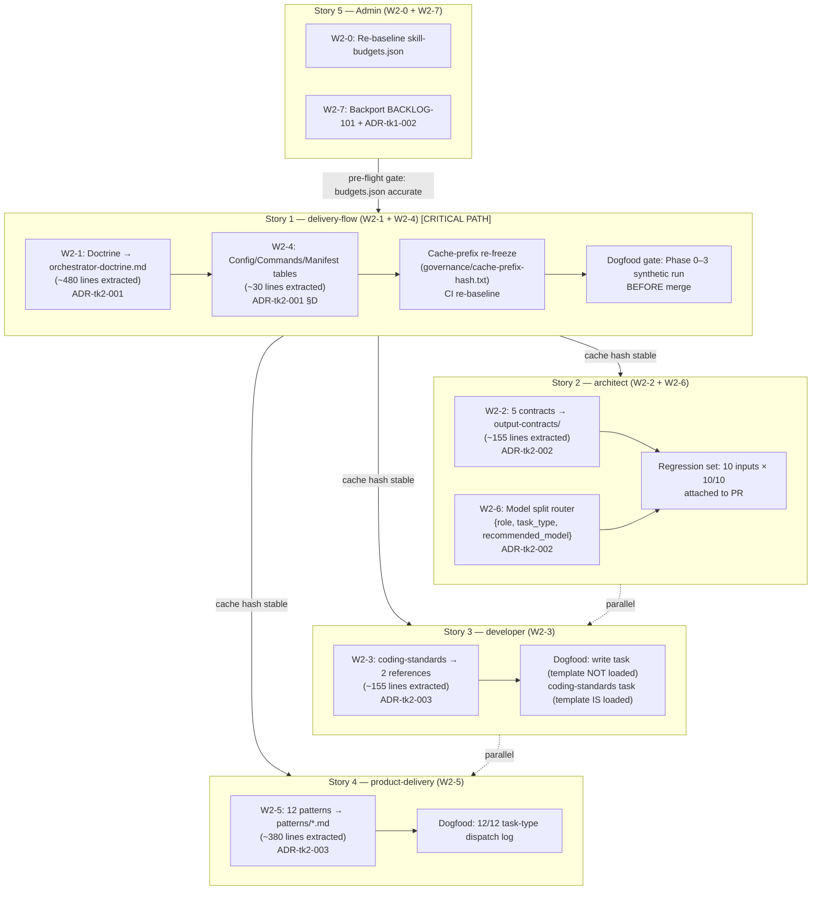

# Wave 2 Solution Architecture: Skill Token-Economy Structural Extractions

*"Let us forge something that will endure beyond the ages."*

## Overview

Wave 2 executes five structural extractions across four SKILL.md files, grouped into
three stories. The critical path runs through Story 1 (W2-1 doctrine extraction) because
it invalidates the Wave 1 cache prefix, blocks Story 1's merge until dogfood validates,
and must complete before the CI hash-check can re-baseline.

---

## Story Grouping & ADR Coverage



---

## Line-Count Targets (Architect Batching Simulation)

| Skill | Baseline | Primary Extract | Surplus Trim | Target | Tier | Status |
|-------|----------|-----------------|--------------|--------|------|--------|
| delivery-flow | 999 | −480 (W2-1) | −30 (W2-4) | **489** | A (≤500) | ✓ |
| architect | 673 | −155 (W2-2) | −20 (W2-6) | **498** | A (≤500) ✓ / B (≤300) deferred Wave 3 | partial |
| product-delivery | 691 | −380 (W2-5) | −11 (Stage 6) | **300** | B (≤300) | ✓ if Stage 6 trims 11 |
| developer | 495 | −155 (W2-3) | −40 (Stage 6) | **300** | B (≤300) | ✓ if Stage 6 trims 40 |

Known-debt entries for architect (~198 lines), product-delivery (+11 risk), and
developer (+40 risk) MUST be recorded in `governance/skill-budgets.json` post-merge.

---

## Critical Risk Register

| Risk | ADR | Mitigation |
|------|-----|------------|
| F-08 dispatch fusion regression (doctrine extraction removes Phase 0–4 anchors) | ADR-tk2-001 §A | Explicit anchor list; dogfood gate (Phase 0–3 synthetic run) BEFORE merge |
| Cache invalidation breaks Wave 1 hash invariant | ADR-tk2-001 §D | Deliberate re-freeze; CI re-baselines to new hash; W2-4 in same PR |
| W2-6 synthesis mis-routed to Sonnet (under-powered ADR drafting) | ADR-tk2-002 §W2-6 | 10-input regression set; >1 misroute blocks merge |
| product-delivery +11 lines, developer +40 lines post-primary-extract | ADR-tk2-003 §Math | Stage 6 Dev trims identified candidates; remainder known-debt if unresolved |
| architect Tier-B not met this wave (198-line debt) | ADR-tk2-002 §Math | skill-budgets.json known_debt entry; BACKLOG-104 Wave 3 per-role extractions |

---

## New File Inventory (22 files)

| Story | New Files |
|-------|-----------|
| S1 W2-1 | `delivery-team/references/shared/orchestrator-doctrine.md` |
| S1 W2-4 | `delivery-flow/references/{config-keys.md,commands.md,manifest.yml}` (×3) |
| S2 W2-2 | `architect/references/output-contracts/{design,adr,game,review,evaluation}.md` (×5) |
| S3 W2-3 | `developer/references/agent-prompts/coding-standards.md` + `coding-standards-template.md` (×2) |
| S4 W2-5 | `product-delivery/references/patterns/<slug>.md` (×12) |

---

## Wave 1 Retro Lessons Applied

| Lesson | Applied |
|--------|---------|
| Batching math simulation | All 3 ADRs show before→−Δ→after; known-debt explicit if over |
| F-08 anchor preservation | ADR-tk2-001 §A enumerates anchors with line-range estimates |
| Cache-prefix re-freeze contract | ADR-tk2-001 §D: procedure + historical hash recorded |
| Plugin-dev pre-load | FR-12 acknowledged in all 3 ADRs |
| Dogfood before merge | S1 dogfood gate is Architect-mandated pre-merge condition |

---

## Acceptance Verification (post-merge)

```bash
wc -l delivery-team/skills/delivery-flow/SKILL.md          # MUST: ≤500
ls delivery-team/references/shared/orchestrator-doctrine.md # MUST: exists
cat governance/cache-prefix-hash.txt                        # MUST: ≠ aea33d57...
wc -l delivery-team/skills/architect/SKILL.md              # MUST: ≤500
ls delivery-team/skills/architect/references/output-contracts/ | wc -l # MUST: 5
wc -l delivery-team/skills/developer/SKILL.md              # MUST: ≤300
wc -l delivery-team/skills/product-delivery/SKILL.md       # MUST: ≤300
ls delivery-team/skills/product-delivery/references/patterns/ | wc -l  # MUST: 12
python3 scripts/check_skill_budgets.py                     # MUST: exit 0
```
