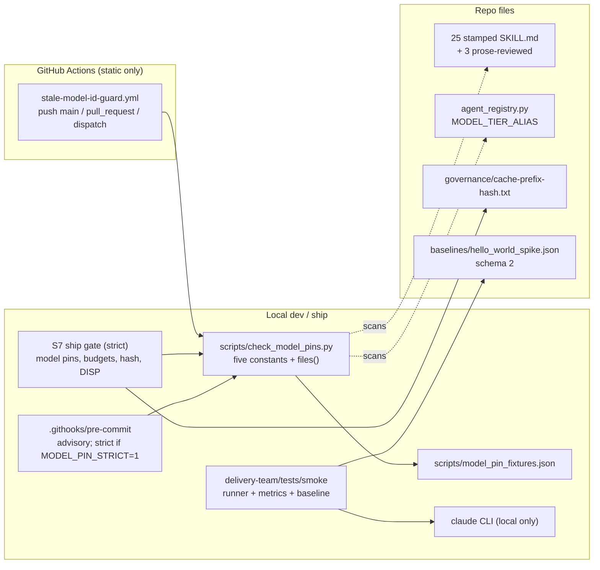
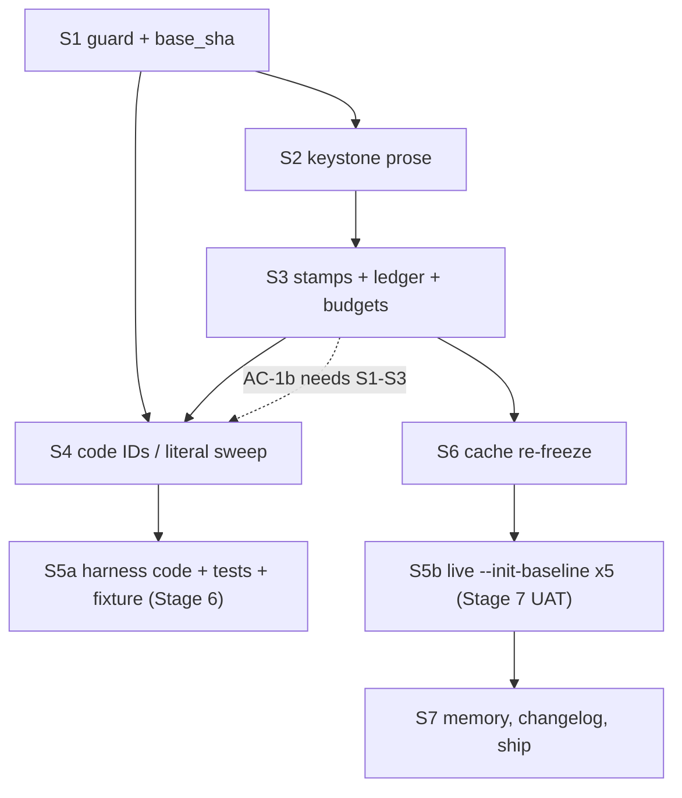

<!-- run: run-2026-05-28-o48m -->
# Architecture: Latest-Model References (BACKLOG-108)

**Stage**: 4 Architect, LIGHT depth (single coherent doc plus 5 ADRs, no debate)
**Role / task**: Solution Architect (Elrond) / design. Recommended model class: synthesis.
**Revision**: 4 (DoD round-2 self-correction: QA B1 plus should-fix findings; see the Revision 4 changelog at the end of this file). Revision 3 = adversarial loop 3 (see the Revision 3 changelog and the `cap_reached` exit record).
**Adversarial loop exit**: `cap_reached` (3 loops, `pipeline.max_self_correction = 3`). Documented exit, not a failure: 0 blocking findings in loop 3; residuals are listed in the Residuals table at the end of this file.
**Inputs**: PRD Revision 6 (`.delivery/artifacts/02-refine/po/prd.md`), `constraints.yml`, BACKLOG-108, memory topic `latest-model-references.md`, round-2 DoD reviews (architect, QA), stage and hot lessons, and the repository sources named in section 11.
**ADRs** (all under `.delivery/artifacts/04-architect/adrs/`, status Proposed until DoD):
ADR-lmr-001 cache fingerprint scope; ADR-lmr-002 guard design; ADR-lmr-003 central alias, stamps and line-budget math; ADR-lmr-004 smoke harness capture contract; ADR-lmr-005 dispatch manifest and ship gate.

> The cache fingerprint is a stone we must lift once, and mark clearly, so the road is never repaved for every new release. (Elrond)

## Revision 1 changelog (adversarial loop 1: `challenger/loop-1.md`, 10 findings plus one doc mismatch)

| Finding | Class | Disposition | Where |
|---|---|---|---|
| F1 telemetry.py hashes first 2048 bytes; prefix framing incomplete | significant | FIXED. Fourth row added, "false" reframed (an executable prefix exists), blast radius measured (13 skills; 25 of 25 stamped files change in the first 2048 bytes), S6 must record before and after. No code change. | ADR-lmr-001 context, decision 7, consequences; section 4 S6; U2 |
| F2 gate scans working tree, not pushed commit | significant | FIXED. Ship step 2 requires a clean tree (`git status --porcelain --untracked-files=all` empty, no assume-unchanged flags); pre-push checks pushed sha equals HEAD; S7b scans a fresh clone. | ADR-lmr-005 item 8; ADR-lmr-002 D8 |
| F3 self-reported ship control; budgets unchecked on push | significant | FIXED in design; two parts flagged for PO (P16). Out-of-tree teed log with shell-computed verdict, pre-push hook in S1, independent post-push S7b dispatch, push trigger for `skill-line-budget.yml` (verified to run with empty `PR_BODY`); if the trigger is declined, "budgets unenforced on push" is stated. No PR introduced. | ADR-lmr-005 item 8; ADR-lmr-002 D7, D8; section 4 S1 |
| F4 effort docs contradict OQ-5/OQ-8; `xhigh` on non-opus | minor | FIXED. `--effort` sent only for `opus`; OQ-5 and OQ-8 rewritten. | ADR-lmr-004 sections 2 and 4; section 6; U13 |
| F5 in-loop cost kill dead on real streams; budget subtype unconfirmed | minor | FIXED. Stated as legacy-only; exit-2 mapping widened (`budget` subtype, `budget limit` text, `is_error` with cost at or above 0.99 x cap, cost above cap). | ADR-lmr-004 section 4 |
| F6 third tier vocabulary outside `MODEL_TIER_ALIAS` | minor | FIXED (scope stated: `agent_registry.py` only; `prd-quality-gate-flow` labels are digit-free and guard-neutral). | ADR-lmr-003 A1a |
| F7 alias set omits `fable` | minor | FIXED (closed set by decision, widened in AC-4.6 only). | ADR-lmr-003 A3 |
| F8 broken cross-references and the `S5a --> S6` edge | minor | FIXED. ADR-001 cites section 7, P10; ADR-003 cites P9; ADR-004 and ADR-005 cite section 5; "section 5.2" cites replaced by "section 4, S2"; edge removed; two internal references in this file corrected (section 8, section 6). | all five ADRs; section 5 graph |
| F9 producer/validator separation is order-provable only | minor | FIXED as far as possible, remainder ACCEPTED. Ids pasted from the Agent tool result; a subagent transcript file per id as a supporting check; limit named. | ADR-lmr-004 section 6 item 5; ADR-lmr-005 item 6 |
| F10 guard blind spots (extensions, loopholes) | minor | FIXED by declaration. Out-of-scope extensions listed with measured counts; loopholes stay accepted; separator decision stays with the PO (P5). | ADR-lmr-002 D3; P17 |
| Doc MISMATCH: effort default per model | doc | ACCEPTED as a PRD-assumption contradiction, flagged (U13); no requirement changes. Same edit as F4. | section 6 rows OQ-5, OQ-8 |

No finding was rebutted, and none was deferred without a design answer. Three items need a human decision and carry a fallback each: pre-push hook and budget push trigger (P16), and the home of the S7b report (P15). All five ADRs stay Proposed (binary status); no ADR-lmr-006 was needed because every finding fits an existing decision record.

## 1. Impact-analysis gate

`.delivery/features/` does not exist (`ls .delivery/features` returns "No such file or directory"). There are no Feature Knowledge Cards, so there are no card-level assumptions to conflict with this design. No assumption conflict exists; nothing to escalate. Existing stale Stage 4 files in `04-architect/` (ADR-001 through ADR-006 series, `architecture-tk3-caveman-lite.md`) belong to earlier runs and were not modified; only the format of `ADR-tk2-001` was consulted.

## 2. Prior Art Analysis

**Summary.** The PRD (about 150 KB, Revision 6) already contains the design: a version-free convention, a guard script with five patterns, a central tier-alias dict, version-free stamps, a parser fix and real-shape fixture for the smoke harness, a cache re-freeze and a ship procedure. It is unusually well specified: patterns are given verbatim, ACs are runnable, and the failure modes discovered by earlier reviews are baked in. This stage validates feasibility against the code, fills the genuinely open questions (OQ-3, OQ-4, OQ-5, OQ-11, partly OQ-12), pins the S5 interface, and proves the line-budget and cache arithmetic with real commands. It changes no PRD requirement; items that look unsound are flagged in section 8 with evidence.

**Classification** (Decision Already Made means the architect does not propose an alternative):

| PRD element | Classification | Rationale |
|---|---|---|
| Refer to the latest of a family, never pin (BINDING-0.1) | Decision Already Made | User decision 2026-09-20 |
| Single guard script `scripts/check_model_pins.py`, five constants, scope `git ls-files --cached --others --exclude-standard`, no exemptions, marker banned | Decision Already Made | BINDING-0.3, FR-1.2, FR-1.6 |
| Workflow triggers push to main, pull_request, workflow_dispatch; no `paths:` filter | Decision Already Made | FR-1.1 |
| Pre-commit hook advisory, strict with `MODEL_PIN_STRICT=1`; local strict ship gate | Decision Already Made | FR-1.5 |
| `MODEL_TIER_ALIAS` one dict with `opus|sonnet|haiku` | Decision Already Made | FR-4.1 |
| Stamps `latest` / `rev-1` / `last_audited`; 9 unstamped files stay unstamped | Decision Already Made | FR-3.2, FR-3.3 |
| Prose review narrowed to 3 SKILL.md; stamps on 25 | Decision Already Made | OQ-9 = NARROW, BINDING-6.1 |
| Smoke: `--model opus`, `--effort xhigh`, `--max-budget-usd`, observed model, `unknown` = failure, real-shape fixture, producer/validator separation | Decision Already Made | FR-5.x, BINDING-4.x |
| Ship: squash-rebase, ff-merge, push origin/main, no PR; local-only smoke | Decision Already Made | BINDING-5.1, 4.6 |
| One Role = One Sub-Agent | Decision Already Made | BINDING-5.4 |
| Story order S1 to S7 | Decision Already Made | BINDING-2.5 |
| Cache fingerprint scope | Open Question (OQ-3) | ADR-lmr-001 |
| Where `dod_validators` counts live; AC-DISP stage list | Open Question (OQ-4) | ADR-lmr-005 |
| `xhigh` vs `high` | Open Question (OQ-5) | section 6 |
| `model: sonnet` in delivery-flow | Open Question (OQ-11) | ADR-lmr-003 A5 |
| S5 function interfaces, `model_usage` dynamic keys, schema version, budget-stop mapping | Open Question (round-2 F2, F4, F6, F7) | ADR-lmr-004 |
| Base ref for pre-ship ACs | Open Question (round-2 F8) | ADR-lmr-005 item 7 |

**Deviation protocol**: no Decision Already Made is replaced. Three additions are proposed for PO confirmation at Plan, not as changes to any requirement: the multi-manifest form of AC-DISP (ADR-lmr-005), and, from revision 1, a `pre-push` hook now designed into S1 (ADR-lmr-002 D8) and a `push` trigger for `skill-line-budget.yml` (ADR-lmr-005 item 8). All three keep the PRD reading valid if declined (U12).

**Domain discovery**: satisfied by the PRD and Stage 2 (PO owns the problem; the Stage 4 stage is light). No discovery interview was re-run.

## 3. Architecture at a glance

Seven concerns, seven stories, one repo, no runtime service. The system is a set of static checks, a handful of edited text files, and a local test harness that drives the `claude` CLI.



**Control posture (revision 2, loop-2 F2).** Every control on the ship path is DETECTION with fix-forward, not prevention, for a pusher who skips the gate. The ship path is squash-rebase, ff-merge, `git push origin main`, no PR (BINDING-5.1). The pre-push hook is opt-in and `--no-verify` skips it; the S7 gate is run by the orchestrator that pushes and its log is self-produced; S7b and the `push: main` workflow both run after the push. Nothing here can stop a bad commit reaching `main`. Prevention (branch protection with required checks, or a server-side hook) is recorded as ACCEPTED RESIDUAL RISK RR-1 in ADR-lmr-005 item 8, owner PO, with revisit triggers; it is not designed in because it would change BINDING-5.1 (no PR). The threat model is accidental drift, not an adversary.

Data flow of the guard: `git ls-files --cached --others --exclude-standard` gives the file set; each line is classified once (`pin`, `stamp`, `prose`); the last stdout line is `guard-scope hits N files M`; exit 1 when N above 0.

Data flow of the smoke harness: `run_smoke.py` builds `claude --print --output-format stream-json --verbose --model opus --effort xhigh --max-budget-usd 3.00`, tees events to `stream.jsonl`, `parse_stream` folds them into `Metrics` (model from `system/init`, cost from `result.total_cost_usd`, dispatches by distinct `message.id`), `report.py` writes `report.json`, and `baseline.py` either compares against a schema-2 baseline (WARN on `model moved`) or, with `--init-baseline`, writes a fresh one with the 5 raw streams and their hashes.

## 4. Story-by-story design

### S1 Guard (ADR-lmr-002)
Files: new `scripts/check_model_pins.py`, `scripts/model_pin_fixtures.json`, `.githooks/pre-push` (revision 1); rewrite `.github/workflows/stale-model-id-guard.yml`; edit `.githooks/pre-commit`; and, if the PO confirms, add a `push: branches: [main]` trigger to `.github/workflows/skill-line-budget.yml` (revision 1, F3). Route hook and workflow edits through `plugin-dev:hook-development` (FR-1.4). The script copies the five PRD constants verbatim. The S1 developer also records `base_sha` (ADR-lmr-005 item 7). Any doc S1 writes about the guard contains no version examples (self-scan rule).

### S2 Keystone prose (ADR-lmr-003, ADR-lmr-001)
Three dispatches, one per keystone, file-disjoint: (a) `delivery-flow/SKILL.md` plus the mirror `orchestrator-doctrine.md`, (b) `prompt-engineer/SKILL.md`, (c) `product-delivery/SKILL.md` (no version mention; ledger only; note `product-delivery` is 300/300 so any prose edit there must be net zero).

**Exact delivery-flow rewrite (proved line-neutral; cited from ADR-lmr-001 and ADR-lmr-003 as "section 4, S2").** Simulated on a scratch copy (not applied). The two version blocks are 4 lines each and stay 4 lines each. Proposed text (the developer may reword, but must keep the four lines per block, the conditional phrase, and the cap sentence on one line; every rewritten line must differ from its source line, or AC-2.1 counts it as still present):

Block 1, replaces lines 27 to 30:
```
> **Model awareness (latest Opus):** The latest Opus delegates to sub-agents more readily
> than prior models, so state delegation scope explicitly. "One Role = One Sub-Agent"
> (Phase 4) is a **behaviourally load-bearing** gate, not a style preference. Fused
> roles and over-spawning both break it; fusion is the highest-confidence regression mode.
```
Block 2, replaces lines 273 to 276:
```
> **Model awareness (latest Opus):** When the orchestrating session runs the latest Opus,
> silent sub-agent fusion or over-spawning is the highest-confidence regression mode.
> `dod_validators.<stage>` is the cap: at most that many subagents per DoD checkpoint, on any model;
> the dispatched roles at each DoD checkpoint MUST NOT exceed the length of that list.
```
Simulation results (commands run, output recorded): line count 499 to 499; bytes 28,616 to 28,684; guard hits in the rewritten file 0 (all five regexes); AC-2.5 prints cond True, cap True, no comment lines; AC-2.1 prints `0 source lines still present`; `check_skill_budgets.py --check <file> --tier A` PASSED. The behavioural claim in block 1 ("delegates ... more readily than prior models") is the doc-verified anchor (PRD section 8; https://platform.claude.com/docs/en/build-with-claude/prompt-engineering/prompting-claude-opus-5, quote recorded there, not re-fetched at this stage). The direction is the reverse of the older "dispatches fewer sub-agents" claim, which stays refuted and never ships (FR-2.1).

Doctrine mirror (`orchestrator-doctrine.md`, lines 77 to 82, no tier key, no budget): same content as block 1 under a family heading (for example `## Model Awareness Note (latest Opus)`), review together with delivery-flow so the two cannot diverge. It is outside the fingerprint (ADR-lmr-001 decision 2).

`prompt-engineer/SKILL.md`: unbudgeted (no tier key), 520 lines. Rewrite the named lines (FR-2.1 list, including 363, 365, 371, 420); the stamp-doc bullets at lines 420 and 421 are reworded so `model_awareness` is defined as `latest` (ADR-lmr-003 A6a, revision 2, F5; one line for one line); Pattern 4.1 becomes a config-read pattern (`MODEL_ID = os.environ["CLAUDE_MODEL_ID"]`, FR-2.2); the "Model-specific optimisation" block becomes `latest Opus`; effort advice says "start from the API default and tune on your own evals", never a per-version level (docs: effort levels are recalibrated between releases, PRD section 8). The claim "Claude Code default effort is `high`" stays unshipped (OQ-8 UNVERIFIED).

### S3 Stamps and ledger (ADR-lmr-003)
25 files, value-only edits, zero line delta (proved per file in ADR-lmr-003). `last_audited` = the S3 DoD date; `fitness_review_due` reset in the 11 files that have it, STAGGERED per ADR-lmr-003 A4 (file i gets S3 date + 20 + 7*i days; 2026-10-10 to 2026-12-19 for today's date; revision 3, F15). The prose ledger `06-development/prose-review-ledger.tsv` has exactly 3 rows; a second file `06-development/stamp-only-ledger.tsv` lists every other stamped path (22 by the loop-3 count) as `stamp-only, not prose-reviewed` (ADR-lmr-003 A6b; revision 3, F7). S3 owns AC-6 (budget exit 0).

### S4 Code IDs and literal sweep (ADR-lmr-003)
`MODEL_TIER_ALIAS`, the three provenance comments, `flow_orchestrator.py:663` comment, `conftest.py` four fixture IDs, two doc fixture IDs, `telemetry-schema.md:36`, `prompt-engineer/SKILL.md:368` (already S2). The closing run is AC-1b: `guard-scope hits 0 files 0`. S4 must leave `python3 -m pytest delivery-team/tests/smoke/tests/test_meta.py` at 3 passed. The `conftest.py` edit changes only the `"model"` string values; its `schema_version "1"` fixtures stay.

### S5 Smoke harness (ADR-lmr-004)
Producer files: `lib/metrics.py`, `lib/runner.py`, `lib/report.py`, `lib/aggregator.py` (pass-through only), `lib/baseline.py`, `run_smoke.py`. Validator files: `tests/test_model_capture.py`, `tests/fixtures/stream_real_shape.jsonl` and `.provenance.txt`. Interface, ordering (stub, red validator, fix), schema 2, budget-stop mapping and the init-baseline rule are in ADR-lmr-004. The fixture's `real_shape` failure message names the defect it catches. **P0 stub rule (revision 4, QA B1; ADR-lmr-004 section 6 items 1 and 2).** The P0 stub keeps every pre-existing function body unchanged (AST check) with ONE named exemption, `report.py::build_report`, which gains the pinned keys with constant defaults only (the gate strips those entries and requires the rest to equal the `base_sha` body, so a computed key or any other edit fails). New stub functions return inert values and never raise `NotImplementedError`. Red-first at `validator_start` means the `real_shape` and capture-failure tests are collected, FAIL, and each failure message begins `AssertionError` or `Failed: DID NOT RAISE`; `ImportError`, `ModuleNotFoundError`, `SyntaxError`, `TypeError`, `AttributeError`, `NameError`, `NotImplementedError` or a collection error voids the evidence. Also revision 4: `_spawn_and_tee` (runner.py:167, the only caller of `_build_claude_command` at :175) joins the interface table; `run_smoke.py` gets `--model` (opus only) and `--effort`; `sample-<n>.jsonl` is the full scrubbed stream (needed for the `message.id` distinctness rule); committed captures pass a secret and path scrub (ADR-lmr-004 sections 5, 8, 9). Revision 3: the pinned `build_report` keys and the `init_baseline` inputs are in ADR-lmr-004 section 2 (F8); red-first is also measured at `validator_start` (F6); an outcome-failed sample aborts `--init-baseline` (F9); every S5a and S5b dispatch passes `--out-dir "${TMPDIR:-/tmp}/smoke-out"` so run output never lands untracked in the tree (F2).

Baseline JSON after capture (schema 2, illustrative; the value under `model_resolved` is observed at capture time and is a `.json`, so outside the guard):
```json
{
  "schema_version": "2",
  "scenario": "hello_world_spike",
  "sample_status": "active",
  "n_samples": 5,
  "model_requested": "opus",
  "model_resolved": ["<observed system/init model>", "<other observed models, if any>"],
  "model_pin_env": {"ANTHROPIC_MODEL": null, "ANTHROPIC_DEFAULT_OPUS_MODEL": null,
                    "ANTHROPIC_DEFAULT_SONNET_MODEL": null, "ANTHROPIC_DEFAULT_HAIKU_MODEL": null},
  "effort": "xhigh",
  "host_context": {"bare": false, "claude_code_version": "<observed>"},
  "samples": [{"stream_file": ".delivery/artifacts/06-development/smoke-streams/sample-1.jsonl", "stream_sha256": "<hash>"}],
  "metrics": {
    "cost_usd": {"mean": 0.0, "hard_max": 3.0, "classification": "hard"},
    "tokens.cache_hit_ratio": {"classification": "advisory"},
    "model_usage.<model>.dispatches": {"classification": "informational"}
  }
}
```
(The `mean` shown for cost is a placeholder; AC-5.4 requires the captured value to be above 0.)

### S6 Cache re-freeze (ADR-lmr-001)
After S3 and any DoD rework, one command rewrites `governance/cache-prefix-hash.txt` and AC-6.1 must print `MATCH`. The hash changes because the frontmatter (first byte difference at 854) and two blocks change; that is deliberate and recorded. Revision 1 (F1): S6 also records the before and after 2048-byte hash used by `delivery-team/hooks/telemetry.py` (`prefix_hash`). It changes for all 13 stamped `delivery-team` skills at ship (measured: 25 of 25 stamped files change in the first 2048 bytes, since the stamps start by byte 927), expected, no code change, no consumer breaks (ADR-lmr-001 decision 7).

### S7 Memory, changelog, ship (ADR-lmr-005)
`## Run outcome` in the memory topic, a CHANGELOG entry naming BACKLOG-108 (CHANGELOG may name retired IDs, it is excluded from the guard), then the ordered ship gate in ADR-lmr-005 item 8, in two blocks (Block A step 0 on the branch before the squash; Block B steps 1 to 9 after it, in the MAIN checkout with the `.claude/worktrees` pathspec exclusion; revision 3, F1 and F3), each step judged by exit status with count steps wrapped in `test` and printing their value into the log (revision 2 F1, revision 3 F11): clean-tree check, one out-of-tree evidence log, then push, then an independent post-push re-run on a fresh clone of `origin/main` by a different dispatch (S7b; revision 1, F2 and F3).

## 5. Sequencing, dependency graph and parallelism (BINDING-2.5, BINDING-4.5)

True dependencies (an arrow means "must finish first"):



The PRD order S1, S2, S3, S4, S5, S6, S7 is a valid topological order and stays the default. Findings:
- S4 closes AC-1b (zero hits repo-wide), which needs S1, S2, S3 landed, so it is correctly after S3, although its edits are file-disjoint from S2 and S3.
- S5a depends on S4 only through `conftest.py` (synthetic IDs, so `test_meta.py` stays green) and on S1 (new S5 files fall inside the guard scope).
- S6 depends only on S3 for content (the earlier drawing had an `S5a --> S6` edge; revision 1, F8, removed it). It stays after S5a by PRD order only, and that is safe because S5 changes no SKILL.md.
- S5b is expensive and reads SKILL.md content indirectly; run it after S6 so the baseline measures the final prose (Architect F8).

**Parallel windows** (only where files are disjoint; BINDING-5.4 and Dispatch-Id evidence still apply to each dispatch):
1. Inside S2: the three keystone dispatches touch three different files; they may run in parallel. The `check_skill_budgets.py` run after them is serial. Commit protocol (revision 3, F12): the three dispatches only EDIT files and never run `git commit` (one working tree shares one index; concurrent commits contend for `.git/index.lock`, and an un-pathspec'd commit takes another dispatch's staged edits and mis-attributes the `Dispatch-Id` trailer). After the window the orchestrator commits serially, one commit per dispatch, with `git commit -- <that dispatch's files>` and that dispatch's `Dispatch-Id` trailer. This is a design rule argued from git semantics, not reproduced.
2. Inside S5a: none. The producer stub, the validator and the producer fix are strictly sequential (red-first; `lib/` stable from validator start to validator end).
3. S4 is file-disjoint from S2 and S3 and could overlap them in a second worktree; the recommendation is NOT to (effort XS, one working tree keeps commit and `Dispatch-Id` hygiene simple, and BINDING-2.5 says strict order). If the Plan wants speed, this is the only safe overlap.
Everything else is sequential. Live capture is never parallel (NFR-6: sequential, one primary model).

**Producer/validator dispatch separation (BINDING-4.5, FR-4.4).** Two independent Agent dispatches, never the same agent id: the producer authors `lib/` and `run_smoke.py`; the validator authors only `tests/test_model_capture.py` and `tests/fixtures/`. Order and observables are in ADR-lmr-004 section 6 and the AC-4.4 additions in ADR-lmr-005 items 6 and 7 (first validator commit is an ancestor of the first fix commit; `Dispatch-Id` trailers cross-checked against the manifest). The S2 prose review follows the same principle at story level: the adversarial reviewer for AC-2.3b is a separate dispatch from the developers who edited the files.

**Where the live baseline runs (needs Plan confirmation).** `.delivery/state.md` records: "Stage 7 UAT: full (includes live --init-baseline 5x ...)", while the PRD closes G5 in S5. Recommendation: Stage 6 delivers S5a (everything except the baseline file and streams; cost about one cheap capture); Stage 7 UAT runs S5b and commits the baseline and streams; S7 ship follows UAT PASS. G5's closing ACs (AC-5.4, 5.5, 5.5c, 5.6) then close at UAT. This changes when G5 closes, not what it requires. It also makes `07-uat` a required AC-DISP stage (ADR-lmr-005). Manifest units are S1, S2, S3, S4, S5a, S6 (`06-development`) and S5b, S7, S7b (`07-uat`), ADR-lmr-005 item 4b (revision 3, F4). If the Plan keeps the live capture inside Stage 6, nothing else in this design changes. **Paid-run controls (revision 4, QA W6, DevOps; ADR-lmr-004 section 8).** The S5b executor is a `devops` dispatch (producer-side, not listed in the S5b manifest; the S5b manifest lists the `qa` validator). Per-sample cap $3.00; aggregate S5b ceiling $15.00 summed over every run report including aborted ones; at most 2 re-runs (7 runs total); fixture capture capped at `--max-budget-usd 0.25`, at most 2 captures. An explicit operator go is required before any paid run and before the push. Because G5's closing ACs move to UAT, Stage 6 DoD cannot pass AC-5.4, 5.5, 5.5c, 5.6; the Plan must record that or Stage 6 stalls.

## 6. Resolution of open questions

| OQ | Resolution |
|---|---|
| OQ-1 | Confirmed by doc (delegates more readily); block 1 above encodes it version-free. |
| OQ-2 | Still UNVERIFIED (no doc source located; not searched exhaustively at light depth). No shipped prose depends on it; keep it out. |
| OQ-3 | ADR-lmr-001: keep whole-file `sha256sum`; `orchestrator-doctrine.md` OUT. |
| OQ-4 | ADR-lmr-005: config `.delivery/config.yml` lines 56 to 63 is the source; stage list `04-architect, 05-plan, 06-development, 07-uat` (`02-refine` dropped in revision 3, F5: predates the manifest rule, ids unrecorded; PRD deviation P22); manifest per round and per unit (S1..S4, S5a, S5b, S6, S7, S7b). |
| OQ-5 | Keep `xhigh` (project choice, BINDING-4.3, `opus` only); it is recorded in the baseline. Revision 1 correction (live model-config page, fetched 2026-09-20 by the reviewer): Claude Code documents `high` as the default on every model except Opus 4.7, where `xhigh` is the default. So `xhigh` is redundant on Opus 4.7 and non-default elsewhere; it stays for reproducibility, and ADR-lmr-004 sends `--effort` only when `model == "opus"`. The API-side default is `high` per PRD section 8, and thinking cannot be disabled at `xhigh` or `max`. Risk R6 (cost) stands; the cap fails loudly; fall back to `high` only by an explicit decision. Optional `effort moved` WARN. |
| OQ-6 | Open, Developer S5: the registry haiku value is a label; the smoke runner uses `opus` only. |
| OQ-7 | Resolved (PRD). |
| OQ-8 | Answered for the latest Opus (revision 3, loop-3 F13: the API models overview lists `Default effort | high` for `claude-opus-5` and `claude-sonnet-5`, and the Claude Code model-config page says `high` is "the default on every model except Opus 4.7"; both fetched by the loop-3 challenger 2026-09-20, not re-fetched here; the CLI `--effort` list is now `low, medium, high, xhigh, max, or ultracode`, six levels). So the default for the latest Opus is `high` by those two pages; `xhigh` is documented as non-default and the runner still passes `--effort xhigh` for `opus` only. Shipped prose still names no level. Earlier wording, kept for the record: partly answered (revision 1). https://code.claude.com/docs/en/model-config (fetched 2026-09-20 by the reviewer) states the Claude Code default per NAMED version (`xhigh` on Opus 4.7, `high` on every other model). It still states nothing for "the latest Opus", so any claim about the latest default stays UNVERIFIED and no shipped prose makes one. The runner passes `--effort` explicitly (opus only), so the default is irrelevant to it. |
| OQ-9 | Resolved NARROW (human). |
| OQ-10 | Resolved by observation; the docs name no init field (https://code.claude.com/docs/en/headless); the fixture pins it. |
| OQ-11 | Confirmed: `model: sonnet` unchanged (ADR-lmr-003 A5). |
| OQ-12 | Michael decides. Architect recommendation: no `--bare` for this run; record `host_context.bare`. New evidence: the headless docs say `--bare` will become the default for `-p` in a future release, so a CLI upgrade can change baseline conditions; re-record the fixture on upgrade (U9). |

## 7. Risks and unknowns the Plan stage must carry

| ID | Risk / unknown | Carry as |
|---|---|---|
| P1 | Live capture placement (Stage 6 vs Stage 7) is unresolved between `state.md` and the PRD | Plan decision; recommendation in section 5 |
| P2 | AC-DISP multi-manifest form (ADR-lmr-005) needs PO acceptance, else fall back to final-round-only | Plan decision |
| P3 | Real stream facts UNVERIFIED: `message.id` on assistant events, repetition across split events, exact budget-stop subtype | Validator red phase settles them; parser has fallbacks |
| P4 | Hook behaviour test in a temp git repo (QA W9): staged pin gives exit 0 by default, exit 1 with `MODEL_PIN_STRICT=1`, zero staged files does not abort under `set -euo pipefail` | S1 AC addition |
| P5 | Guard false positives in `hardware-team/` prose (electronics values, `claude-*-v2` names) and separator loopholes (QA W6, W7) | S1 reports a whole-tree run before closing; PO decision on loophole tightening |
| P6 | Doc rework after the baseline capture invalidates it (F8) | Capture last (section 5); else re-capture or written waiver |
| P7 | Main advances during the run; ACs using `main` shift (F8) | `base-sha.txt` recorded at S1 |
| P8 | `06-dev` vs `06-development` naming; stale files in `06-development/dod/` | Dispatch prompts name the path explicitly |
| P9 | Stale user-local SQLite rows keep the retired ID (`_load_default_agents` skips when rows exist); nothing reads it | Note in the S4 report; no code change |
| P10 | The `## Volatile` comment in delivery-flow contradicts the fingerprint scope | Later wave; not fixed here |
| P11 | Cost of the first uncached read of the re-frozen skill is UNVERIFIED | Accept; not measured |
| P12 | `--max-budget-usd` is checked between turns (UNVERIFIED), so a sample can exceed the cap slightly | Layer-2 post-check enforces NFR-1 |
| P13 | Stage 6 review dispatch load: each story needs manifests and `Dispatch-Id` trailers; the orchestrator must write them as it dispatches | Checklist item in every Stage 6 dispatch prompt |
| P14 | S1 to S3 leave the tree red on the guard workflow until S4; ship is one squashed push so main never sees it | Keep squash; do not push S1 alone (the pre-push hook acts only on `refs/heads/main`, so branch pushes are not blocked) |
| P15 | Ship-gate evidence and S7b: the S7b report lands in a post-ship docs-only commit (a second push of `.delivery/` files); Plan confirms that is acceptable or names another home (revision 1, F3) | Plan decision; recommendation in ADR-lmr-005 item 8 |
| P16 | `skill-line-budget.yml` push trigger and `.githooks/pre-push` are additions to the PRD's S1 scope; PO confirms or strikes; if the trigger is struck, budgets are unenforced by CI on direct pushes (F3) | Plan decision |
| P17 | Guard scope blind spots: 26 tracked files outside `.py .md .yml .yaml .txt .sh` and `.delivery/` (17 `.json`, 1 `.jsonl`, 2 `.gitignore`, and one each of `.githooks/pre-commit`, `Makefile`, `LICENSE`, `.gitkeep`, `.gitattributes`, `.example`) are out of scope by decision; none carries a pin today (F10; recounted in revision 2) | Accepted; ADR-lmr-002 D3 |
| P19 | Two tracked executable files sit outside the guard scope: `.githooks/pre-commit` (the only mode-100755 tracked file outside `.delivery/`) and `Makefile`. Widening the scope changes the PRD's fixed six-extension scan and the count-equals-script equivalence, so it is a PO decision (loop-2 F3). Both are clean today (pin-pattern grep exits 1). Owner: PO. Non-blocking: no current false negative, and S1 edits the hook under review | Plan decision; ADR-lmr-002 D3 |
| P20 | RR-1: direct push to main is detect-and-fix-forward, not prevent (loop-2 F2). Branch protection or a server-side hook would prevent it but conflicts with BINDING-5.1 (no PR). Owner PO. Revisit if a pin reaches main, a second pusher appears, or BINDING-5.1 is reopened | Accepted residual risk; ADR-lmr-005 item 8 |
| P21 | Uniform `latest` stamp on 22 files nobody prose-reviewed repeats a recorded failure (memory: "false claim wearing a truthful sleeve"). Mitigated by the stated limit in ADR-lmr-003 A6b and `stamp-only-ledger.tsv`; the PO decides whether that is enough or whether the 22 should be reviewed (loop-3 F7). Owner PO | Plan decision |
| P22 | PRD deviation: `02-refine` dropped from the AC-DISP REQUIRED list (its dispatch ids were never recorded; a manifest would need typed ids). Owner PO; alternative is a reconstructed manifest exempt from the transcript check (loop-3 F5) | Plan decision; ADR-lmr-005 item 1 |
| P23 | Hook install: `core.hooksPath` is `.git/hooks` here, so pre-commit and pre-push are inert until `git config core.hooksPath .githooks` (loop-3 F14) | S1 and S7 handoff |
| P18 | Telemetry `prefix_hash` changes for 13 skills at ship; a reader grouping by it sees new groups (F1) | Accepted; S6 records the delivery-flow before and after values |

## 8. PRD items found technically unsound (flagged, not changed)

| # | PRD text | Problem, with evidence | Suggested handling |
|---|---|---|---|
| U1 | FR-7.4 / AC-DISP: one manifest per stage, roles distinct, N equals lines | A second DoD round or seven stories repeat roles. Evidence: `02-refine/dod/` and `04-architect/dod/` hold `-r2` files; `06-development/dod/` holds `S1-S2-*` and `S3-*`. A correct run would fail the AC. | ADR-lmr-005 |
| U2 | OQ-3 and the SKILL.md comment: "prefix is bytes 0..2048" / "ends at end of Phase 3" | Measured: end of Phase 3 is byte 15,479; byte 2048 is inside line 40; governance hash is whole-file (`8c2ebf97...` for `head -c 2048` differs from `43067c9e...` in the file). The design brief's "2048-byte prefix ends at the end of Phase 3" is false, and the SKILL.md comment is inconsistent. Revision 1 correction (F1): the 2048-byte notion is NOT merely stale; `delivery-team/hooks/telemetry.py` (`PREFIX_READ_BYTES = 2048`) executes it as `prefix_hash`. Two live fingerprints exist with different scopes. | ADR-lmr-001 records the measurements and the telemetry consumer |
| U3 | FR-5.7: "`_check_hard_rules` and `_check_advisory_rules` skip `model_usage.*`" | Already true (they only walk fixed keys and `skill_loads.*`); the actual gap is that nothing collects `model_usage.*` into `metrics`, so AC-5.1 can never pass. | ADR-lmr-004 section 3 |
| U4 | FR-5.9 "does not double count the `result` aggregate" | Under-specified: `dispatch_count` and per-model dispatches also double count when one API message is split across several assistant events, and the current parser counts a legacy `result` as a dispatch, which `test_meta.py` relies on. | ADR-lmr-004 section 1 (two-mode parser) |
| U5 | FR-5.6 / `_init_baseline_flow` | `_execute_single_run` loads the old baseline for every sample; with schema 2 and `load_baseline`, init would fail or compare against the invalidated file. | ADR-lmr-004 section 5 |
| U6 | AC-4.4 producer/validator observables | Red-first is not chronological (QA W1); authorship trailers are self-declared (QA W5); `run_smoke.py` is a producer file but AC-4.4 checks only `lib/`. | ADR-lmr-004 section 6, ADR-lmr-005 item 6 |
| U7 | Guard test helper realities | `tests/conftest.py` blocks any `claude` subprocess, and `_claude_cli_version()` calls `claude --version`, so a meta-test calling `init_baseline` or `build_report` unpatched fails with `AssertionError`. Not in the PRD. | ADR-lmr-004 section 6 |
| U8 | R4 rated Low | QA probes (round 2) show `claude-plugins-v2`, `on 6.8 kernels`, `with 4.7 V rail`, `the 4.7 uF cap` flag; hardware-team prose makes Medium the honest rating. | ADR-lmr-002 consequences |
| U9 | OQ-12 / R13 | Docs now say `--bare` will become the default for `-p`; the baseline's conditions can change on a CLI upgrade. | Recorded; `host_context` and fixture re-record |
| U10 | AC-2.1, AC-2.5, AC-4.4, AC-5.9b use the moving `main` ref | Fragile if main advances (F8). | `base-sha.txt` |
| U12 | PRD FR-1.5 / S1 scope names a pre-commit hook and a guard workflow only; the ship path is a direct push (BINDING-5.1) and `skill-line-budget.yml` is `pull_request`-only | Two controls have no PRD text: a pre-push hook and a push trigger for the budget workflow. Proposed as additions, not silent changes (P16). | ADR-lmr-002 D8, ADR-lmr-005 item 8 |
| U13 | PRD OQ-5 / OQ-8 assume no documented Claude Code default effort for the latest Opus | Live docs document it: `high` for the latest Opus and Sonnet (API overview) and `high` on every model except Opus 4.7 (model-config; revision 3, F13). Contradiction is now full, not partial. No requirement changes (the runner passes `--effort` explicitly). | Section 6 rows OQ-5 and OQ-8; ADR-lmr-004 |
| U14 | PRD FR-1.5 and BINDING-5.1 describe the local run as the "blocking gate" | For a direct push to main the gate cannot block a pusher who skips it (`--no-verify`, or the same orchestrator both runs and reports it); it detects. Not a requirement change: the PRD already states the workflow "detects after the push" (FR-1.1). Wording flagged so no reader takes the gate as an access control. | Section 3 control posture; ADR-lmr-005 RR-1 |
| U11 | Design brief and PRD both call Stage 4 "single cache-fingerprint ADR" | Five decisions are load-bearing; the ADR set is five files, not one. Not a defect, a scope note. | This document |

## 9. Non-functional traceability

| NFR | Design element |
|---|---|
| NFR-1, NFR-2, NFR-3 | Two-layer cap; sequential samples; `hard_max` unchanged |
| NFR-4 | Zero line delta proved (ADR-lmr-003); S3 runs `check_skill_budgets.py` |
| NFR-5 | Fixtures with both floors, run in both engines |
| NFR-8 | Workflow calls the script only; no `pip install`, no `claude` |
| NFR-9 | Meta-tests use fixtures only; no subprocess to `claude` |
| NFR-11 | Family-agnostic `PIN_RE`; `synthetic-future` fixtures |
| NFR-12 | One Python dict plus nine vocabulary-checked frontmatter lines |
| NFR-13 | Script is one pass over `git ls-files`; PRD measured 0.5 s |

## 10. Verification log (commands run in this stage, worktree root, 2026-09-20)

| Command (abridged) | Result used |
|---|---|
| `wc -c` and `wc -l` on delivery-flow SKILL.md | 28,616 bytes; 499 lines |
| `sha256sum` of the file, `cat governance/cache-prefix-hash.txt`, `git show main:governance/cache-prefix-hash.txt` | all `43067c9e...b8328`, identical |
| `head -c 2048 ... \| sha256sum`; `head -c 15479 ... \| sha256sum`; `head -248 ... \| wc -c` | `8c2ebf97...`, `ac03f1f2...`, 15,479 |
| Python offset scan for `## Phase N` headings | Phase 0 at 1892; Phase 1 at 9477; Phase 2 at 12135; Phase 3 at 13429; Phase 4 at 15479; `## Volatile` at 27209; byte 2048 in line 40; lines 27 to 30 at bytes 1566 to 1886 |
| Scratch-copy simulation of stamps and two blocks (files under `/tmp/lmr/`, tree untouched) | 25 files, 9,056 to 9,056 lines; delivery-flow 499 to 499; +68 bytes; guard hits 0; AC-2.5 True/True; AC-2.1 0 left; new hashes as in ADR-lmr-001 |
| `python3 scripts/check_skill_budgets.py` and `--check <scratch> --tier A/B/C` | `BUDGET CHECK PASSED: 17 file(s) ...` exit 0; scratch checks PASSED, exit 0 |
| `git ls-files` scans; Python census of stamp keys in the 25 files | 25/25 have `model_awareness`, `pattern_library_version`, `last_audited`; 11 have `fitness_review_due` |
| `grep -rn "model_awareness\|pattern_library_version"` (non-`.delivery`) | only `skill-md-header-warn.yml` presence check |
| `claude --version`, `claude --help` (grep flags) | 2.1.278; `--model`, `--effort`, `--max-budget-usd`, `--bare`, `--fallback-model` present |
| `ls .delivery/features` | No such file or directory |
| Revision 1: `grep -rIln 'cache-prefix-hash\|prefix_hash\|PREFIX_READ' .` (outside `.delivery/`), `sed -n 15,60p delivery-team/hooks/telemetry.py`, `grep -rn prefix_hash delivery-team/tests` | code consumer is `telemetry.py` only; no test, no reader (F1) |
| Revision 1: scratch simulation over the 25 stamped files (`python3 /tmp/lmr-pfx.py`, read-only) | `stamped 25 stamp-line offset<2048: 25 max offset 927 prefix_hash changes on stamp-only edit: 25`; 13 of the 25 are under `delivery-team/skills/` (F1) |
| Revision 1: `git status --porcelain --untracked-files=all`, `git ls-files -v \| grep -c '^[a-zS]'`, a `--no-hardlinks` local clone of HEAD in `/tmp`, then budgets and hash there | dirty check printed the untracked challenger file; flag count `0`; clone HEAD `85db40f...` printed `BUDGET CHECK PASSED: 17 file(s) ...`, `MATCH`, 0 porcelain lines, challenger file absent (F2, F3) |
| Revision 1: `env -u PR_BODY python3 scripts/check_skill_budgets.py`, `PR_BODY= python3 ...`; `sed -n 1,30p .github/workflows/skill-line-budget.yml` | exit 0 with empty `PR_BODY`; trigger is `pull_request` only (F3) |
| Revision 1: `bash /tmp/lmr-hk/test.sh` (pre-push hook against a stubbed `git`) | 7 cases as expected: non-main rc=0, main clean rc=0, sha mismatch rc=1, dirty rc=1, guard fail rc=1, empty stdin rc=0, delete main rc=0 (F3) |
| Revision 1: `claude --help \| grep -n -i -A2 'effort\|fable'`; `grep -n '_running_cost\|cost_cap' delivery-team/tests/smoke/lib/runner.py`; `grep -n '"model": "claude-' prd-quality-gate-flow/stage_definitions.py`; extension census of tracked files outside `.delivery/` | `--effort` levels low..max, alias `fable` documented; in-loop kill at runner.py lines 95 and 252; 7 digit-free labels in `stage_definitions.py`; 16 `.json` plus 8 other files outside the scan extensions (F4, F5, F6, F7, F10) |
| Revision 1: `ls ~/.claude/projects/<slug>/<session>/subagents/` | `agent-<id>.jsonl` and `.meta.json` per subagent exist (F9) |
| Revision 2: `git ls-files -v \| grep -c '^[a-zS]'; echo exit=$?` and the negated `grep -q` form | `0` with `exit=1` (the clean case exits 1, F1); the `!` form is exit-clean and is the one specified |
| Revision 2: tracked-file census outside `.delivery/` minus the six scanned extensions; `git ls-files -s` filtered for mode 100755; grep of `Makefile` and `.githooks/pre-commit` for the pin patterns | 26 files (17 `.json`, 1 `.jsonl`, 2 `.gitignore`, 1 each `pre-commit`, `Makefile`, `LICENSE`, `.gitkeep`, `.gitattributes`, `.example`); only `.githooks/pre-commit` is 100755; grep exit 1 (no match) (F3) |
| Revision 2: `git grep -n model_awareness` outside `.delivery/`, then sed of `prompt-engineer/SKILL.md` 416 to 424 and of `skill-md-header-warn.yml` 20 to 36 | readers: header-warn (presence only), `prompt-engineer/SKILL.md:420` (definition), `delivery-flow/SKILL.md:491` (volatile note) (F5) |
| Revision 2: `ls scripts/` | `check_model_pins.py` not present yet (S1 creates it); no guard run was claimed for the new text, the new lines carry no digit (F5) |
| Revision 3: scratch repo via `python3 /tmp/lmr-r3.py` (nested worktree `.claude/worktrees/w1`; status with and without the pathspec `-- . ':!.claude/worktrees'`; `rev-list --count` bare vs wrapped in `test`) | raw status `?? .claude/worktrees/w1/`; pathspec status empty; stray file still `?? b`; bare count printed `1` rc 0, `test "$(...)" = 0` rc 1 (F1, F11) |
| Revision 3: `grep -n "out-dir" delivery-team/tests/smoke/run_smoke.py`; `git config --show-origin core.hooksPath` | flag exists at line 57; hooksPath origin is `.git/config`, value `.git/hooks` (F2, F14) |
| Revision 3: python date arithmetic for 11 staggered dates | `2026-10-10 2026-12-19 90` (F15) |
| Reads of `runner.py`, `metrics.py`, `baseline.py`, `report.py`, `run_smoke.py`, `tests/conftest.py`, `tests/test_meta.py`, `agent_registry.py`, `.githooks/pre-commit`, `stale-model-id-guard.yml`, `skill-md-header-warn.yml`, `.delivery/config.yml`, `state.md`, `pipeline-stages.md`, `quality-gates.md` | facts cited in ADR-lmr-002 to 005 |

## 11. Citations and UNVERIFIED items

Fetched this stage (WebFetch, 2026-09-20):
- https://code.claude.com/docs/en/model-config: alias table (`opus`, `sonnet` latest; `haiku` "the fast and efficient Haiku model for simple tasks"); "Aliases point to the recommended version for your provider and update over time. To pin to a specific version, use the full model name ... or set the corresponding environment variable like `ANTHROPIC_DEFAULT_OPUS_MODEL`."; effort levels `low, medium, high, xhigh, max` and `--effort` documented.
- https://code.claude.com/docs/en/headless: "The `system/init` event reports session metadata including the model, tools, MCP servers, and loaded plugins."; "With `--output-format json`, the response payload includes `total_cost_usd` and a per-model cost breakdown"; subagent messages carry `parent_tool_use_id`, `null` for the main conversation; "`--bare` is the recommended mode for scripted and SDK calls, and will become the default for `-p` in a future release."; bare mode never reads OAuth credentials.
- https://code.claude.com/docs/en/agent-sdk/typescript: the summarized fetch lists an `error_max_budget_usd` result subtype and fields `total_cost_usd`, `modelUsage`, `usage`; it was truncated and could not confirm `SDKSystemMessage` fields or `message.id`.

Carried from the PRD (fetched by other stages, not re-fetched here): API has no evergreen alias (platform.claude.com model-ids-and-versions and overview); the latest Opus "delegates to subagents more readily" and effort recalibration (platform.claude.com prompting-claude-opus-5, effort, migration-guide pages).

Revision 1 (WebFetch by the challenger, 2026-09-20, https://code.claude.com/docs/en/model-config, effort table): `high` is "the default on every model except Opus 4.7"; `xhigh` is "the default on Opus 4.7"; the CLI reference says available `--effort` levels depend on the model, and that `--max-budget-usd` stops "before stopping (print mode only)" with subagent spawns failing with `Budget limit reached`. Carried from the reviewer's fetch, not re-fetched by this revision.

**UNVERIFIED** (not relied on for a hard requirement): (1) `message.id` presence and split-event repetition on real assistant events; (2) exact budget-stop result subtype string (parser matches `budget` by substring); (3) whether the CLI stops exactly at the budget or between turns; (4) init-event field name beyond the local observation of top-level `model` on CLI 2.1.278; (5) size of the one-time cache cost after re-freeze; (6) OQ-2 doc source for "more literal instruction following"; (7) RESOLVED in revision 3 (F13): default effort for the latest Opus is `high` per the API overview and model-config pages (challenger fetch; six `--effort` levels including `ultracode`); (8) `haiku` alias resolving to the latest Haiku (docs do not say "latest").

## 12. Handoff notes for Plan and Development

- Dev DoD validators for S6 must re-run the three cache commands and paste the output (memory lesson: cache-prefix ADRs need runs-the-command).
- Every dispatch prompt for a SKILL.md edit starts with the `plugin-dev:skill-development` acknowledgement; hook and workflow edits with `plugin-dev:hook-development` (BC-01).
- Every producer and validator commit carries `Dispatch-Id`; the orchestrator writes the per-round manifests as it dispatches (P13).
- Revision 3 handoff: S1 and S7 record `git config core.hooksPath` in the log and run `git config core.hooksPath .githooks` first, or state the hooks are inert (F14); S5a and S5b dispatch prompts pass `--out-dir "${TMPDIR:-/tmp}/smoke-out"` (F2); S2 dispatches never commit, the orchestrator commits serially with pathspecs (F12); S3 writes both ledgers and staggers `fitness_review_due` (F7, F15); the manifest set is per ADR-lmr-005 item 4b, with the recovered form for pre-writer Stage 4 rounds (F4, F5).
- The S7 executor runs step 0 on the branch, then the squash, then steps 1 to 8 of ADR-lmr-005 item 8 as one teed sequence in the MAIN checkout with the log outside the tree; a separate devops dispatch (S7b) re-runs on a fresh clone of `origin/main` after the push.
- The S6 report records the telemetry-hash before and after values (ADR-lmr-001 decision 7).
- The S7 executor records `step=<n> exit=<rc> value=<v>` per step and uses the `!` form for the flag check (revision 2, F1). The S7 report states that the ship path is detect-and-fix-forward (RR-1, P20).
- The S2(b) prompt-engineer dispatch also rewrites the two stamp-doc bullets at lines 420 and 421 (ADR-lmr-003 A6a).
- The S2 developer runs `wc -l` on delivery-flow after the edit and pastes it; it must print 499 (500 is the cap).
- Revision 4 handoff: S1 implements the guard hardening in ADR-lmr-002 D9 (NUL-delimited `git ls-files -z`, `shell=False`, fail closed, `files-scanned` line, canary AC, known-fp fixtures, AC-1.6b for three categories, workflow `permissions: contents: read` and `persist-credentials: false`); S5a/S5b follow ADR-lmr-004 sections 6, 8, 9; S7 follows the ADR-lmr-005 item 8 additions (guard return code, count extraction, operator go, aggregate spend check, S7b transcript check); every temp path is `mktemp`.

## Revision 2 changelog (adversarial loop 2: `challenger/loop-2.md`, 5 findings, no blocking)

| Finding | Class | Disposition | Where |
|---|---|---|---|
| F1 gate step 2 exit-code contradiction | minor | FIXED. The flag check is now `! git ls-files -v \| grep -q '^[a-zS]'`. Reproduced: the `grep -c` form printed `0` with `exit=1`. The gate is judged by exit status; count steps also print their value into the S7 log. | ADR-lmr-005 item 8 step 2; section 4 S7; section 10; section 12 |
| F2 NO-PR push is detect-and-fix-forward | significant | FIXED by statement, plus ACCEPTED RESIDUAL RISK. Stated in section 3 and ADR-lmr-005 item 8 (RR-1: what is not prevented, blast radius, prevention options, owner PO, three revisit triggers); ADR-lmr-002 consequences point to it; no PR requirement added. Recorded as P20 and U14. | Section 3, section 7 P20, section 8 U14; ADR-lmr-005 item 8, alternatives, consequences; ADR-lmr-002 consequences |
| F3 guard scope misses extensionless executables | minor | FIXED by declaration with count, widening DEFERRED to Plan (P19, owner PO). The PRD fixes the six-extension scope, so widening is a requirement change, not an architect edit. Measured: 26 out-of-scope tracked files; exactly two are executable code (`.githooks/pre-commit`, `Makefile`); pin grep exits 1. The stale "16 `.json`" count is corrected to 17. Non-blocking: no current false negative; the S1 developer edits the hook under review. | ADR-lmr-002 D3; section 7 P17, P19 |
| F4 alias set includes `fable` | minor | FIXED. `fable` is intentionally excluded from `MODEL_TIER_ALIAS` (no tier meaning, no consumer), stated where the dict is defined, with the one-edit widening path. `inherit` likewise. | ADR-lmr-003 A1 (with A3) |
| F5 `model_awareness` definition contradicts `latest` | minor | FIXED. All readers listed: header-warn is presence-only (unaffected), `delivery-flow/SKILL.md:491` stays true (no edit), `prompt-engineer/SKILL.md:420` is reworded (line 421 alongside), one line for one line, inside the S2(b) dispatch. | ADR-lmr-003 A6a; section 4 S2; section 12 |

Nothing was rebutted. One item is deferred (F3 widening, P19) with owner and reason. F2 has no design fix by intent; it is an accepted residual risk. Cross-references checked after the edits: the ADR item numbers used above (item 8, step 2, A1, A3, A6a, D3) exist as cited; the section numbers cited in this file (3, 4, 7, 8, 10, 12) are unchanged. No PRD requirement changed; U14 flags the PRD's "blocking gate" wording. All five ADRs stay Proposed (binary status).

## Revision 3 changelog (adversarial loop 3: `challenger/loop-3.md`, 15 findings: 0 blocking, 7 significant, 8 minor)

| Finding | Class | Disposition | Where |
|---|---|---|---|
| F1 ship-gate clean tree fails with nested worktrees; ship checkout unspecified | significant | FIXED. Ship checkout named (main checkout); step 2 and pre-push hook use pathspec `-- . ':!.claude/worktrees'`. Reproduced in a scratch repo. No `.gitignore` edit. Plan AC added. | ADR-lmr-005 item 8; ADR-lmr-002 D8 |
| F2 smoke run output untracked in tree | significant | FIXED. `--out-dir "${TMPDIR:-/tmp}/smoke-out"` in every S5 dispatch; S7 handoff. | ADR-lmr-004 section 7; sections 4 (S5), 12 |
| F3 gate order: step 0 needs pre-squash history | significant | FIXED. Block A (step 0, branch, pre-squash) and Block B (steps 1 to 9, post-squash); each states its commit (`PRE_SHA`, `SHIP_SHA`). | ADR-lmr-005 item 8 |
| F4 manifest set circular for S7, names wrong units | significant | FIXED. Units S1..S4, S5a, S5b, S6, S7, S7b with directories; S7 covers pre-ship deliverables only; S7b validates the ship log; step 8 excludes S7b, re-checked post-push. | ADR-lmr-005 items 4b, 5, 8 |
| F5 `02-refine` manifest cannot be written truthfully | significant | FIXED. `02-refine` dropped (PRD deviation P22); Stage 4 pre-writer rounds use the transcript-recovered form with mandatory transcript files. | ADR-lmr-005 items 1, 4a; P22 |
| F6 red-first vs `main`; P0 not checked to be a stub | significant | FIXED. AST-body check base vs `validator_start`; red-first also at `validator_start` by `AssertionError`. Plan writes both ACs. | ADR-lmr-004 section 6 |
| F7 uniform `latest` stamp on unreviewed files | significant | FIXED as far as the PRD allows (value fixed by PRD): stated limit A6b, `stamp-only-ledger.tsv`, PO decision P21. Residual accepted (R-1). | ADR-lmr-003 A6b; P21 |
| F8 S5 table omits `build_report` and `init_baseline` shapes | minor | FIXED. Keys pinned; `init_baseline` reads `stream_file` and `session_id` from each report. | ADR-lmr-004 section 2 |
| F9 outcome-failed sample averaged into baseline | minor | FIXED. `--init-baseline` aborts on any non-zero exit. | ADR-lmr-004 section 4 |
| F10 version words in non-`.md` scanned files pass the guard | minor | DEFERRED to PO (Residual R-2). Declared as an accepted in-scope gap. | ADR-lmr-002 consequences |
| F11 gate steps 1, 5, 9 always exit 0 | minor | FIXED. `test "$(...)" = ...` forms; reproduced rc 0 vs rc 1. | ADR-lmr-005 item 8 |
| F12 parallel S2 dispatches share one index | minor | FIXED by rule (argued, not reproduced): dispatches do not commit; orchestrator commits serially with pathspecs. | Section 5 window 1 |
| F13 effort-default facts stale | minor | FIXED. OQ-8, UNVERIFIED (7), U13 updated; `ultracode` noted. Sources are the challenger's fetch, not re-fetched here. | Sections 6, 8, 11; ADR-lmr-004 section 4 |
| F14 hooks inert in this repo | minor | FIXED. Install command and `hooksPath=` log line in S1 and S7 handoffs; hook stated inert otherwise (P23). | ADR-lmr-005 item 8; section 12 |
| F15 all 11 `fitness_review_due` identical | minor | FIXED. Staggered `S3 date + 20 + 7*i`; 2026-10-10 to 2026-12-19 computed. | ADR-lmr-003 A4 |

Nothing REBUTTED. 13 FIXED, 1 FIXED-with-residual (F7), 1 DEFERRED (F10). No ADR-lmr-006 was needed. Cross-references checked after the edits: section numbers 1 to 12 unchanged (new material added inside existing sections); ADR item numbers cited (item 1, 4, 4a, 4b, 5, 8, A4, A6b, D8) exist; the `02-refine` removal is reflected in the OQ-4 row, ADR-lmr-005 item 1 and P22. All five ADRs stay Proposed (binary status).

## Adversarial loop exit: `cap_reached`

`exit: cap_reached` after 3 loops (`pipeline.max_self_correction = 3`). This is a documented exit, not a failure: loop 3 found 0 blocking items, every finding has a disposition above, and no redesign is pending. Confidence at loop 3: 3 of 5 (challenger).

### Residuals

| ID | Residual (finding) | Owner | Why non-blocking | Revisit trigger |
|---|---|---|---|---|
| R-1 | Uniform `latest` stamp on the 22 non-prose-reviewed files certifies no prose review (F7); mitigated by stated limit and `stamp-only-ledger.tsv` only | PO | PRD fixes the stamp value; the ledger keeps the distinction falsifiable outside the frontmatter | Plan decision P21; or the first fitness review that finds a stale claim in a stamp-only file |
| R-2 | Version words in non-`.md` scanned files pass the guard (F10) | PO | No such line exists today (baseline `stamp 52, pin 20, prose 19`); extending Rule B changes PRD FR-1.2 | A non-`.md` scanned file first needs a model name, or a real hit is found |
| R-3 | RR-1 direct push to main is detect-and-fix-forward (carried from loop 2) | PO | Threat model is accidental drift; prevention conflicts with BINDING-5.1 | ADR-lmr-005 item 8 triggers (a) to (c) |
| R-4 | Guard scope excludes two executable files, P19 (carried from loop 2) | PO | Both clean today | A pin needed in `Makefile` or `.githooks/` |
| R-5 | `02-refine` dropped from AC-DISP, PRD deviation P22 (F5) | PO | Only truthful option; the manifest could not be written without typed ids | PO wants Stage 2 covered: then a reconstructed form must be designed |
| R-6 | F12 (serial commit rule) and F13 (doc facts) are argued or carried from the challenger, not reproduced by this author | Solution Architect, then S2 executor | F12 is a process rule the orchestrator can follow; F13 changes no requirement | First S2 run shows an `index.lock` error or mis-attributed trailer; a CLI or docs upgrade |

## Revision 4 changelog (DoD round 2: `dod/{architect,qa,developer,devops,security}-review.md`; QA NOT_DONE with 1 blocking, others DONE)

Section numbers 1 to 12 unchanged. Edits are inside existing sections and ADRs.

| Finding | Disposition | Where |
|---|---|---|
| QA B1a AST gate vs pinned `build_report` stub | FIXED. Exemption `{build_report}`, restricted to constant-valued pinned keys; gate strips them and compares the rest to `base_sha`; new functions inert, no `NotImplementedError`. | ADR-lmr-004 section 6 item 1 (1a, 1b, 1c); section 4 S5 |
| QA B1b `NotImplementedError` vs `AssertionError` | FIXED. Stubs return inert values. Failure-type rule: collected, FAILED, message begins `AssertionError` or `Failed: DID NOT RAISE`; ImportError, ModuleNotFoundError, SyntaxError, TypeError, AttributeError, NameError, NotImplementedError, collection error void it; test-writing rule stated. | ADR-lmr-004 section 6 item 2; section 4 S5 |
| QA W1 AC-3.1b ignores guard return code | FIXED (design; Plan writes AC). rc in (0,1), summary regex, `files-scanned` above 0, listing count equals summary; ship step 4 judged on own rc. | ADR-lmr-002 D9; ADR-lmr-005 item 8 step 4 |
| QA W2 scan-nothing looks clean; canary | FIXED. `files-scanned <K>` line, exit 2 on empty scope or failed listing, canary AC in `mktemp` copy (S1, Block A, S7b). | ADR-lmr-002 D9 |
| QA W3 identical streams; AC-5.5c distinctness | FIXED. Non-overlapping `message.id` sets plus distinct hash and `session_id`; samples are full scrubbed streams so the ids exist. | ADR-lmr-004 section 5; ADR-lmr-002 D9 |
| QA W4 transcript check skippable | FIXED. Skip only if the slug tree is absent, loud line; any missing id fails when the tree exists, all session dirs searched; S7b always runs it. Role/unit match stays an accepted limit. | ADR-lmr-005 item 6, item 8 |
| QA W5 producer ids item 5 vs 6 | FIXED. Manifests list validators only; producer/executor ids live in `Dispatch-Id` trailers; disjointness is the cross-check. | ADR-lmr-005 items 5, 6; ADR-lmr-004 section 8 |
| QA W6 S5b owner, aggregate budget, fixture budget | FIXED. Executor `devops`; $15.00 aggregate incl. aborted runs; max 7 runs; fixture `--max-budget-usd 0.25`, max 2; operator go. Stage 6 cannot pass G5 ACs recorded (PLAN-CARRY). | ADR-lmr-004 section 8; section 5 |
| QA W7 per-stage cap vs per-unit manifests | FIXED. Cap is per DoD checkpoint; checker bounds each manifest; shipped block 2 text reworded (also `MUST equal` became `MUST NOT exceed`, matching `N <=` and light stages). PRD note below. | ADR-lmr-005 item 5; section 4 S2 |
| QA W8 known false positives; AC-1.6b breadth; validator_start/end self-recorded | FIXED. `known_fp` fixtures; marker test on pin, stamp and prose lines; self-recorded note plus derived parent/last-commit checks. R-1, R-2 stay open (unchanged). | ADR-lmr-002 D9; ADR-lmr-004 section 6 item 4 |
| Architect ADR-005 item 2 still maps `02-refine` | FIXED. Removed from the map. | ADR-lmr-005 item 2 |
| Developer `--model`/`--effort` for `run_smoke.py`; `_spawn_and_tee` | FIXED. Flags pinned (land at P1); `_spawn_and_tee` (runner.py:167 to :175) added to the table. | ADR-lmr-004 section 2 |
| Developer sources for `session_id`, `stream_path`, `host_context.bare`, `model_pin_env` | FIXED. Sources named in the `build_report` row; `model_pin_env` holds `"set"` or null, never values. | ADR-lmr-004 section 2 |
| Developer `sample-<n>.jsonl` content | FIXED. Full verbatim scrubbed stream; consistent with distinctness rule; size note. | ADR-lmr-004 section 5 |
| Developer ADR-001 decision 4 "S7 step 5" | FIXED. Now Block B step 7 (also the alternatives row). | ADR-lmr-001 decision 4 and alternatives |
| Developer `$canonical_count`/`$script_list_count` extraction | FIXED. Field 3 of the canonical last line vs hit-line count by `awk`; both must equal the summary hits. | ADR-lmr-005 item 8 step 5 |
| Developer sidecar must not carry a resolved model ID | FIXED. Provenance `.txt` is in guard scope; ID lives only in `.jsonl`/`.json`. | ADR-lmr-004 section 9 |
| DevOps aggregate check and operator go | FIXED. `spent <= 15.00` printed before S5b and at Block B step 1; operator go before paid runs and push. | ADR-lmr-005 item 8 step 9; ADR-lmr-004 section 8 |
| DevOps `Budget-Exception:` on a direct push | FIXED. No exception route on push; a `known_debt[]` entry with `target_wave:` committed before ship is the only route. | ADR-lmr-005 item 8 |
| DevOps S1..S4 red guard | FIXED. Single squashed push keeps `main` green; do not push S1 to S3 alone. | ADR-lmr-005 item 8; P14 |
| Security workflow permissions, `persist-credentials` | FIXED, including the `skill-line-budget.yml` push trigger. | ADR-lmr-002 D9; ADR-lmr-005 item 8 |
| Security scrub/secret-scan AC, no ARN values | FIXED. Home-path replace and a scan for `sk-ant-`, `ANTHROPIC_API_KEY`, `Bearer `, `ghp_`, `xox`, `arn:aws`, `AKIA`, home paths. | ADR-lmr-004 section 9 |
| Security guard `-z`, `shell=False`, fail closed, skip symlinks | FIXED. | ADR-lmr-002 D9 |
| Security `mktemp`, S7b transcript, hooks `-z`/`xargs -0` | FIXED. | ADR-lmr-005 item 8; ADR-lmr-002 D9 |
| Architect W1 id-level FR/AC matrix | DEFERRED to Plan (PLAN-CARRY 1). | below |
| Architect W3 PO decisions P1/P2/P16/P21/P22 pending | DEFERRED to Plan (PLAN-CARRY 2); not designable by the architect. | below |

**PRD conflicts, stated not changed.** (1) Dropping `02-refine` from AC-DISP REQUIRED stays P22. (2) The PRD AC-3.1b and AC-5.5c snippets lack the return-code, canary and distinctness checks; ADR text says what the Plan adds, and the PRD text is untouched. (3) The `files-scanned` stdout line is an addition; the last-line format `guard-scope hits N files M` is unchanged. (4) The block 2 shipped-prose reword ("per DoD checkpoint", "MUST NOT exceed") touches wording that PRD FR-2.1 and BINDING-5.4 describe as a cap; the meaning "never more than the list" is preserved, "MUST equal" is dropped because light stages dispatch fewer (ADR-lmr-005 context). PO confirms at Plan. The reworded line still holds `dod_validators`, a cap word and `subagents` (AC-2.5), and the four-line block shape. Hash values quoted in ADR-lmr-001 came from the earlier simulated text; S6 recomputes the real hash, so no hash is pinned by this reword.

### Plan-carry (deferred, not designed here)

1. Id-level FR to AC traceability matrix (architect W1): the Plan builds it from PRD FR/AC ids against the traceability table in the QA round-1 review.
2. PO decisions still open: P1 (live capture placement), P2 (multi-manifest AC-DISP form), P16 (budget push trigger and pre-push hook), P21 (uniform `latest` stamp on 22 unreviewed files), P22 (`02-refine` dropped from REQUIRED).
3. Plan AC text for: AC-3.1b caller rules and canary (ADR-lmr-002 D9); AST P0 gate 1a to 1c and red-first failure-type rule (ADR-lmr-004 section 6); scrub AC (section 9); paid-run ceiling and operator go (section 8); derived `validator_start`/`validator_end` checks; AC-DISP transcript rules.
4. Stage 6 DoD cannot pass the G5 closing ACs (5.4, 5.5, 5.5c, 5.6) when the baseline capture sits in Stage 7 (P1).

### ADR status after revision 4

Left PROPOSED. B1 is fixed in the text, but the fix has not been re-validated by the QA reviewer, and every ADR says "flips to Accepted when Stage 4 DoD passes". Flipping on the author's own judgement would be a self-approval. The orchestrator flips all five after QA round 2 returns DONE.
