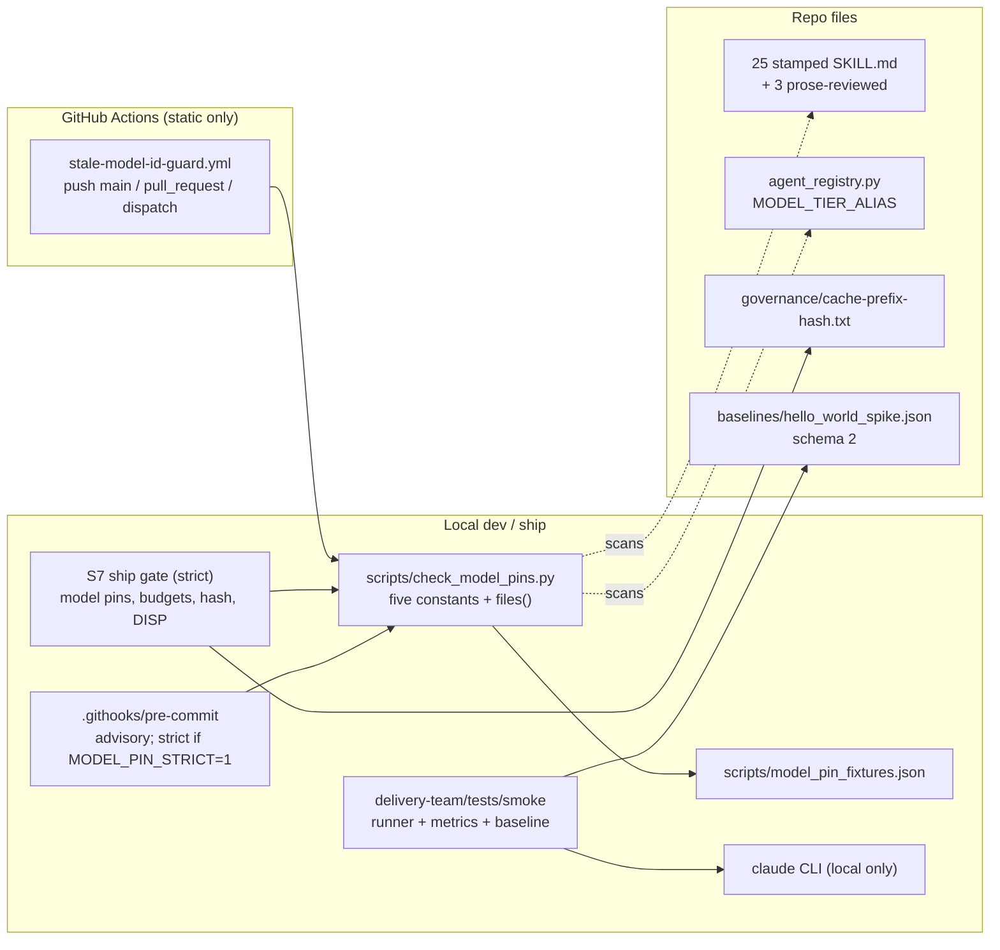
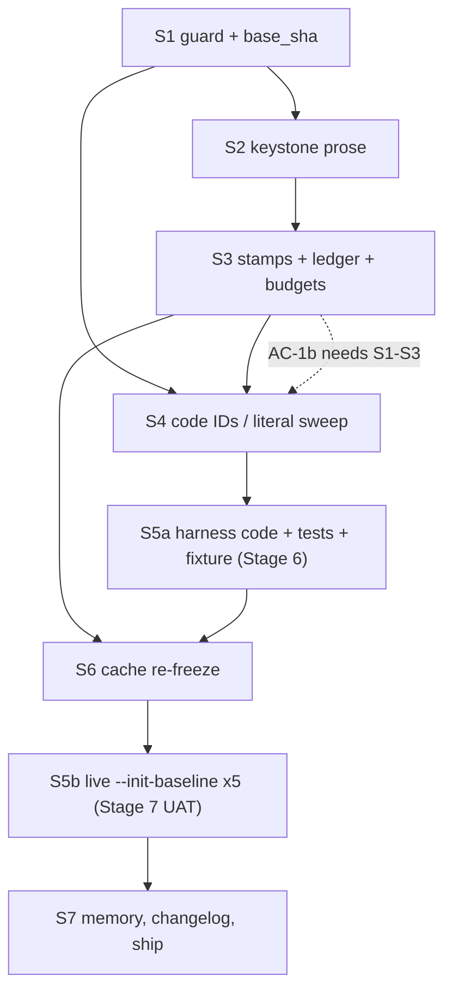

<!-- run: run-2026-05-28-o48m -->
# Architecture: Latest-Model References (BACKLOG-108)

**Stage**: 4 Architect, LIGHT depth (single coherent doc plus 5 ADRs, no debate)
**Role / task**: Solution Architect (Elrond) / design. Recommended model class: synthesis.
**Inputs**: PRD Revision 6 (`.delivery/artifacts/02-refine/po/prd.md`), `constraints.yml`, BACKLOG-108, memory topic `latest-model-references.md`, round-2 DoD reviews (architect, QA), stage and hot lessons, and the repository sources named in section 11.
**ADRs** (all under `.delivery/artifacts/04-architect/adrs/`, status Proposed until DoD):
ADR-lmr-001 cache fingerprint scope; ADR-lmr-002 guard design; ADR-lmr-003 central alias, stamps and line-budget math; ADR-lmr-004 smoke harness capture contract; ADR-lmr-005 dispatch manifest and ship gate.

> The cache fingerprint is a stone we must lift once, and mark clearly, so the road is never repaved for every new release. (Elrond)

## 1. Impact-analysis gate

`.delivery/features/` does not exist (`ls .delivery/features` returns "No such file or directory"). There are no Feature Knowledge Cards, so there are no card-level assumptions to conflict with this design. No assumption conflict exists; nothing to escalate. Existing stale Stage 4 files in `04-architect/` (ADR-001 through ADR-006 series, `architecture-tk3-caveman-lite.md`) belong to earlier runs and were not modified; only the format of `ADR-tk2-001` was consulted.

## 2. Prior Art Analysis

**Summary.** The PRD (about 150 KB, Revision 6) already contains the design: a version-free convention, a guard script with five patterns, a central tier-alias dict, version-free stamps, a parser fix and real-shape fixture for the smoke harness, a cache re-freeze and a ship procedure. It is unusually well specified: patterns are given verbatim, ACs are runnable, and the failure modes discovered by earlier reviews are baked in. This stage validates feasibility against the code, fills the genuinely open questions (OQ-3, OQ-4, OQ-5, OQ-11, partly OQ-12), pins the S5 interface, and proves the line-budget and cache arithmetic with real commands. It changes no PRD requirement; items that look unsound are flagged in section 9 with evidence.

**Classification** (Decision Already Made means the architect does not propose an alternative):

| PRD element | Classification | Rationale |
|---|---|---|
| Refer to the latest of a family, never pin (BINDING-0.1) | Decision Already Made | User decision 2026-09-20 |
| Single guard script `scripts/check_model_pins.py`, five constants, scope `git ls-files --cached --others --exclude-standard`, no exemptions, marker banned | Decision Already Made | BINDING-0.3, FR-1.2, FR-1.6 |
| Workflow triggers push to main, pull_request, workflow_dispatch; no `paths:` filter | Decision Already Made | FR-1.1 |
| Pre-commit hook advisory, strict with `MODEL_PIN_STRICT=1`; local strict ship gate | Decision Already Made | FR-1.5 |
| `MODEL_TIER_ALIAS` one dict with `opus|sonnet|haiku` | Decision Already Made | FR-4.1 |
| Stamps `latest` / `rev-1` / `last_audited`; 9 unstamped files stay unstamped | Decision Already Made | FR-3.2, FR-3.3 |
| Prose review narrowed to 3 SKILL.md; stamps on 25 | Decision Already Made | OQ-9 = NARROW, BINDING-6.1 |
| Smoke: `--model opus`, `--effort xhigh`, `--max-budget-usd`, observed model, `unknown` = failure, real-shape fixture, producer/validator separation | Decision Already Made | FR-5.x, BINDING-4.x |
| Ship: squash-rebase, ff-merge, push origin/main, no PR; local-only smoke | Decision Already Made | BINDING-5.1, 4.6 |
| One Role = One Sub-Agent | Decision Already Made | BINDING-5.4 |
| Story order S1 to S7 | Decision Already Made | BINDING-2.5 |
| Cache fingerprint scope | Open Question (OQ-3) | ADR-lmr-001 |
| Where `dod_validators` counts live; AC-DISP stage list | Open Question (OQ-4) | ADR-lmr-005 |
| `xhigh` vs `high` | Open Question (OQ-5) | section 7 |
| `model: sonnet` in delivery-flow | Open Question (OQ-11) | ADR-lmr-003 A5 |
| S5 function interfaces, `model_usage` dynamic keys, schema version, budget-stop mapping | Open Question (round-2 F2, F4, F6, F7) | ADR-lmr-004 |
| Base ref for pre-ship ACs | Open Question (round-2 F8) | ADR-lmr-005 item 7 |

**Deviation protocol**: no Decision Already Made is replaced. Two additions are proposed as recommendations for PO confirmation at Plan, not as changes: an optional `pre-push` hook (ADR-lmr-002 D8) and the multi-manifest form of AC-DISP (ADR-lmr-005). Both keep the PRD reading valid if declined.

**Domain discovery**: satisfied by the PRD and Stage 2 (PO owns the problem; the Stage 4 stage is light). No discovery interview was re-run.

## 3. Architecture at a glance

Seven concerns, seven stories, one repo, no runtime service. The system is a set of static checks, a handful of edited text files, and a local test harness that drives the `claude` CLI.



Data flow of the guard: `git ls-files --cached --others --exclude-standard` gives the file set; each line is classified once (`pin`, `stamp`, `prose`); the last stdout line is `guard-scope hits N files M`; exit 1 when N above 0.

Data flow of the smoke harness: `run_smoke.py` builds `claude --print --output-format stream-json --verbose --model opus --effort xhigh --max-budget-usd 3.00`, tees events to `stream.jsonl`, `parse_stream` folds them into `Metrics` (model from `system/init`, cost from `result.total_cost_usd`, dispatches by distinct `message.id`), `report.py` writes `report.json`, and `baseline.py` either compares against a schema-2 baseline (WARN on `model moved`) or, with `--init-baseline`, writes a fresh one with the 5 raw streams and their hashes.

## 4. Story-by-story design

### S1 Guard (ADR-lmr-002)
Files: new `scripts/check_model_pins.py`, `scripts/model_pin_fixtures.json`; rewrite `.github/workflows/stale-model-id-guard.yml`; edit `.githooks/pre-commit`. Route hook and workflow edits through `plugin-dev:hook-development` (FR-1.4). The script copies the five PRD constants verbatim. The S1 developer also records `base_sha` (ADR-lmr-005 item 7). Any doc S1 writes about the guard contains no version examples (self-scan rule).

### S2 Keystone prose (ADR-lmr-003, ADR-lmr-001)
Three dispatches, one per keystone, file-disjoint: (a) `delivery-flow/SKILL.md` plus the mirror `orchestrator-doctrine.md`, (b) `prompt-engineer/SKILL.md`, (c) `product-delivery/SKILL.md` (no version mention; ledger only; note `product-delivery` is 300/300 so any prose edit there must be net zero).

**5.2 Exact delivery-flow rewrite (proved line-neutral).** Simulated on a scratch copy (not applied). The two version blocks are 4 lines each and stay 4 lines each. Proposed text (the developer may reword, but must keep the four lines per block, the conditional phrase, and the cap sentence on one line; every rewritten line must differ from its source line, or AC-2.1 counts it as still present):

Block 1, replaces lines 27 to 30:
```
> **Model awareness (latest Opus):** The latest Opus delegates to sub-agents more readily
> than prior models, so state delegation scope explicitly. "One Role = One Sub-Agent"
> (Phase 4) is a **behaviourally load-bearing** gate, not a style preference. Fused
> roles and over-spawning both break it; fusion is the highest-confidence regression mode.
```
Block 2, replaces lines 273 to 276:
```
> **Model awareness (latest Opus):** When the orchestrating session runs the latest Opus,
> silent sub-agent fusion or over-spawning is the highest-confidence regression mode.
> `dod_validators.<stage>` is the cap: at most that many subagents per stage, on any model;
> the dispatched roles at each DoD checkpoint MUST equal the length of that list.
```
Simulation results (commands run, output recorded): line count 499 to 499; bytes 28,616 to 28,684; guard hits in the rewritten file 0 (all five regexes); AC-2.5 prints cond True, cap True, no comment lines; AC-2.1 prints `0 source lines still present`; `check_skill_budgets.py --check <file> --tier A` PASSED. The behavioural claim in block 1 ("delegates ... more readily than prior models") is the doc-verified anchor (PRD section 8; https://platform.claude.com/docs/en/build-with-claude/prompt-engineering/prompting-claude-opus-5, quote recorded there, not re-fetched at this stage). The direction is the reverse of the older "dispatches fewer sub-agents" claim, which stays refuted and never ships (FR-2.1).

Doctrine mirror (`orchestrator-doctrine.md`, lines 77 to 82, no tier key, no budget): same content as block 1 under a family heading (for example `## Model Awareness Note (latest Opus)`), review together with delivery-flow so the two cannot diverge. It is outside the fingerprint (ADR-lmr-001 decision 2).

`prompt-engineer/SKILL.md`: unbudgeted (no tier key), 520 lines. Rewrite the named lines (FR-2.1 list, including 363, 365, 371, 420); Pattern 4.1 becomes a config-read pattern (`MODEL_ID = os.environ["CLAUDE_MODEL_ID"]`, FR-2.2); the "Model-specific optimisation" block becomes `latest Opus`; effort advice says "start from the API default and tune on your own evals", never a per-version level (docs: effort levels are recalibrated between releases, PRD section 8). The claim "Claude Code default effort is `high`" stays unshipped (OQ-8 UNVERIFIED).

### S3 Stamps and ledger (ADR-lmr-003)
25 files, value-only edits, zero line delta (proved per file in ADR-lmr-003). `last_audited` = the S3 DoD date; `fitness_review_due` reset in the 11 files that have it to a date after today and within 90 days (2026-12-19 for today's date). The prose ledger `06-development/prose-review-ledger.tsv` has exactly 3 rows. S3 owns AC-6 (budget exit 0).

### S4 Code IDs and literal sweep (ADR-lmr-003)
`MODEL_TIER_ALIAS`, the three provenance comments, `flow_orchestrator.py:663` comment, `conftest.py` four fixture IDs, two doc fixture IDs, `telemetry-schema.md:36`, `prompt-engineer/SKILL.md:368` (already S2). The closing run is AC-1b: `guard-scope hits 0 files 0`. S4 must leave `python3 -m pytest delivery-team/tests/smoke/tests/test_meta.py` at 3 passed. The `conftest.py` edit changes only the `"model"` string values; its `schema_version "1"` fixtures stay.

### S5 Smoke harness (ADR-lmr-004)
Producer files: `lib/metrics.py`, `lib/runner.py`, `lib/report.py`, `lib/aggregator.py` (pass-through only), `lib/baseline.py`, `run_smoke.py`. Validator files: `tests/test_model_capture.py`, `tests/fixtures/stream_real_shape.jsonl` and `.provenance.txt`. Interface, ordering (stub, red validator, fix), schema 2, budget-stop mapping and the init-baseline rule are in ADR-lmr-004. The fixture's `real_shape` failure message names the defect it catches.

Baseline JSON after capture (schema 2, illustrative; the value under `model_resolved` is observed at capture time and is a `.json`, so outside the guard):
```json
{
  "schema_version": "2",
  "scenario": "hello_world_spike",
  "sample_status": "active",
  "n_samples": 5,
  "model_requested": "opus",
  "model_resolved": ["<observed system/init model>", "<other observed models, if any>"],
  "model_pin_env": {"ANTHROPIC_MODEL": null, "ANTHROPIC_DEFAULT_OPUS_MODEL": null,
                    "ANTHROPIC_DEFAULT_SONNET_MODEL": null, "ANTHROPIC_DEFAULT_HAIKU_MODEL": null},
  "effort": "xhigh",
  "host_context": {"bare": false, "claude_code_version": "<observed>"},
  "samples": [{"stream_file": ".delivery/artifacts/06-development/smoke-streams/sample-1.jsonl", "stream_sha256": "<hash>"}],
  "metrics": {
    "cost_usd": {"mean": 0.0, "hard_max": 3.0, "classification": "hard"},
    "tokens.cache_hit_ratio": {"classification": "advisory"},
    "model_usage.<model>.dispatches": {"classification": "informational"}
  }
}
```
(The `mean` shown for cost is a placeholder; AC-5.4 requires the captured value to be above 0.)

### S6 Cache re-freeze (ADR-lmr-001)
After S3 and any DoD rework, one command rewrites `governance/cache-prefix-hash.txt` and AC-6.1 must print `MATCH`. The hash changes because the frontmatter (first byte difference at 854) and two blocks change; that is deliberate and recorded.

### S7 Memory, changelog, ship (ADR-lmr-005)
`## Run outcome` in the memory topic, a CHANGELOG entry naming BACKLOG-108 (CHANGELOG may name retired IDs, it is excluded from the guard), then the ordered ship gate in ADR-lmr-005 item 8.

## 5. Sequencing, dependency graph and parallelism (BINDING-2.5, BINDING-4.5)

True dependencies (an arrow means "must finish first"):



The PRD order S1, S2, S3, S4, S5, S6, S7 is a valid topological order and stays the default. Findings:
- S4 closes AC-1b (zero hits repo-wide), which needs S1, S2, S3 landed, so it is correctly after S3, although its edits are file-disjoint from S2 and S3.
- S5a depends on S4 only through `conftest.py` (synthetic IDs, so `test_meta.py` stays green) and on S1 (new S5 files fall inside the guard scope).
- S6 depends only on S3 for content, but stays after S5 by PRD order; it is safe because S5 changes no SKILL.md.
- S5b is expensive and reads SKILL.md content indirectly; run it after S6 so the baseline measures the final prose (Architect F8).

**Parallel windows** (only where files are disjoint; BINDING-5.4 and Dispatch-Id evidence still apply to each dispatch):
1. Inside S2: the three keystone dispatches touch three different files; they may run in parallel. The `check_skill_budgets.py` run after them is serial.
2. Inside S5a: none. The producer stub, the validator and the producer fix are strictly sequential (red-first; `lib/` stable from validator start to validator end).
3. S4 is file-disjoint from S2 and S3 and could overlap them in a second worktree; the recommendation is NOT to (effort XS, one working tree keeps commit and `Dispatch-Id` hygiene simple, and BINDING-2.5 says strict order). If the Plan wants speed, this is the only safe overlap.
Everything else is sequential. Live capture is never parallel (NFR-6: sequential, one primary model).

**Producer/validator dispatch separation (BINDING-4.5, FR-4.4).** Two independent Agent dispatches, never the same agent id: the producer authors `lib/` and `run_smoke.py`; the validator authors only `tests/test_model_capture.py` and `tests/fixtures/`. Order and observables are in ADR-lmr-004 section 6 and the AC-4.4 additions in ADR-lmr-005 items 6 and 7 (first validator commit is an ancestor of the first fix commit; `Dispatch-Id` trailers cross-checked against the manifest). The S2 prose review follows the same principle at story level: the adversarial reviewer for AC-2.3b is a separate dispatch from the developers who edited the files.

**Where the live baseline runs (needs Plan confirmation).** `.delivery/state.md` records: "Stage 7 UAT: full (includes live --init-baseline 5x ...)", while the PRD closes G5 in S5. Recommendation: Stage 6 delivers S5a (everything except the baseline file and streams; cost about one cheap capture); Stage 7 UAT runs S5b and commits the baseline and streams; S7 ship follows UAT PASS. G5's closing ACs (AC-5.4, 5.5, 5.5c, 5.6) then close at UAT. This changes when G5 closes, not what it requires. It also makes `07-uat` a required AC-DISP stage (ADR-lmr-005). If the Plan keeps the live capture inside Stage 6, nothing else in this design changes.

## 6. Resolution of open questions

| OQ | Resolution |
|---|---|
| OQ-1 | Confirmed by doc (delegates more readily); block 1 above encodes it version-free. |
| OQ-2 | Still UNVERIFIED (no doc source located; not searched exhaustively at light depth). No shipped prose depends on it; keep it out. |
| OQ-3 | ADR-lmr-001: keep whole-file `sha256sum`; `orchestrator-doctrine.md` OUT. |
| OQ-4 | ADR-lmr-005: config `.delivery/config.yml` lines 56 to 63 is the source; stage list `02-refine, 04-architect, 05-plan, 06-development, 07-uat`; manifest per round and per story. |
| OQ-5 | Keep `xhigh` (project choice, BINDING-4.3); it is recorded in the baseline. The docs say the API default is `high` and thinking cannot be disabled at `xhigh` or `max` (PRD section 8). Risk R6 (cost) stands; the cap fails loudly; fall back to `high` only by an explicit decision. Optional `effort moved` WARN. |
| OQ-6 | Open, Developer S5: the registry haiku value is a label; the smoke runner uses `opus` only. |
| OQ-7 | Resolved (PRD). |
| OQ-8 | Open; the runner passes `--effort` explicitly so the Claude Code default is irrelevant. https://code.claude.com/docs/en/model-config (fetched 2026-09-20) discusses default effort held across sessions for named models but no fetched text states the default for the latest Opus. |
| OQ-9 | Resolved NARROW (human). |
| OQ-10 | Resolved by observation; the docs name no init field (https://code.claude.com/docs/en/headless); the fixture pins it. |
| OQ-11 | Confirmed: `model: sonnet` unchanged (ADR-lmr-003 A5). |
| OQ-12 | Michael decides. Architect recommendation: no `--bare` for this run; record `host_context.bare`. New evidence: the headless docs say `--bare` will become the default for `-p` in a future release, so a CLI upgrade can change baseline conditions; re-record the fixture on upgrade (U9). |

## 7. Risks and unknowns the Plan stage must carry

| ID | Risk / unknown | Carry as |
|---|---|---|
| P1 | Live capture placement (Stage 6 vs Stage 7) is unresolved between `state.md` and the PRD | Plan decision; recommendation in section 5 |
| P2 | AC-DISP multi-manifest form (ADR-lmr-005) needs PO acceptance, else fall back to final-round-only | Plan decision |
| P3 | Real stream facts UNVERIFIED: `message.id` on assistant events, repetition across split events, exact budget-stop subtype | Validator red phase settles them; parser has fallbacks |
| P4 | Hook behaviour test in a temp git repo (QA W9): staged pin gives exit 0 by default, exit 1 with `MODEL_PIN_STRICT=1`, zero staged files does not abort under `set -euo pipefail` | S1 AC addition |
| P5 | Guard false positives in `hardware-team/` prose (electronics values, `claude-*-v2` names) and separator loopholes (QA W6, W7) | S1 reports a whole-tree run before closing; PO decision on loophole tightening |
| P6 | Doc rework after the baseline capture invalidates it (F8) | Capture last (section 5); else re-capture or written waiver |
| P7 | Main advances during the run; ACs using `main` shift (F8) | `base-sha.txt` recorded at S1 |
| P8 | `06-dev` vs `06-development` naming; stale files in `06-development/dod/` | Dispatch prompts name the path explicitly |
| P9 | Stale user-local SQLite rows keep the retired ID (`_load_default_agents` skips when rows exist); nothing reads it | Note in the S4 report; no code change |
| P10 | The `## Volatile` comment in delivery-flow contradicts the fingerprint scope | Later wave; not fixed here |
| P11 | Cost of the first uncached read of the re-frozen skill is UNVERIFIED | Accept; not measured |
| P12 | `--max-budget-usd` is checked between turns (UNVERIFIED), so a sample can exceed the cap slightly | Layer-2 post-check enforces NFR-1 |
| P13 | Stage 6 review dispatch load: each story needs manifests and `Dispatch-Id` trailers; the orchestrator must write them as it dispatches | Checklist item in every Stage 6 dispatch prompt |
| P14 | S1 to S3 leave the tree red on the guard workflow until S4; ship is one squashed push so main never sees it | Keep squash; do not push S1 alone |

## 8. PRD items found technically unsound (flagged, not changed)

| # | PRD text | Problem, with evidence | Suggested handling |
|---|---|---|---|
| U1 | FR-7.4 / AC-DISP: one manifest per stage, roles distinct, N equals lines | A second DoD round or seven stories repeat roles. Evidence: `02-refine/dod/` and `04-architect/dod/` hold `-r2` files; `06-development/dod/` holds `S1-S2-*` and `S3-*`. A correct run would fail the AC. | ADR-lmr-005 |
| U2 | OQ-3 and the SKILL.md comment: "prefix is bytes 0..2048" / "ends at end of Phase 3" | Measured: end of Phase 3 is byte 15,479; byte 2048 is inside line 40; governance hash is whole-file (`8c2ebf97...` for `head -c 2048` differs from `43067c9e...` in the file). The design brief's "2048-byte prefix ends at the end of Phase 3" is also false. | ADR-lmr-001 records the measurements |
| U3 | FR-5.7: "`_check_hard_rules` and `_check_advisory_rules` skip `model_usage.*`" | Already true (they only walk fixed keys and `skill_loads.*`); the actual gap is that nothing collects `model_usage.*` into `metrics`, so AC-5.1 can never pass. | ADR-lmr-004 section 3 |
| U4 | FR-5.9 "does not double count the `result` aggregate" | Under-specified: `dispatch_count` and per-model dispatches also double count when one API message is split across several assistant events, and the current parser counts a legacy `result` as a dispatch, which `test_meta.py` relies on. | ADR-lmr-004 section 1 (two-mode parser) |
| U5 | FR-5.6 / `_init_baseline_flow` | `_execute_single_run` loads the old baseline for every sample; with schema 2 and `load_baseline`, init would fail or compare against the invalidated file. | ADR-lmr-004 section 5 |
| U6 | AC-4.4 producer/validator observables | Red-first is not chronological (QA W1); authorship trailers are self-declared (QA W5); `run_smoke.py` is a producer file but AC-4.4 checks only `lib/`. | ADR-lmr-004 section 6, ADR-lmr-005 item 6 |
| U7 | Guard test helper realities | `tests/conftest.py` blocks any `claude` subprocess, and `_claude_cli_version()` calls `claude --version`, so a meta-test calling `init_baseline` or `build_report` unpatched fails with `AssertionError`. Not in the PRD. | ADR-lmr-004 section 6 |
| U8 | R4 rated Low | QA probes (round 2) show `claude-plugins-v2`, `on 6.8 kernels`, `with 4.7 V rail`, `the 4.7 uF cap` flag; hardware-team prose makes Medium the honest rating. | ADR-lmr-002 consequences |
| U9 | OQ-12 / R13 | Docs now say `--bare` will become the default for `-p`; the baseline's conditions can change on a CLI upgrade. | Recorded; `host_context` and fixture re-record |
| U10 | AC-2.1, AC-2.5, AC-4.4, AC-5.9b use the moving `main` ref | Fragile if main advances (F8). | `base-sha.txt` |
| U11 | Design brief and PRD both call Stage 4 "single cache-fingerprint ADR" | Five decisions are load-bearing; the ADR set is five files, not one. Not a defect, a scope note. | This document |

## 9. Non-functional traceability

| NFR | Design element |
|---|---|
| NFR-1, NFR-2, NFR-3 | Two-layer cap; sequential samples; `hard_max` unchanged |
| NFR-4 | Zero line delta proved (ADR-lmr-003); S3 runs `check_skill_budgets.py` |
| NFR-5 | Fixtures with both floors, run in both engines |
| NFR-8 | Workflow calls the script only; no `pip install`, no `claude` |
| NFR-9 | Meta-tests use fixtures only; no subprocess to `claude` |
| NFR-11 | Family-agnostic `PIN_RE`; `synthetic-future` fixtures |
| NFR-12 | One Python dict plus nine vocabulary-checked frontmatter lines |
| NFR-13 | Script is one pass over `git ls-files`; PRD measured 0.5 s |

## 10. Verification log (commands run in this stage, worktree root, 2026-09-20)

| Command (abridged) | Result used |
|---|---|
| `wc -c` and `wc -l` on delivery-flow SKILL.md | 28,616 bytes; 499 lines |
| `sha256sum` of the file, `cat governance/cache-prefix-hash.txt`, `git show main:governance/cache-prefix-hash.txt` | all `43067c9e...b8328`, identical |
| `head -c 2048 ... \| sha256sum`; `head -c 15479 ... \| sha256sum`; `head -248 ... \| wc -c` | `8c2ebf97...`, `ac03f1f2...`, 15,479 |
| Python offset scan for `## Phase N` headings | Phase 0 at 1892; Phase 1 at 9477; Phase 2 at 12135; Phase 3 at 13429; Phase 4 at 15479; `## Volatile` at 27209; byte 2048 in line 40; lines 27 to 30 at bytes 1566 to 1886 |
| Scratch-copy simulation of stamps and two blocks (files under `/tmp/lmr/`, tree untouched) | 25 files, 9,056 to 9,056 lines; delivery-flow 499 to 499; +68 bytes; guard hits 0; AC-2.5 True/True; AC-2.1 0 left; new hashes as in ADR-lmr-001 |
| `python3 scripts/check_skill_budgets.py` and `--check <scratch> --tier A/B/C` | `BUDGET CHECK PASSED: 17 file(s) ...` exit 0; scratch checks PASSED, exit 0 |
| `git ls-files` scans; Python census of stamp keys in the 25 files | 25/25 have `model_awareness`, `pattern_library_version`, `last_audited`; 11 have `fitness_review_due` |
| `grep -rn "model_awareness\|pattern_library_version"` (non-`.delivery`) | only `skill-md-header-warn.yml` presence check |
| `claude --version`, `claude --help` (grep flags) | 2.1.278; `--model`, `--effort`, `--max-budget-usd`, `--bare`, `--fallback-model` present |
| `ls .delivery/features` | No such file or directory |
| Reads of `runner.py`, `metrics.py`, `baseline.py`, `report.py`, `run_smoke.py`, `tests/conftest.py`, `tests/test_meta.py`, `agent_registry.py`, `.githooks/pre-commit`, `stale-model-id-guard.yml`, `skill-md-header-warn.yml`, `.delivery/config.yml`, `state.md`, `pipeline-stages.md`, `quality-gates.md` | facts cited in ADR-lmr-002 to 005 |

## 11. Citations and UNVERIFIED items

Fetched this stage (WebFetch, 2026-09-20):
- https://code.claude.com/docs/en/model-config: alias table (`opus`, `sonnet` latest; `haiku` "the fast and efficient Haiku model for simple tasks"); "Aliases point to the recommended version for your provider and update over time. To pin to a specific version, use the full model name ... or set the corresponding environment variable like `ANTHROPIC_DEFAULT_OPUS_MODEL`."; effort levels `low, medium, high, xhigh, max` and `--effort` documented.
- https://code.claude.com/docs/en/headless: "The `system/init` event reports session metadata including the model, tools, MCP servers, and loaded plugins."; "With `--output-format json`, the response payload includes `total_cost_usd` and a per-model cost breakdown"; subagent messages carry `parent_tool_use_id`, `null` for the main conversation; "`--bare` is the recommended mode for scripted and SDK calls, and will become the default for `-p` in a future release."; bare mode never reads OAuth credentials.
- https://code.claude.com/docs/en/agent-sdk/typescript: the summarized fetch lists an `error_max_budget_usd` result subtype and fields `total_cost_usd`, `modelUsage`, `usage`; it was truncated and could not confirm `SDKSystemMessage` fields or `message.id`.

Carried from the PRD (fetched by other stages, not re-fetched here): API has no evergreen alias (platform.claude.com model-ids-and-versions and overview); the latest Opus "delegates to subagents more readily" and effort recalibration (platform.claude.com prompting-claude-opus-5, effort, migration-guide pages).

**UNVERIFIED** (not relied on for a hard requirement): (1) `message.id` presence and split-event repetition on real assistant events; (2) exact budget-stop result subtype string (parser matches `budget` by substring); (3) whether the CLI stops exactly at the budget or between turns; (4) init-event field name beyond the local observation of top-level `model` on CLI 2.1.278; (5) size of the one-time cache cost after re-freeze; (6) OQ-2 doc source for "more literal instruction following"; (7) Claude Code default effort for the latest Opus; (8) `haiku` alias resolving to the latest Haiku (docs do not say "latest").

## 12. Handoff notes for Plan and Development

- Dev DoD validators for S6 must re-run the three cache commands and paste the output (memory lesson: cache-prefix ADRs need runs-the-command).
- Every dispatch prompt for a SKILL.md edit starts with the `plugin-dev:skill-development` acknowledgement; hook and workflow edits with `plugin-dev:hook-development` (BC-01).
- Every producer and validator commit carries `Dispatch-Id`; the orchestrator writes the per-round manifests as it dispatches (P13).
- The S2 developer runs `wc -l` on delivery-flow after the edit and pastes it; it must print 499 (500 is the cap).
