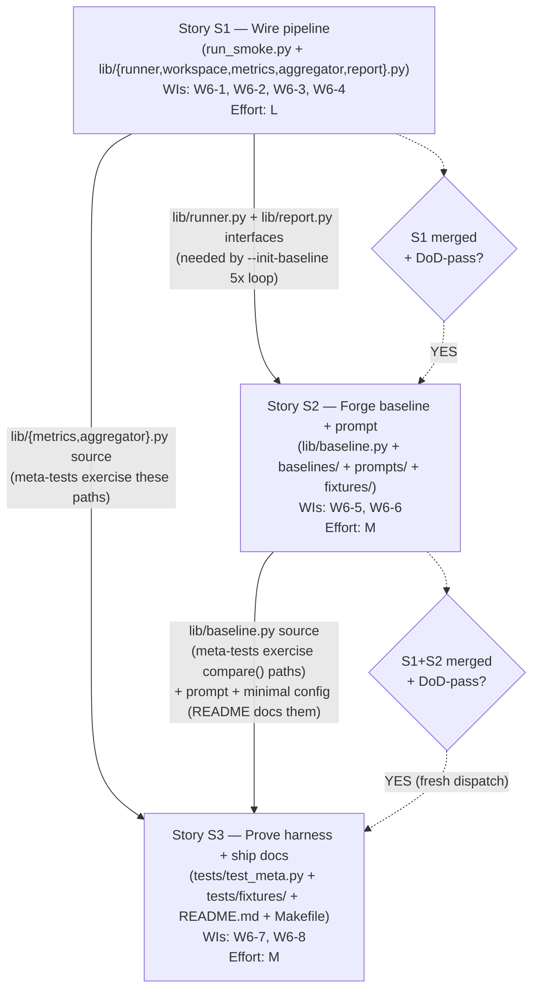

<!-- run: run-2026-05-13-tk5 -->
<!-- author: Celebrimbor (Solution Architect, Stage 5 light, step 2) -->
<!-- backlog: BACKLOG-106 -->
<!-- artifact: implementation sequencing -->
# Implementation Sequencing — BACKLOG-106 Smoke-Test Runner

> *"Let us forge something that will endure beyond the ages."* — Celebrimbor

Me lay forging order for three stories. S1 first. Then S2. Then S3 in fresh hands. Producer-validator binding holds. No parallel inside one dispatch; cross-dispatch parallel only when S1 fully merged AND DoD-pass.

---

## 1. Dependency DAG



**Edges read**:
- S1 → S2: S2's `lib/baseline.py` `compare()` consumes the `report.json` schema produced by S1's `lib/report.py`. The `--init-baseline` 5× loop is wired into S1's `lib/runner.py` but its loop semantics live in S2.
- S1 → S3: S3's meta-tests fault-inject against S1's `lib/metrics.py` (malformed-stream) and S1's `lib/aggregator.py` (workspace-fixture parsing).
- S2 → S3: S3's meta-tests exercise S2's `lib/baseline.py` `compare()` paths; S3's README documents S2's prompt + minimal config fixture.

S2 and S3 share no file scope, but S3 transitively depends on both. S3 is NOT runnable until S2 lands because two of three meta-tests target S2 surfaces.

---

## 2. Per-Story Implementation Order

| Order | Story | Rationale (file-dependency chain) |
|-------|-------|-----------------------------------|
| **1st** | S1 — Wire pipeline | Entry story. No upstream files. Builds `lib/` foundation: `workspace.py` → `runner.py` → `metrics.py` → `aggregator.py` → `report.py`. Schema in `report.py` is the contract S2's `baseline.py` consumes. The `--dry-run` artifact triplet (`report.json`, `summary.md`, `stream.jsonl`) is what S3's fixture corpus mirrors. |
| **2nd** | S2 — Baseline + prompt | `lib/baseline.py` directly imports `Metrics` shape and reads `report.json` written by S1's `lib/report.py`. The `--init-baseline` 5× loop is dispatched through S1's `lib/runner.py` (concurrency-of-1 enforced there). `baselines/hello_world_spike.json` is computed from 5 reports S1 emits; cannot exist before S1. `prompts/hello_world_spike.txt` and `fixtures/delivery_config_minimal.yml` are standalone but logically pair with S2 baseline-capture (the prompt feeds the runner that produces the baseline; the config fixture is installed into the mktemp HOME by S1's `lib/workspace.py`). |
| **3rd** | S3 — Meta-tests + docs | Two of three meta-tests target S1 modules (`lib/metrics.py` malformed-stream injection; `lib/aggregator.py` fixture-workspace parsing). One meta-test targets S2's `lib/baseline.py` `compare()`. README documents S1 flags + S2 baseline workflow. Makefile `smoke` target invokes S1's CLI. S3 has zero new surface for S1/S2 to consume — pure validator side. |

**Internal sequencing within S1** (informs Dev's per-file order):

```
1. lib/workspace.py    (no internal deps; mktemp HOME + plugin install)
2. lib/runner.py       (imports workspace; spawns subprocess; capability probe)
3. lib/metrics.py      (pure functions; no S1-internal deps; consumed by report)
4. lib/aggregator.py   (reads workspace artifacts written by subprocess; no metrics import)
5. lib/report.py       (imports Metrics from metrics; merges with aggregator dict)
6. run_smoke.py        (CLI wiring; imports runner + report)
```

`lib/baseline.py` (Story 2) imports the `report.json` schema as a JSON contract — it does NOT import from `lib/metrics.py` directly. Baseline depends on metrics by data contract, not by Python import. Keeps the validator surface clean.

---

## 3. Module-Import Map

| Module | Story | Internal imports (within `lib/`) | External reads (filesystem) | Exposes (for downstream) |
|--------|-------|----------------------------------|------------------------------|---------------------------|
| `lib/workspace.py` | S1 | — | `<repo>/delivery-team/` (for `--plugin-dir` or copy-into-HOME); `fixtures/delivery_config_minimal.yml` (S2) | `mktemp` HOME path; plugin-load strategy; minimal config installed |
| `lib/runner.py` | S1 | `lib.workspace` | `claude --help` (capability probe); spawns `claude` subprocess | subprocess handle; `stream.jsonl` tee; `outcome.{success,exit_code,reason}` |
| `lib/metrics.py` | S1 | — (pure functions) | `stream.jsonl` events | `Metrics` dataclass: `tokens.*`, `model_usage[]`, `cost_usd`, `wall_clock_seconds`, `dispatch_count` |
| `lib/aggregator.py` | S1 | — | `<workspace>/.delivery/telemetry/skill-loads.jsonl`; newest `run-summary-*.json`; `<workspace>/.delivery/state.md`; fallback: `delivery-team/hooks/telemetry_run_summary.py` | merged dict: `skill_loads[]`, `pipeline.{stages_completed, stories_completed, dispatch_count, defects_logged}` |
| `lib/report.py` | S1 | `lib.metrics` (Metrics dataclass) | reads `Metrics` + aggregator dict in-memory | writes `report.json`, `summary.md`, `stream.jsonl` to `artifacts/<utc-timestamp>/` |
| `run_smoke.py` | S1 | `lib.runner`, `lib.report` | CLI args | exit code; artifact triplet path |
| `lib/baseline.py` | S2 | — (consumes `report.json` as JSON contract, not Python import) | `baselines/hello_world_spike.json`; one `report.json` per `compare()` call | `CompareResult(exit_code, hard_failures[], advisory_warnings[])`; mirrors `scripts/check_skill_budgets.py` exit convention |
| `baselines/hello_world_spike.json` | S2 | n/a (data file) | written by S2 after S1's `--init-baseline` 5× loop produces 5 reports | consumed by `lib/baseline.py:compare()` |
| `prompts/hello_world_spike.txt` | S2 | n/a (data file) | read by S1's `lib/runner.py` and piped on subprocess stdin | drives the hello-world delivery-flow run inside the mktemp HOME |
| `fixtures/delivery_config_minimal.yml` | S2 | n/a (data file) | read by S1's `lib/workspace.py` and installed into `<tmpdir>/<workdir>/.delivery/config.yml` | minimal config for the hello-world pipeline |
| `tests/test_meta.py` | S3 | imports `lib.metrics`, `lib.baseline`, `lib.aggregator` AT TEST RUNTIME ONLY (not at fixture-authoring time per AC-S3-07) | `tests/fixtures/` | 3 pytest functions, < 5 sec wall-clock, no `claude` spawn |
| `tests/fixtures/` | S3 | n/a (data files) | authored from PRD + BACKLOG + architecture-doc contract ONLY (BC-03) | malformed-stream `.jsonl`, hard-fail + advisory-warn synthetic `.json` reports, workspace-shape fixture (`skill-loads.jsonl` + `run-summary-*.json` + `state.md`) |
| `README.md` | S3 | n/a (doc) | documents S1 flags + S2 baseline workflow + binding memory file path | maintainer entry point |
| root `Makefile` | S3 | n/a (build file) | invokes `run_smoke.py` (S1) | `make smoke` target |

**Key observation**: `lib/baseline.py` consumes `report.json` as a *JSON contract* (file-based), not as a Python import. This decouples S2 from S1's internal Python API and keeps the producer/validator boundary clean — S3 can write synthetic `report.json` fixtures from the architecture-doc §5 schema without ever reading S1's source.

---

## 4. Parallel-Dispatch Annotation

**Config**: `pipeline.max_parallel_agents: 3` permits up to 3 concurrent Dev sub-agents.

**Per-story dispatch assignment** (from PO stories.md §Cross-story producer-validator summary):

| Story | Dispatch | Role |
|-------|----------|------|
| S1 | Dispatch A | producer |
| S2 | Dispatch A (SAME as S1) | producer |
| S3 | Dispatch B (DIFFERENT from A) | validator |

**Can S2 and S3 run in parallel?**

**NO** — and not because of the parallel-agent budget, but because of two binding constraints:

1. **PO decomposition rule (stories.md §S1 Constraints)**: "Story 1 Dev dispatch may also be assigned Story 2 (per BACKLOG-106 §Story Decomposition: 'Stories 1+2 to one Dev dispatch')." S1 and S2 are co-authored by Dispatch A sequentially within one dispatch. Parallelism inside Dispatch A is not on the table — one dispatch = one execution stream.
2. **Producer-validator separation (BC-03, validated:5)**: Dispatch B (S3) MUST author fixtures from PRD/BACKLOG/architecture-doc contract ONLY and MUST NOT read `lib/metrics.py` or `lib/baseline.py` source while authoring. If S3 launches while S2 is still in-flight, the meta-test author has no stable `lib/baseline.py` contract to validate against — only a moving target — and may correctly write fixtures against an interface that drifts before merge. The validator must wait for a frozen contract.

**Gate condition for launching S3** (sequential gate, not parallel):

```
LAUNCH_S3 ⇐ (S1 merged ∧ S1 DoD-pass) ∧ (S2 merged ∧ S2 DoD-pass)
```

**Concretely**: Stage 6 orchestrator dispatches Dispatch A with S1+S2 as a single ordered work unit. After Dispatch A returns and Stage 6 DoD-validates the S1+S2 artifacts (acceptance criteria green, `make smoke -n` resolves, fixtures install cleanly), Stage 6 dispatches a fresh Dispatch B with S3 scope. The two dispatches are sequential, not parallel. The `max_parallel_agents: 3` budget is unused by this initiative — sequential isolation matters more than wall-clock here.

**Why not exploit the parallel budget anyway?** Even ignoring BC-03, S3's meta-tests cannot be authored without a frozen `Metrics` shape and a frozen `CompareResult` shape. Those shapes are S1 and S2 deliverables. Launching S3 in parallel saves zero wall-clock on the critical path because S3 is fully dependency-blocked by S1+S2 until both shapes are frozen at merge.

---

## 5. Risk Heat-Map

| Story | Biggest implementation risk |
|-------|------------------------------|
| **S1** | **Subprocess plumbing** — `subprocess.Popen` with `HOME` override, stream-json tee, capability-probe selection of `--plugin-dir` vs copy-into-HOME, SIGTERM on timeout, and mktemp scrub verification all interact at the OS boundary. One missed `env=` arg or one leaked file descriptor and the isolation guarantee silently degrades; the post-run stat check on `~/.claude/` is the only fail-loud signal. |
| **S2** | **Regression-detector threshold tuning** — the 2σ advisory band against a 5-sample stddev is statistically thin; one outlier in the 5-run baseline capture can inflate stddev and mask real drift for the first month. The `pipeline.stories_completed != mean` strict-equality rule is fragile if the pipeline ever legitimately completes 0 or 2 stories on a hello-world run (e.g. retrospective spawned a defect story). |
| **S3** | **Pytest fixtures that mirror real workspace shape** — the aggregator-fixture parsing test (AC-S3-04) requires `tests/fixtures/workspace_sample/.delivery/{telemetry/skill-loads.jsonl, telemetry/run-summary-*.json, state.md}` to match the byte-shape that `telemetry.py` and `telemetry_run_summary.py` actually emit. Authored from architecture-doc contract only (BC-03), the fixture may diverge from the real hook output if the architecture doc lags the hook source. Mitigation: Stage 6 Dev for S3 cross-references `delivery-team/hooks/telemetry.py` output schema docstrings (READ-ONLY of the hook, not of S1's parser) while authoring. |

---

## 6. Producer-Validator Dispatch Guidance

**Binding rule (BC-03, validated:5 from past waves)**: Stage 6 orchestrator MUST dispatch S3 meta-tests via a DIFFERENT `Agent` tool call than S1 metrics or S2 baseline.

**Concrete instruction to Stage 6 orchestrator**:

1. **First Agent call** — Dispatch A: scope = S1 + S2 combined.
   - Author `run_smoke.py`, `lib/{runner,workspace,metrics,aggregator,report,baseline}.py`, `baselines/hello_world_spike.json` (via `--init-baseline --dry-run`), `prompts/hello_world_spike.txt`, `fixtures/delivery_config_minimal.yml`.
   - Within Dispatch A, internal order: S1 first (file-by-file per §2 internal sequencing), THEN S2.
   - Dispatch A returns; Stage 6 runs DoD validation. If green, merge S1+S2 artifacts.

2. **Wait for S1+S2 DoD-pass.** Do NOT launch S3 until both S1 and S2 are merged AND DoD-pass. This is a sequential gate, not a parallel one. The validator dispatch needs a frozen contract; an in-flight S1+S2 dispatch produces a moving target.

3. **Second Agent call** — Dispatch B: scope = S3 only. **Fresh context**. Sub-agent prompt for Dispatch B MUST include:
   - PRD reference (`.delivery/artifacts/02-refine/po/prd.md`)
   - BACKLOG reference (`.delivery/backlog/BACKLOG-106-delivery-team-smoke-test.md`)
   - Architecture doc reference (`delivery-team/architecture/smoke-test-architecture.md` §5 schema + §6 baseline shape + §7 detector logic)
   - Explicit prohibition: "**You MUST NOT read `delivery-team/tests/smoke/lib/metrics.py` or `delivery-team/tests/smoke/lib/baseline.py` source while authoring fixtures.** Fixtures are derived from the architecture-doc contract only. You MAY import these modules at test runtime (test bodies); you MAY NOT inspect their source while authoring fixture content."
   - The hook output schemas in `delivery-team/hooks/telemetry.py` and `delivery-team/hooks/telemetry_run_summary.py` are PERMITTED reads (these are the real producers of the workspace artifacts S3's aggregator-fixture mirrors; reading them is not a BC-03 violation since they are not S1's parser).

4. **Why sequential, not parallel, maximizes fresh-context isolation**:
   - A parallel dispatch shares wall-clock with Dispatch A but the validator's *prompt context* is still isolated. So parallel does not break BC-03 on its own.
   - HOWEVER, parallel dispatch forces Stage 6 orchestrator to hand Dispatch B a non-frozen contract ("S1+S2 are still in flight; here is the architecture-doc shape; trust it"). If Dispatch A discovers a contract gap mid-flight (e.g. an extra `Metrics` field needed for the malformed-event warning count), the architecture-doc updates AFTER Dispatch B has already authored fixtures against the old shape. Dispatch B's fixtures then silently diverge from the merged S1+S2 interface.
   - Sequential dispatch lets Stage 6 update the architecture doc (if needed) at the S1+S2 merge gate, then hand Dispatch B a stable contract. This is the same producer-validator discipline that surfaced 5 meta-test defects in earlier initiatives — past-wave evidence (validated:5) shows the wait is worth it.
   - **Recommendation**: Stage 6 orchestrator dispatches Dispatch A, awaits S1+S2 merge + DoD-pass, THEN dispatches Dispatch B. Total wall-clock cost: one extra round-trip. Total context-isolation benefit: validator sees only the frozen, merged, DoD-validated contract.

5. **Stage-7 UAT verification** (per ADR-tk5-001 §Producer-Validator Separation): git log MUST show two distinct Dev commits (or two distinct commit authors within a squash) for the producer (S1+S2) and validator (S3) halves. AC-S3-07 codifies the post-hoc check.

---

## 7. Summary Table — Stage 6 Dispatch Plan

| Step | Stage 6 action | Dispatch | Story scope | Wait condition before next step |
|------|----------------|----------|-------------|----------------------------------|
| 1 | First `Agent` call | A (producer) | S1 → S2 (sequential within dispatch) | Dispatch A returns + S1+S2 DoD-pass + merge |
| 2 | Stage 6 DoD validation | (orchestrator, not a Dev dispatch) | S1+S2 artifacts | DoD green; architecture doc updated if any contract gap surfaced |
| 3 | Second `Agent` call (FRESH context) | B (validator) | S3 (meta-tests + README + Makefile) | Dispatch B returns + S3 DoD-pass + merge |
| 4 | Stage 6 final validation | (orchestrator) | All three stories merged | Stage 7 UAT can begin |

`pipeline.max_parallel_agents: 3` is unused by this initiative. Sequential producer→validator dispatch is the correct choice for this work shape.

---

## 8. Traceability

| Sequencing decision | Source |
|---------------------|--------|
| S1 blocks S2 + S3 | PO stories.md §S1 "Blocks: S2, S3" + architecture §3 component map |
| S2 blocks S3 | PO stories.md §S3 "Depends on: S1, S2" |
| S1+S2 to one Dispatch A; S3 to fresh Dispatch B | PO stories.md §Cross-story producer-validator summary; ADR-tk5-001 §Producer-Validator Separation |
| Sequential, not parallel, between Dispatch A and Dispatch B | BC-03 + past-wave evidence (validated:5) + frozen-contract argument |
| `pipeline.max_parallel_agents: 3` unused | This artifact §4 — work is fully dependency-blocked |
| Internal S1 file order (workspace → runner → metrics → aggregator → report) | This artifact §2 — derived from architecture §3 component map dependency edges |
| Baseline depends on metrics by JSON contract, not Python import | Architecture §5 schema + this artifact §3 import map |
| S3 fixtures from contract only, not S1+S2 source | BC-03 + AC-S3-07 + ADR-tk5-001 §Producer-Validator Separation |

---

*— Celebrimbor, Stage 5 Architect (sequencing), run-2026-05-13-tk5. Three stories, one DAG, one fresh-context validator gate. Forged in order so the seams hold.*
