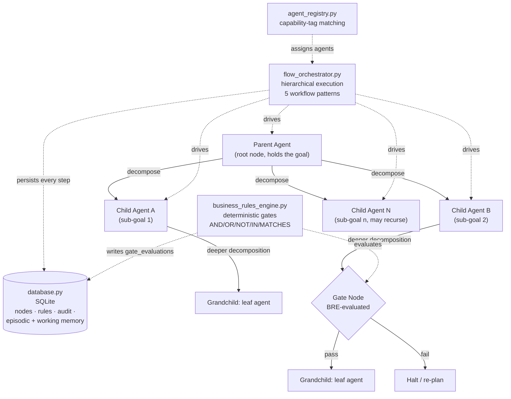
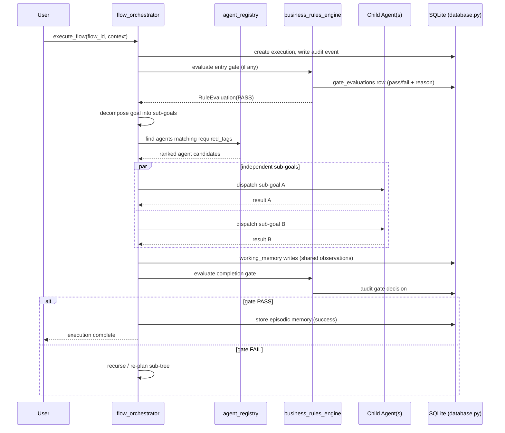

# Agentic Flow Builder — Architecture

> *Celebrimbor, Lord of Eregion, at the anvil. What follows is not a thing of
> rumour — every script cited I have examined by hand. If I name a stone, the
> stone is there.*

## 1. Purpose

This plugin guides smiths in forging **dynamic agentic flows** — long-horizon
workflows where a parent agent decomposes a goal into sub-goals, dispatches
children to solve them, and proves correctness at deterministic gates. It
combines three traditions:

- **ReAcTree** — hierarchical tree decomposition for long-horizon planning
- **Anthropic's workflow patterns** — prompt chaining, routing, parallelization,
  orchestrator-workers, evaluator-optimizer
- **A Business Rules Engine (BRE)** — rule-based gates, *never* AI guesswork,
  so decisions are auditable and reproducible

Unlike `delivery-team` (which prescribes a 7-stage delivery pipeline) or
`mtg-commander` (a fixed 4-stage adversarial pipeline), this plugin is a
**toolkit and pattern guide** for building *your own* flows.

## 2. Core Concept: ReAcTree

A flow is a tree. The **root** receives a goal. Each interior node either
solves its sub-goal directly (an *agent node*), orchestrates children under an
Anthropic pattern (a *control-flow node*), or evaluates a deterministic gate (a
*gate node*). Children may themselves decompose — recursion all the way down,
until every leaf is a concrete, agent-shaped task. Gates at decision
boundaries use the BRE so the tree's branching is **rule-driven, not
model-driven**, which makes the whole work audit-worthy.

## 3. Component Overview

Unlike some of the sparser plugins in this marketplace, this one carries its
own reference implementation. Every file below was verified to exist:

| Component | File | Role |
|---|---|---|
| Pattern guide | [`skills/flow-builder/SKILL.md`](skills/flow-builder/SKILL.md) | The skill Claude loads — invocation protocol, patterns, recipes |
| SQLite DAL | [`scripts/database.py`](scripts/database.py) | Flow/node/rule schema, execution tracking, audit logs, dual-memory tables |
| Rules engine | [`scripts/business_rules_engine.py`](scripts/business_rules_engine.py) | Deterministic AND/OR/NOT/IN/MATCHES evaluator — gate decisions |
| Orchestrator | [`scripts/flow_orchestrator.py`](scripts/flow_orchestrator.py) | Hierarchical execution, five workflow patterns, episodic + working memory |
| Registry | [`scripts/agent_registry.py`](scripts/agent_registry.py) | Dynamic agent discovery, capability-tag matching, performance tracking |
| Worked example | [`references/complete_example.py`](references/complete_example.py) | End-to-end flow assembly, for smiths learning the hammer |
| License | [`LICENSE.txt`](LICENSE.txt) | MIT |

CLAUDE.md mentions these four core modules (`database.py`,
`business_rules_engine.py`, `flow_orchestrator.py`, `agent_registry.py`) as
shared across this plugin and `prd-quality-gate-flow/`. I verified: they live
**here**, in `agentic-flow-builder/scripts/`. The sister plugin carries its
own flat-layout copies (with added `gate_definitions.py`, `stage_definitions.py`,
`schema.py`, `shared.py`) — they are siblings, not one importing the other.
This plugin is the **pattern guide and reference implementation**; the sister
is a **concrete application of the same pattern** to PRD gating.

### Diagram 1 — Component Layout (flowchart TD)

## 4. Hierarchical Execution Flow

### Diagram 2 — One Flow Execution (sequenceDiagram)

## 5. Deterministic Gates (BRE)

Per CLAUDE.md's architectural stance: *"Business Rules Engine is intentionally
deterministic — gate decisions must be rule-based, not AI-inferred, to ensure
consistent and auditable workflow outcomes."* The engine in
`scripts/business_rules_engine.py` supports **AND / OR / NOT / IN / MATCHES /
IS NULL** and priority ordering. Same input, same decision — always. No
temperature, no hallucination. For regulated work, this is the only way the
tree can be trusted.

## 6. Memory Model

Two stores, both in the SQLite schema defined by `database.py`:

- **Episodic memory** — past goal signatures + their outcomes. On a new goal,
  the orchestrator retrieves similar prior executions as in-context examples.
  Stored by default only on success (configurable).
- **Working memory** — key/value observations shared across nodes *within one
  execution*. Saves threading state through parameters; downstream nodes read
  what upstream nodes wrote.

All execution steps, gate evaluations, and agent dispatches are appended to
the audit log — immutable by convention, queryable by `rule_id`, `status`,
`execution_id`, or time window.

## 7. Relationship to Sibling Plugins

**`delivery-team/`** uses similar orchestration *ideas* at a higher level — a
7-stage delivery pipeline with its own DoD, adversarial-review, and
debate/consensus patterns. It does not share this SQLite/BRE core; its
coordination is prose-driven SKILL.md instructions. **`prd-quality-gate-flow/`**
is the direct sibling: it carries its own flat-layout copy of the same four
core modules, specialised for a 7-gate PRD workflow with 8 fixed agents. Read
it to see this pattern applied end-to-end.

## 8. Extension Points

| Extend with... | How |
|---|---|
| **A new flow type** | Build a tree via `database.FlowDatabase.create_flow` + `create_node`; attach rules; execute. See `references/complete_example.py`. |
| **A new agent type** | Register via `agent_registry` with capability tags; hot-reload is supported (SKILL.md §0). |
| **A new gate** | Add a row to `business_rules` with an AND/OR/NOT condition tree and a priority; no code changes required. |
| **A new workflow pattern** | Extend `flow_orchestrator.py`'s control-flow dispatcher — the five Anthropic patterns are already implemented as precedent. |

## 9. See Also

- [`skills/flow-builder/SKILL.md`](skills/flow-builder/SKILL.md) — authoritative invocation guide and pattern catalogue
- [`references/complete_example.py`](references/complete_example.py) — working end-to-end flow
- [`../prd-quality-gate-flow/README.md`](../prd-quality-gate-flow/README.md) — concrete production-shaped usage
- Root [`CLAUDE.md`](../CLAUDE.md) — "Agentic flow core components" and "Business Rules Engine" notes

---

*Forged in Eregion. If a ring is to bind these flows, let it at least be one whose runes you can read.* — Celebrimbor
