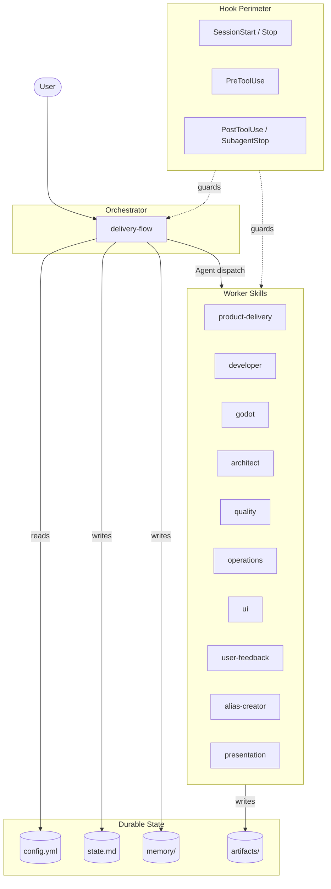
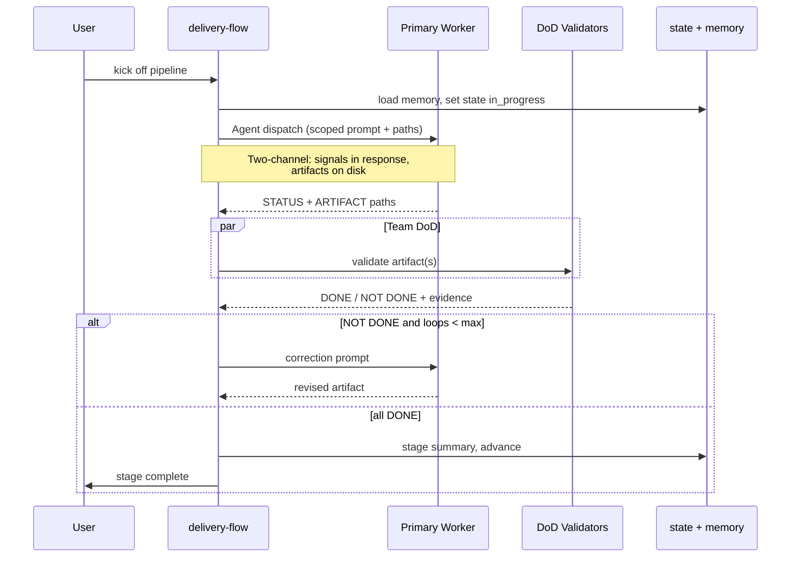
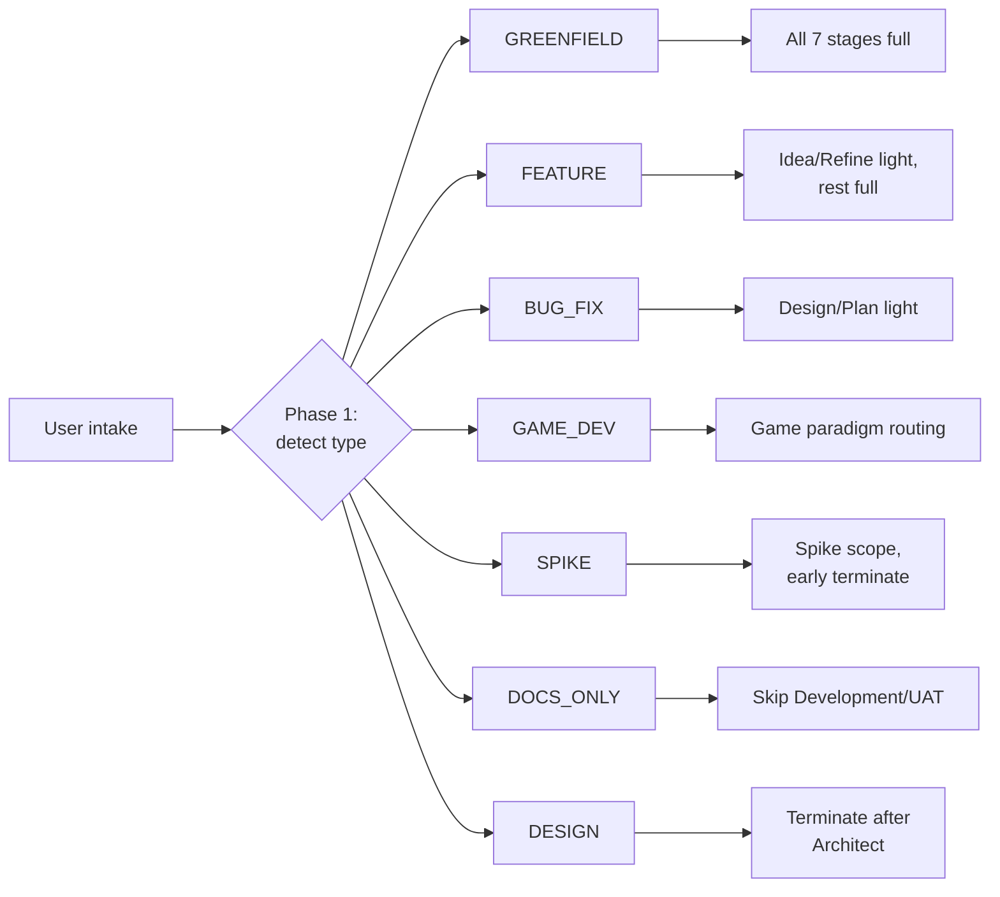
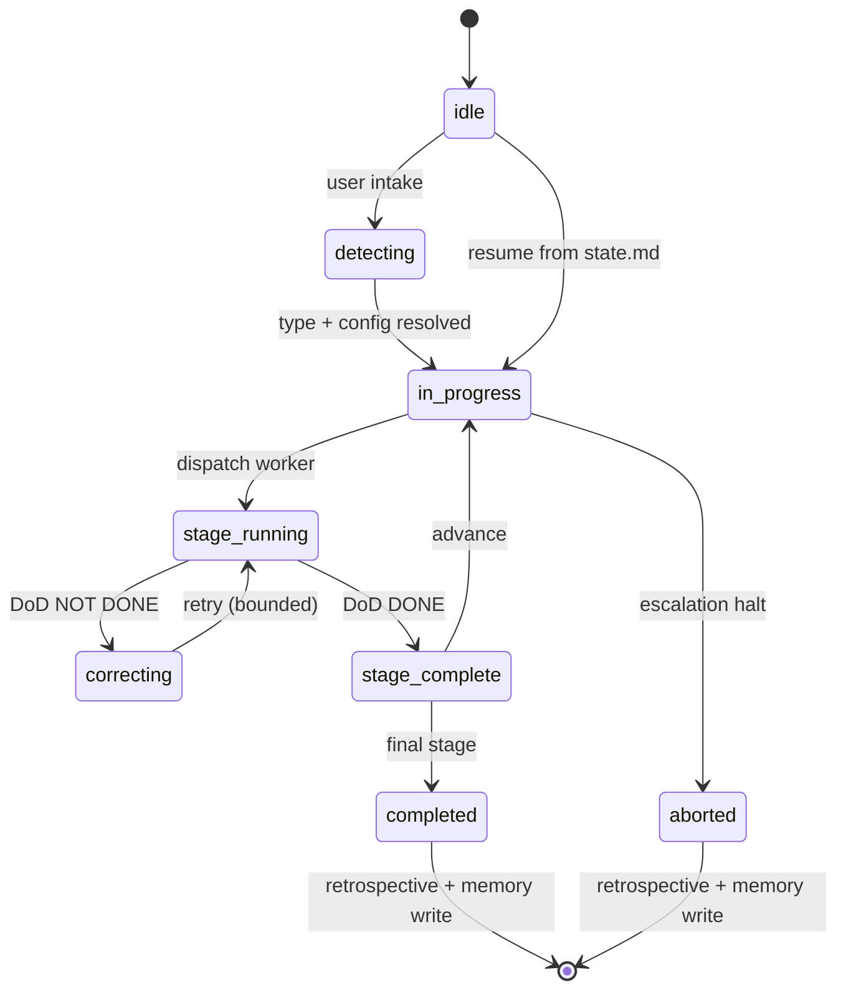

# delivery-team — Architecture

> *Celebrimbor of Eregion speaks: let us forge a true map of this work, that
> those who come after may read its wheels without guesswork. No stone is set
> here that does not rest on `delivery-flow/SKILL.md` or the references it
> cites. Audience: contributors and advanced users — not Claude.*

## Purpose

`delivery-team/` is a multi-skill plugin that orchestrates end-to-end software
delivery through a 7-stage pipeline (Idea → Refine → Design → Architect → Plan
→ Development → UAT). One orchestrator (`delivery-flow`) routes work to ten
domain worker skills via the Agent tool under strict context isolation,
validates artifacts through a team Definition of Done, and self-corrects
within bounded loops. Hooks guard the edges, `.delivery/config.yml` configures
behaviour, and tiered memory under `.delivery/memory/` lets the pipeline
learn across runs.

---

## 1. Component Overview

One orchestrator, ten workers, a hook perimeter, three flavours of durable
state.

- **Orchestrator** — `delivery-team/skills/delivery-flow/SKILL.md`. Produces
  no domain artifacts; only dispatches sub-agents and writes state/memory/stage
  summaries (Prime Directive, `delivery-flow/SKILL.md` L17-38).
- **Worker skills (10)** under `delivery-team/skills/`: `product-delivery`,
  `developer`, `godot`, `architect`, `quality`, `operations`, `ui`,
  `user-feedback`, `alias-creator`, `presentation`.
- **Hooks (7)** under `delivery-team/hooks/` — see section 7.
- **Configuration** — `.delivery/config.yml` (schema v2.7, source of truth:
  `delivery-flow/references/config-schema.md`).
- **State** — `.delivery/state.md` (pipeline state + resume contract) and
  `.delivery/memory/` (tiered self-learning store).
- **Artifacts** — `.delivery/artifacts/NN-stage/role/*.md`, the only place
  domain outputs live.

Cross-skill touch points: `delivery-team/CROSS-SKILL-REFERENCES.md`.

---

## 2. The 7-Stage Pipeline

Stages (`delivery-flow/references/pipeline-stages.md`) fan out to one primary
worker and multiple DoD validators, then converge at a team gate before
advancing, correcting, or escalating.

Two-channel rule (`references/artifact-contracts.md`): sub-agents return
signals (STATUS, ARTIFACT, SUMMARY) and write artifacts to disk; the
orchestrator never forwards artifact bodies between workers.

---

## 3. Project Type Routing

Phase 1 detects project type per run (v2.7 — type is no longer pinned in
config; `routing.force_type` is the opt-in override). The routing matrix then
decides per stage whether to run **full**, **light**, or **skip** — *light*
means reduced depth, never skipped (see `references/project-types.md`).

---

## 4. Collaboration Patterns

Six patterns in `delivery-flow/references/team-patterns.md`, each bounded.

| Pattern | Where | Purpose |
|---|---|---|
| Evaluator-Optimizer | Any stage on DoD fail | Route evidence back, retry |
| Adversarial Review | Architect, Development | Paired primary vs challenger |
| Review Board | Architect (Architecture Board) | Multi-persona cross-exam |
| Decision Ownership | All stages | Named owner resolves blocks |
| Debate | Contested trade-offs | Two-side argument + arbiter |
| Consensus | Cross-team alignment | All roles sign off |

---

## 5. State and Memory Model

Pipeline state lives in `.delivery/state.md` (YAML frontmatter + log). Memory
is tiered under `.delivery/memory/` — `MEMORY.md` index plus chunked
topic/stage files loaded on demand (`references/memory-protocol.md`).

Every run — including aborts — ends with a retrospective that writes to
memory; the Stop hook enforces this.

---

## 6. Recently-Shipped Primitives

- **`constraints.yml`** — per-project hard constraints checked in DoD
  (`delivery-flow/references/constraints-quickstart.md`,
  `scripts/check_dod_constraints.py`).
- **Architecture Board Review** — multi-persona review board in the Architect
  stage (`references/team-patterns.md`,
  `references/architecture-board-personas.md`).
- **Transformation Planning** — AS-IS → TO-BE roadmap in four phases
  (`skills/architect/references/transformation-planning.md`).
- **Paradigm-as-skill** — architecture paradigms loaded as isolated sub-skills,
  DDD and Volatility (`skills/architect/paradigms/`).
- **Design Sprint** — compressed discovery path for Refine/Design
  (`delivery-flow/references/design-sprint.md`).

---

## 7. Hooks Layer

Seven hooks across five event types. Definitions in
`delivery-team/hooks/hooks.json`; helpers in `hooks/lib/hook_utils.py`.

| Hook | Event | Role |
|---|---|---|
| `check_config.py` | SessionStart | Validate `.delivery/config.yml` is current |
| retrospective-enforcement (prompt) | Stop | Block session end if pipeline ran without retro |
| `enforce_pipeline_scope.py` | PreToolUse (Skill) | Warn when developer/godot fired outside pipeline |
| `audit_agent_prompt.py` | PreToolUse (Agent) | Audit prompts for context-isolation compliance |
| `validate_gdscript.py` | PostToolUse (Write/Edit) | Parse-check `.gd` via `godot --headless` |
| `verify_skill_load.py` | PostToolUse (Agent) | Assert SKILL_LOADED signal in responses |
| `flag_empirical_validation.py` | SubagentStop | Detect runtime-only acceptance criteria |

---

## 8. Extension Points

- **New worker skill** — add `delivery-team/skills/<name>/SKILL.md`, register
  in `references/pipeline-stages.md`, add DoD validators if it gates a stage.
- **New alias theme** — drop a theme under `delivery-flow/references/aliases/`
  and surface it via `alias-creator`.
- **New collaboration pattern** — document in `references/team-patterns.md`
  with firing rules, bounds, and exit conditions.
- **New paradigm sub-skill** — add `skills/architect/paradigms/<name>/`
  mirroring the DDD/Volatility layout.
- **New project type** — extend `references/project-types.md` with detection
  signals and a per-stage routing row; update `pipeline-stages.md`.

Any extension must preserve the Prime Directive: the orchestrator still does
not produce domain artifacts.

---

## See Also

- `delivery-team/README.md` — per-plugin overview and quickstart
- `CLAUDE.md` (repo root) — plugin section and features list
- `delivery-flow/references/constraints-quickstart.md`
- `delivery-flow/references/troubleshooting.md`
- `delivery-team/CROSS-SKILL-REFERENCES.md`
