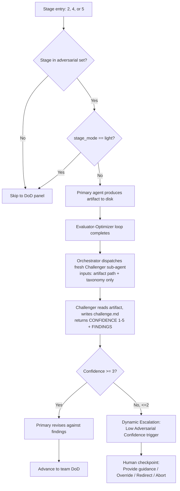
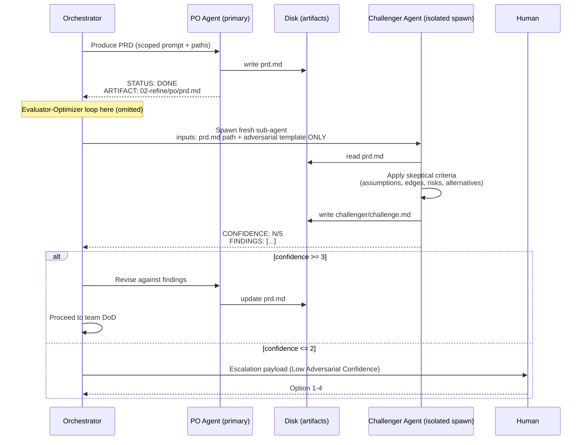

# Adversarial Review Trigger Flow

> *Celebrimbor of Eregion, at the forge: a true blade is not the one that sings praise back to its smith — it is the one an honest foe could not break. So too with Adversarial Review. The Challenger is no courtier. He is the tester of the steel.*

## 1. Purpose

Adversarial Review is **one of six collaboration patterns** governed by `delivery-team/skills/delivery-flow/references/team-patterns.md` (Pattern 2) and referenced throughout `delivery-team/skills/delivery-flow/SKILL.md`. It fires at specific stage points (Refine, Architect, Plan) and carries specific failure routing: a confidence rating of 2 or below triggers **dynamic escalation to human immediately** (SKILL.md L831; team-patterns.md L131).

This doc is distinct from two siblings:

- **DoD Self-Correction** (`dod-self-correction.md`, FLOW-4) — the multi-perspective convergence gate where ALL validators must return DONE. That is a *panel* mechanism.
- **Architecture Board** (`references/architecture-board-personas.md`, BACKLOG-003) — a configurable N-reviewer + judge pattern that *replaces* the single-reviewer adversarial at Architect stage when `architecture_board.enabled: true`.

Adversarial Review is the simplest antagonistic pattern: **one Challenger, one artifact, one confidence score.**

## 2. What "Adversarial" Means Here

A Challenger agent's job is to **find problems, not confirm quality**. The team-patterns.md prompt template states it bluntly: *"You are a devil's advocate. Your job is to stress-test this artifact by finding weaknesses, blind spots, and risks. You are NOT being helpful -- you are trying to break this"* (L160-162).

Scoring is 1-5. Three is the pass-line. **2 or 1 escalates, full stop.** The Challenger is never a rubber stamp.

## 3. Per-Stage Trigger Matrix

Verified against `delivery-team/skills/delivery-flow/SKILL.md` lines 626, 662, 680:

| Stage | Adversarial Review Fires? | Trigger | Confidence Threshold |
|---|---|---|---|
| 1. Idea | No | — | — |
| 2. Refine | **Yes** | After PRD draft, before team DoD | <=2 = escalate |
| 3. Design | No (Multi-Perspective Review Board instead) | — | — |
| 4. Architect | **Yes** (or Architecture Board when enabled) | After `architecture.md` draft | <=2 = escalate |
| 5. Plan | **Yes** | After sprint plan + stories | <=2 = escalate |
| 6. Development | No (per-story DoD covers it) | — | — |
| 7. UAT | No (Review Board for go/no-go) | — | — |

Light-mode note: when `stage_mode == light` (SKILL.md L304), adversarial review is suppressed along with debate — light is *reduced depth*, and the Challenger dispatch is one of the depths pruned.

## 4. Diagram 1 — Decision Flowchart

## 5. Diagram 2 — Refine Stage Sequence

## 6. The Six Escalation Triggers

Adversarial confidence is one of six triggers in the Dynamic Escalation Protocol (SKILL.md L826-835):

1. **Repeated DoD failure** — same criterion fails 3 consecutive validation cycles
2. **Low adversarial confidence** — Challenger rates <=2/5 — **this doc's primary trigger**
3. **Decision deadlock** — Decision Owner cannot resolve a routed issue
4. **Debate stalemate** — Judge returns DEADLOCK, arguments equally compelling
5. **No correction progress** — self-correction iteration produces no meaningful change
6. **Cross-cutting conflict** — two roles produce contradictory NOT_DONE findings

All six feed the same human checkpoint format (Provide guidance / Override / Redirect / Abort).

## 7. Relationship to Architecture Board

BACKLOG-003 shipped the Architecture Board: when `architecture_board.enabled: true` in `.delivery/config.yml`, the Architect stage runs **N parallel persona reviewers plus a judge** instead of a single Challenger. Adversarial Review is the simpler form; the Board is the configurable adversarial-on-steroids with explicit persona context files, iteration-2 cross-persona routing (MAR), and deadlock escalation via the Debate pattern. Both ultimately feed the same team DoD gate. See `delivery-team/skills/delivery-flow/references/architecture-board-personas.md`.

## 8. Anti-Pattern: Rubber-Stamp Adversarial

A Challenger that returns "looks good, 5/5, no concerns" on first pass has **failed its job**. The template explicitly says *"If you cannot find issues, state that explicitly -- do not invent problems"* (team-patterns.md L178), but this is the floor, not the ceiling. A skeptical reviewer who cannot find issues on a non-trivial artifact should provoke suspicion from the orchestrator, not celebration.

Memory lesson `feedback_subagents_mtg.md` is the abiding rule: **validators should ACTIVELY try to find problems.** If your Challenger is a courtier, retire it and forge a new one. A blade that flatters its smith shatters in the hand.

## 9. Configuration Knobs

From `.delivery/config.yml` (schema v2.7 — see `delivery-team/skills/delivery-flow/references/config-schema.md`):

- `pipeline.collaboration_patterns` — list; include `adversarial` to enable, omit to disable globally
- `pipeline.max_self_correction` — integer (default 3); caps the evaluator-optimizer loop that runs *before* the Challenger, and the revision cycle after
- `architecture_board.enabled` — when `true`, **replaces** the single Challenger at Architect stage with the Board pattern
- Light-mode stages (DOCS_ONLY, BUG_FIX) suppress adversarial regardless of the above

## 10. See Also

- `delivery-team/architecture/dod-self-correction.md` (FLOW-4, sibling — the DoD panel that runs after adversarial)
- `delivery-team/architecture/dynamic-escalation.md` (FLOW-4 successor — full trigger decision tree)
- `delivery-team/skills/delivery-flow/references/team-patterns.md` (Patterns 2 and 2b — full protocol, prompt templates, isolation rules)
- `delivery-team/skills/delivery-flow/references/architecture-board-personas.md` (Board-style adversarial)
- `delivery-team/ARCHITECTURE.md` (pattern table — this doc is the deep-flow supplement for row "Adversarial Review")

*The ring is set. What the Challenger cannot break, the pipeline may trust — for a season.*
— Celebrimbor
