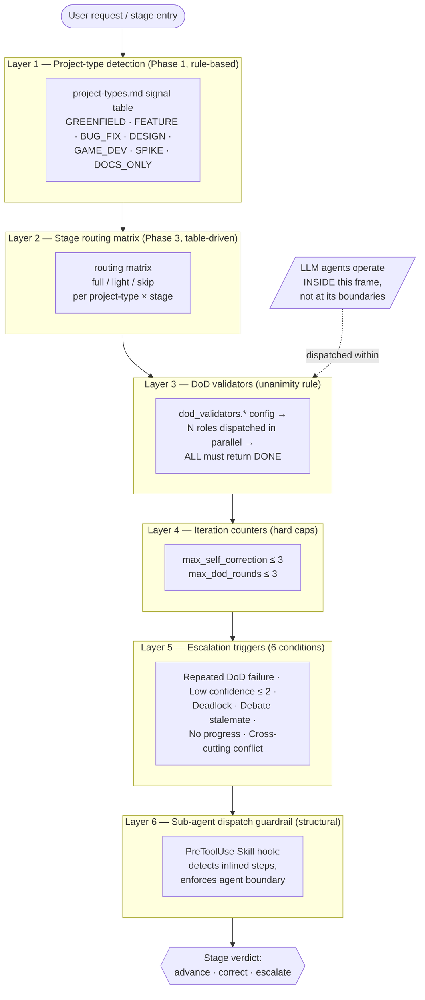
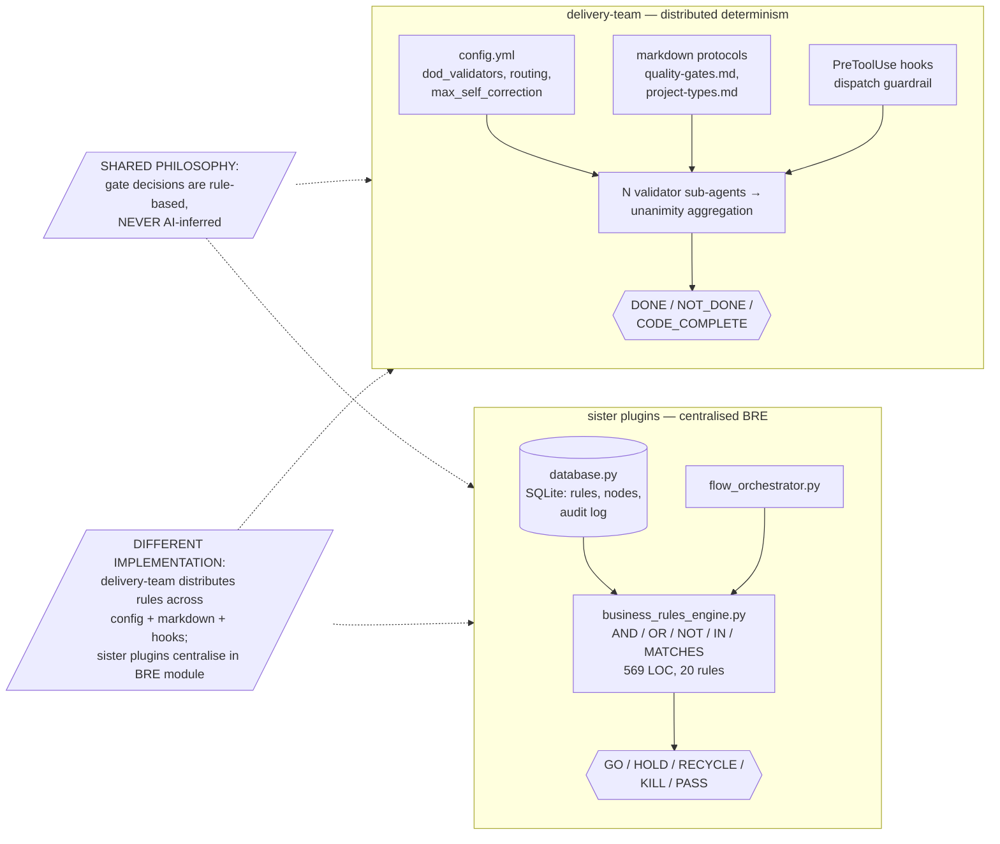

# Deterministic Gating & the BRE Relationship

> *Celebrimbor of Eregion, at the anvil. The Product Owner asked of Business
> Rules — and asked truly. I will not inscribe a rune on a stone that has not
> been struck. What follows is the honest reckoning of how `delivery-team`
> renders its verdicts, and where the true BRE lives (not here).*

## 1. Honest Framing — delivery-team has NO BRE module

State this plainly, for the sake of every contributor who comes after:

**`delivery-team` does NOT have a Business Rules Engine module.** The term
"BRE" refers specifically to `business_rules_engine.py` — a concrete Python
class that evaluates AND/OR/NOT predicates against a context dictionary and
returns a `GateEvaluationResult`. That class lives in the **sister plugins**:

- [`agentic-flow-builder/scripts/business_rules_engine.py`](../../agentic-flow-builder/) — the pattern-guide reference implementation.
- [`prd-quality-gate-flow/business_rules_engine.py`](../../prd-quality-gate-flow/business_rules_engine.py) — the concrete application (569 LOC, 20 rules across 7 gates, SQLite-backed audit log).

What `delivery-team` **does** have is a **layered-determinism approach**: a
stack of six rule-based mechanisms distributed across config, protocol, and
structural hooks. Every gate decision is deterministic — but the determinism
is *distributed*, not centralised in a single evaluator class. This document
clarifies that relationship so no future smith mistakes the absence of
`business_rules_engine.py` here for an absence of rigour.

---

## 2. delivery-team's Six Deterministic Layers

| # | Layer | Mechanism | Source |
|---|-------|-----------|--------|
| 1 | **Project-type detection** | Phase 1 signal-table match (GREENFIELD, FEATURE, BUG_FIX, DESIGN, GAME_DEV, SPIKE, DOCS_ONLY). Rule-based, NOT AI-inferred. | [`references/project-types.md`](../skills/delivery-flow/references/project-types.md) |
| 2 | **Stage routing matrix** | Phase 3 table-driven `full`/`light`/`skip` per `(project-type × stage)` tuple. NOT AI-inferred. | [`SKILL.md`](../skills/delivery-flow/SKILL.md) routing section |
| 3 | **DoD validators (unanimity rule)** | Per-stage role lists from `dod_validators.*` config. **ALL validators must return DONE** for stage completion — any single NOT_DONE blocks advance. Check-by-check against role criteria. NOT AI-inferred at the aggregation step. | `quality-gates.md` L16; `SKILL.md` L526, L788, L802 |
| 4 | **Self-correction iteration counters** | `pipeline.max_self_correction` (default 3) and `pipeline.max_dod_rounds` (default 3) are **hard caps**, not suggestions. Pure counters. | `SKILL.md` L168-169, L750 |
| 5 | **Escalation triggers** | Six deterministic conditions monitored continuously (e.g. "same criterion fails 3 cycles" is a counter; "confidence ≤ 2" is a numeric threshold). | `SKILL.md` L826-835; `quality-gates.md` L138 |
| 6 | **Sub-agent dispatch guardrail** | Structural enforcement — inlining a step rather than dispatching a sub-agent is **detectable by hook** (`PreToolUse(Skill)` audit). Recently shipped via the mtg-commander pattern. | `delivery-team/hooks/` |

AI judgement is dispatched at the **agent level, inside** this deterministic
frame — never at the gating boundaries themselves. The frame is rule-based;
the artifacts inside the frame are LLM-produced but gated by rules.

---

## 3. Diagram 1 — The Six-Layer Determinism Stack

---

## 4. Diagram 2 — BRE Comparison: delivery-team vs. Sister Plugins

---

## 5. Why delivery-team Did Not Adopt a Centralised BRE

Honest engineering rationale — not absence of thought:

- **delivery-team's "rules" are markdown protocols, not first-order-logic predicates.** "ALL validators return DONE" is a protocol; the inside of each validator is a role-specific rubric that requires LLM judgement against rich criteria.
- **The pipeline *is* the rule set.** Centralising it would mean re-encoding 1,000+ lines of `SKILL.md` into predicate logic — ceremony without gain.
- **DoD validators already ARE the rule check.** Further abstraction adds a layer, not clarity.
- **Sister plugins use a BRE because their gate criteria ARE first-order logic.** `gate1_completeness` fires IF `entity_count > 0 AND has_acceptance_criteria`. That is BRE-shaped.
- **delivery-team's gate criteria are richer** — e.g. "does this artifact address the user's stated needs?" — and require LLM judgement **within** a deterministic structure, not replaced by one.

## 6. When to Introduce a BRE in delivery-team (future work)

Consider it if/when:

- A stage's gate criteria become formalisable as predicates. (Partial precedent exists: `constraints.yml` validation is already programmatic — see §7.)
- Audit requirements demand a single source of gate decisions. (None today.)
- Gate decisions must be reused outside `delivery-flow`. (None today.)

Absent one of these, the layered approach is the right craft.

## 7. The Baby BRE Already Here

Two scripts are the closest analogues to a BRE within `delivery-team` —
they are small, deterministic, programmatic gates:

- [`delivery-team/skills/delivery-flow/scripts/validate_constraints.py`](../skills/delivery-flow/scripts/validate_constraints.py) — validates `constraints.yml` against a schema. Pure rule evaluation.
- [`delivery-team/skills/delivery-flow/scripts/check_dod_constraints.py`](../skills/delivery-flow/scripts/check_dod_constraints.py) — programmatic DoD-constraint checks.

If the plugin ever grows a centralised BRE, these are the seed.

## 8. Relationship to Sister Plugins

When `delivery-team` work needs formal BRE-style gating, the pattern is:

1. Use [`agentic-flow-builder/ARCHITECTURE.md`](../../agentic-flow-builder/ARCHITECTURE.md) as the **architectural pattern guide**.
2. Use [`prd-quality-gate-flow/ARCHITECTURE.md`](../../prd-quality-gate-flow/ARCHITECTURE.md) as the **concrete reference implementation** (7 gates, 20 rules, SQLite-backed).
3. Adapt their BRE patterns into a new sub-skill if `delivery-team` grows that need — do not force the module into the pipeline's current shape.

## 9. See Also

- [`agentic-flow-builder/ARCHITECTURE.md`](../../agentic-flow-builder/ARCHITECTURE.md) — pattern guide
- [`prd-quality-gate-flow/ARCHITECTURE.md`](../../prd-quality-gate-flow/ARCHITECTURE.md) — concrete BRE application
- [`prd-quality-gate-flow/business_rules_engine.py`](../../prd-quality-gate-flow/business_rules_engine.py) — the actual BRE source
- [`delivery-team/skills/delivery-flow/references/quality-gates.md`](../skills/delivery-flow/references/quality-gates.md) — validator unanimity rule (L16)
- [`delivery-team/skills/delivery-flow/references/project-types.md`](../skills/delivery-flow/references/project-types.md) — Layer 1 signal table
- [`delivery-team/skills/delivery-flow/scripts/validate_constraints.py`](../skills/delivery-flow/scripts/validate_constraints.py) — the baby BRE
- [`delivery-team/ARCHITECTURE.md`](../ARCHITECTURE.md) — the high map this doc supplements

*The truest gate is one whose rules are written where contributors can read
them. I have not pretended this plugin owns a BRE it does not. May the next
smith honour the same craft.* — **Celebrimbor**
