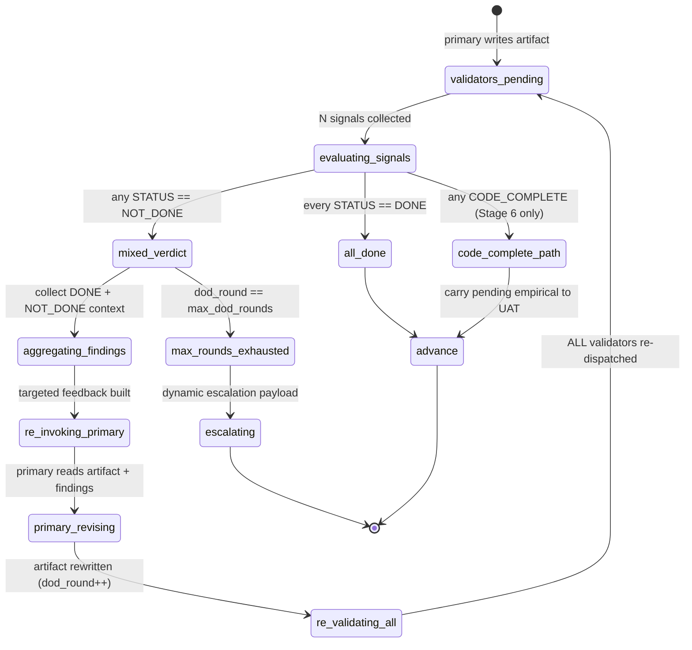

# DoD Validation & Self-Correction State Machine

> *Celebrimbor of Eregion at the anvil, Legolas at the parapet: I shape the ring;
> he watches where the light leaks. This forging merges my structural lens with
> his regression-hunter's eye. The state machine is mine; the insistence that
> every validator re-runs after revision — "revise AC-X, and AC-Y cracks behind
> you" — is his, and load-bearing.*

**Audience:** contributors (orchestrator maintainers, skill authors, gate tuners).
**Scope:** FLOW-4. The gate that decides whether a stage advances.

## 1. Purpose

DoD validation gates every active stage. Any single NOT_DONE engages
self-correction routing. This doc diagrams the state machine, the round
counter, regression-handling, and the escalation triggers that bound the loop.
Source of truth: `delivery-team/skills/delivery-flow/SKILL.md` §Step 7
(L512-537) and `.../references/quality-gates.md` L5-135.

## 2. The DoD Protocol — a single round

1. Stage primary agent writes its artifact to disk (namespaced path,
   e.g. `.delivery/artifacts/02-refine/po/prd.md`).
2. Orchestrator dispatches **N validators in parallel** (one Agent call each)
   when `pipeline.parallel_validators` is true (default). Each validator gets
   ONLY: artifact path + role-specific criteria from `quality-gates.md` + the
   DoD Validator prompt template.
3. Each validator reads the artifact, applies its criteria, writes findings to
   its own namespaced path
   (`.delivery/artifacts/{NN}-{stage}/dod/{role}-review.md`), returns
   `STATUS: {DONE|NOT_DONE|CODE_COMPLETE}` + `ARTIFACT: {findings_path}` +
   `SUMMARY`.
4. Orchestrator collects N signals. No validator sees another's output —
   isolation is load-bearing for parallel correctness.
5. **Verdict logic**: ALL DONE → advance · ANY NOT_DONE → self-correction ·
   Stage 6 Developer may return CODE_COMPLETE (terminal here, carries to
   Stage 7 UAT — see `empirical-lifecycle.md`).

## 3. Diagram 1 — State machine



Counter `dod_round` starts at 1 and increments on each re-validation loop;
bound `pipeline.max_dod_rounds` (default 3). Legolas's rule, stamped on the
ring's edge: **`re_validating_all` re-dispatches every validator, not only
those that voted NOT_DONE.** Revisions can quietly break criteria that already
passed.

## 4. Self-correction routing — the payload

On any NOT_DONE, the orchestrator builds a re-invocation prompt for the primary.
Four parts — omit any and framing is lost:

- **All findings.** DONE for context (what not to break); NOT_DONE with
  actionable fixes per criterion.
- **Original artifact path.** Primary reads from disk; orchestrator NEVER
  pastes artifact content into the prompt.
- **Iteration count.** `dod_round` of `max_dod_rounds` — runway is explicit.
- **Targeted feedback per failing criterion.** Not "fix it" — each NOT_DONE
  maps to a criterion with a specific corrective action (`quality-gates.md`
  L95-128).

## 5. Regression check — why ALL validators re-run

Legolas's lesson, written on the wall after more than one stuck stage:

- Revising AC-X to pass its validator may inadvertently break AC-Y, which a
  different validator already signed off on.
- Re-running only previously-failed validators produces a **false DONE** on
  the regressed criterion — no one checks it again.
- Cost: N dispatches per round; parallel fan-out mitigates wall time. Benefit:
  zero regression escape. Codified: `quality-gates.md` L125, `SKILL.md` L810-811.

## 6. Diagram 2 — Sequence (one full self-correction cycle)

```mermaid
sequenceDiagram
    autonumber
    participant O as Orchestrator
    participant V1 as Validator A
    participant V2 as Validator B
    participant V3 as Validator C
    participant P as Primary agent
    participant D as Disk

    Note over O: dod_round = 1
    par parallel fan-out
        O->>V1: criteria + artifact path
        O->>V2: criteria + artifact path
        O->>V3: criteria + artifact path
    end
    V1->>D: read artifact; write findings
    V2->>D: read; write findings
    V3->>D: read; write findings
    V1-->>O: STATUS DONE
    V2-->>O: STATUS DONE
    V3-->>O: NOT_DONE + findings path
    O->>O: aggregate (2 DONE context + 1 NOT_DONE fixes)
    O->>P: re-invoke with artifact path + all findings + round=1/3
    P->>D: read artifact + findings; write revised artifact
    P-->>O: STATUS DONE (revision complete)
    Note over O: dod_round = 2 — re-run ALL validators
    par regression check
        O->>V1: criteria + revised artifact path
        O->>V2: criteria + revised artifact path
        O->>V3: criteria + revised artifact path
    end
    V1-->>O: STATUS DONE
    V2-->>O: STATUS DONE
    V3-->>O: STATUS DONE
    O->>O: all DONE → advance stage
```

## 7. Counters & limits

| Counter | Default | Scope |
|---|---|---|
| `pipeline.max_dod_rounds` | 3 | per-stage DoD loop |
| `pipeline.max_self_correction` | 3 | broader correction (e.g. evaluator-optimizer) |

Both live in `.delivery/config.yml`; per-stage overrides via `quality-gates.md`.
When exhausted, the orchestrator builds a dynamic escalation payload showing
**all attempts** round-by-round, not just the final one.

## 8. Escalation triggers from DoD failure (Legolas lens)

Per `SKILL.md` L826-835 and `quality-gates.md` L133-140:

- **Repeated DoD failure.** Same criterion fails 3 consecutive cycles.
- **No correction progress.** Revisions produce no meaningful change across
  rounds (semantic, not string-equality).
- **Cross-cutting conflict.** Two validator roles produce contradictory
  NOT_DONE findings irreconcilable without an architectural decision.
- **Low adversarial confidence.** If adversarial review (see
  `adversarial-review-triggers.md`) rated the artifact ≤ 2/5 earlier, escalation
  may fire mid-DoD rather than after 3 rounds.

The user sees aggregated findings from the final round AND earlier attempts —
full trail, no silent pruning.

## 9. Per-stage validator rosters

From `quality-gates.md` §Stage Gate Criteria (L169-279):

| Stage | Validators |
|---|---|
| Idea | Product Owner, Architect |
| Refine | Product Owner, Architect, QA Engineer |
| Design | UX Designer, Product Owner, QA Engineer, Architect |
| Architect | Architect, QA Engineer, DevOps, Security |
| Plan | Scrum Bag, Product Owner, QA Engineer, DevOps |
| Development (per story) | Developer, QA Engineer, Architect, Technical Writer |
| UAT | QA Engineer, DevOps, Product Owner, Technical Writer |

Each roster is configurable via `dod_validators.*` in `.delivery/config.yml`.
Adding a validator means another Agent call per round — design accordingly.

## 10. Anti-patterns

- **Re-running only failed validators.** Regression escape. Always re-dispatch
  the full roster (§5).
- **Aggregating findings without preserving DONE context.** Primary loses
  framing and may refactor passing criteria into failure.
- **Bypassing DoD via human override without recording it.** The override must
  land in the stage summary or the audit trail rots.
- **Treating CODE_COMPLETE as DONE.** CODE_COMPLETE carries forward — the
  acceptance criterion is NOT skipped; it becomes a mandatory UAT test case
  (see `empirical-lifecycle.md`).
- **Fusing validator roles into one compound prompt.** One validator = one
  Agent call (`quality-gates.md` L47-49).

## 11. See also

- `delivery-team/architecture/adversarial-review-triggers.md` — FLOW-1, fires BEFORE DoD; can lower confidence into escalation.
- `delivery-team/architecture/empirical-lifecycle.md` — FLOW-5, CODE_COMPLETE handling Stage 6 → UAT.
- `delivery-team/architecture/deterministic-gating.md` — FLOW-2, DoD unanimity as one of four determinism layers.
- `delivery-team/skills/delivery-flow/references/quality-gates.md` — criteria.
- `delivery-team/skills/delivery-flow/SKILL.md` §Step 7 — orchestrator protocol.

*The ring holds only if every gem is re-seated after the reshaping. — Celebrimbor (with Legolas nodding from the wall)*
