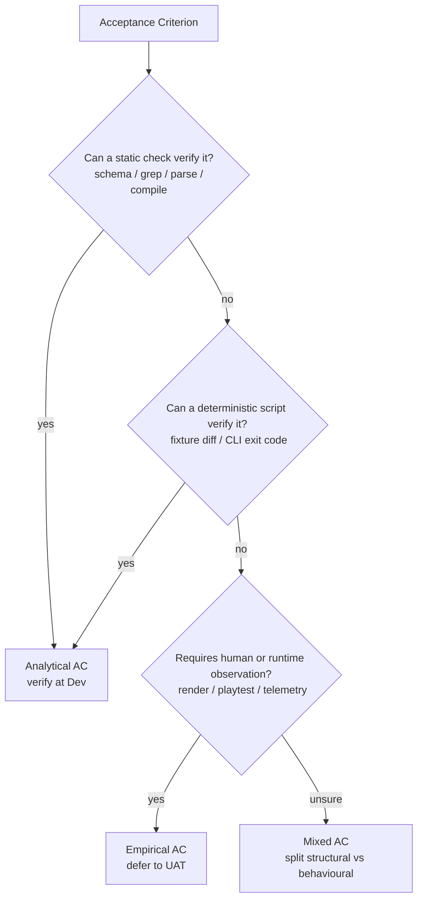
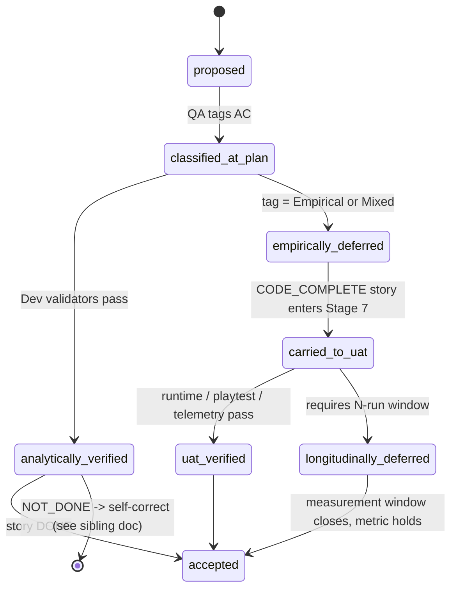

# Empirical vs Analytical Validation Lifecycle

> *Celebrimbor at the anvil: "Some steel is proven by the hammer's ring; other
> steel only by the blade's first bite in earnest battle. Name which is which,
> lest you mistake a flaw for a song."*

**Author:** Celebrimbor (Architect) · **Story:** FLOW-5 · **Source brainstorm:**
`.delivery/artifacts/01-idea/qa/flow-contributions.md` Proposal 1 (Legolas).

---

## 1. Purpose

The delivery-team Definition of Done admits **three** verdicts, not two:

- `DONE` — acceptance criterion (AC) is provably satisfied now.
- `CODE_COMPLETE` — code is correct but the AC requires runtime verification,
  explicitly deferred to UAT (see `delivery-flow/SKILL.md` L699).
- `NOT_DONE` — the AC is not satisfied; self-correction fires.

This document traces an AC from Plan classification through Dev verdict, UAT
carry-forward, and — where needed — post-release longitudinal measurement.

## 2. Why this distinction matters

- **Analytical ACs** fall to static checks: schema validates, file exists,
  grep matches, code compiles, parse-check passes, fixture equals expected.
- **Empirical ACs** require runtime reality: "feature works under load,"
  "animation is smooth," "API responds within SLA," "playtest does not stutter."
- Treating the second class as verified at Dev manufactures false-PASS and
  ships bugs to production. The `SubagentStop` empirical hook
  (`delivery-team/hooks/flag_empirical_validation.py`) is our standing rebuke
  to that temptation: it detects runtime-only AC patterns unflagged.

## 3. AC classification at Plan stage

When QA authors the test strategy (see `delivery-team/skills/quality/SKILL.md`),
each AC receives one of three tags:

| Tag | Verifiable by | Terminal stage |
|-----|---------------|----------------|
| **Analytical** | static check, schema, grep, type-check, parse, fixture diff | Stage 6 (Dev) |
| **Empirical** | runtime, UI render, integration, telemetry, dogfood run | Stage 7 (UAT) |
| **Mixed** | structural part at Dev + behavioural part at UAT | Both |

## 4. Diagram 1 — Classification decision tree

## 5. Stage 6 (Dev) — DoD verdict logic

Primary delivers against the story. Validators fan out in parallel (see
`dod-self-correction.md`). Verdict is assembled as follows:

- All ACs analytical **and** all pass → **`DONE`**.
- Some ACs empirical (or mixed-behavioural) **and** all verifiable-now pass →
  **`CODE_COMPLETE`** with an explicit *deferred AC list* written into the
  story's Verification Status section.
- Any verifiable AC fails → **`NOT_DONE`** → self-correction round (up to
  three, per the self-correction state machine).

The `SubagentStop` empirical hook fires after each developer/godot sub-agent.
Its pattern library scans the transcript for phrases like *renders*, *animates*,
*responds with 200*, *collision*, *plays*, *navigates to*. If such phrases
appear inside AC lines and the sub-agent did not mark them deferred, the hook
emits: *"EMPIRICAL VALIDATION REQUIRED … Story status should be CODE_COMPLETE
(not DONE)."* This is the auto-detection backstop against an unflagged
runtime claim slipping past the verdict.

## 6. Carry-forward to Stage 7 (UAT)

`CODE_COMPLETE` stories enter UAT with their deferred AC list **intact** — it
is a first-class artifact, not a footnote. The UAT QA test plan addresses each
deferred AC explicitly. Permitted empirical verification modes:

- **Dogfood pipeline run** — exercise the change through a real delivery run.
- **Manual playtest** — game dev; bounded scripted scenarios.
- **Telemetry observation** — live metric over a bounded window.
- **Longitudinal metric** — *deferred even further*, to a post-release window.

CHECKPOINT 4 surfaces pending empirical validations to the human reviewer,
per `delivery-flow/SKILL.md` L719.

## 7. Diagram 2 — AC lifecycle state

## 8. The empirical validation hook

- **File:** `delivery-team/hooks/flag_empirical_validation.py`
- **Event:** `SubagentStop` (scoped to developer, godot sub-agents).
- **Mechanism:** reads transcript, filters to AC-bearing lines (`acceptance`,
  `given/when/then`, `should`, `must`, `verify`), then scans those lines with
  a combined regex of five empirical pattern families (visual, interaction,
  runtime behaviour, physics/simulation, audio/media).
- **Output:** advisory message naming the matched keywords; instructs the
  author to mark them *Requires runtime validation* and downgrade verdict to
  `CODE_COMPLETE`. The hook does not block — it flags. Blocking is for
  analytical failure, not empirical honesty.
- **See also:** `delivery-team/architecture/hook-firing-timeline.md` for the
  hook's firing position in the overall timeline.

## 9. Longitudinal deferrals

Some claims cannot honestly be verified at UAT — they require many pipeline
runs, or a calendar window of live traffic. Examples encountered in this
codebase:

- "Plan first-try pass rate ≥80% over next 5 runs" — self-learning memory
  metric; demands five subsequent pipeline invocations to measure.
- "Token overhead ≤25% per stage" — architecture-board NFR; requires
  production telemetry.
- "Zero cross-vendor pricing escalations over 30 days" — `mtg-commander`
  adversarial-challenger goal; calendar-bounded.

These are labelled honestly in the UAT verdict as
`empirically-deferred-post-release` with a stated measurement window and a
memory write-back when the window closes.

## 10. Anti-patterns

- **Silent `CODE_COMPLETE`-as-`DONE`.** Dropping the deferred AC list loses
  UAT visibility; the runtime claim becomes invisible debt.
- **Mislabelling analytical ACs as empirical** to dodge test authorship.
  Any AC a grep or parser could settle is analytical. The easy road through
  the gate is the wrong one.
- **Ignoring empirical-hook output.** The hook is advisory; ignoring it
  defeats the auto-detection signal and forfeits the safety net.
- **Forgetting longitudinal write-back.** When the measurement window closes
  without updating `.delivery/memory/`, the learning is lost and the next
  pipeline makes the same bet blind.

## 11. See also

- `delivery-team/architecture/dod-self-correction.md` — FLOW-4 sibling:
  the validator state machine and finding-schema contract.
- `delivery-team/architecture/hook-firing-timeline.md` — FLOW-3: where the
  empirical hook sits in the full hook timeline.
- `delivery-team/skills/quality/SKILL.md` — test strategy authoring; the
  origin of AC classification tags.
- `delivery-team/skills/delivery-flow/SKILL.md` L699, L719 — DoD verdict
  options and CHECKPOINT 4 surfacing of pending empirical validations.
- `delivery-team/hooks/flag_empirical_validation.py` — the detector itself.

*"Forge the ring of power only when the metal has been tried by both hammer
and hearth — and name which trial it has yet to face."* — Celebrimbor
