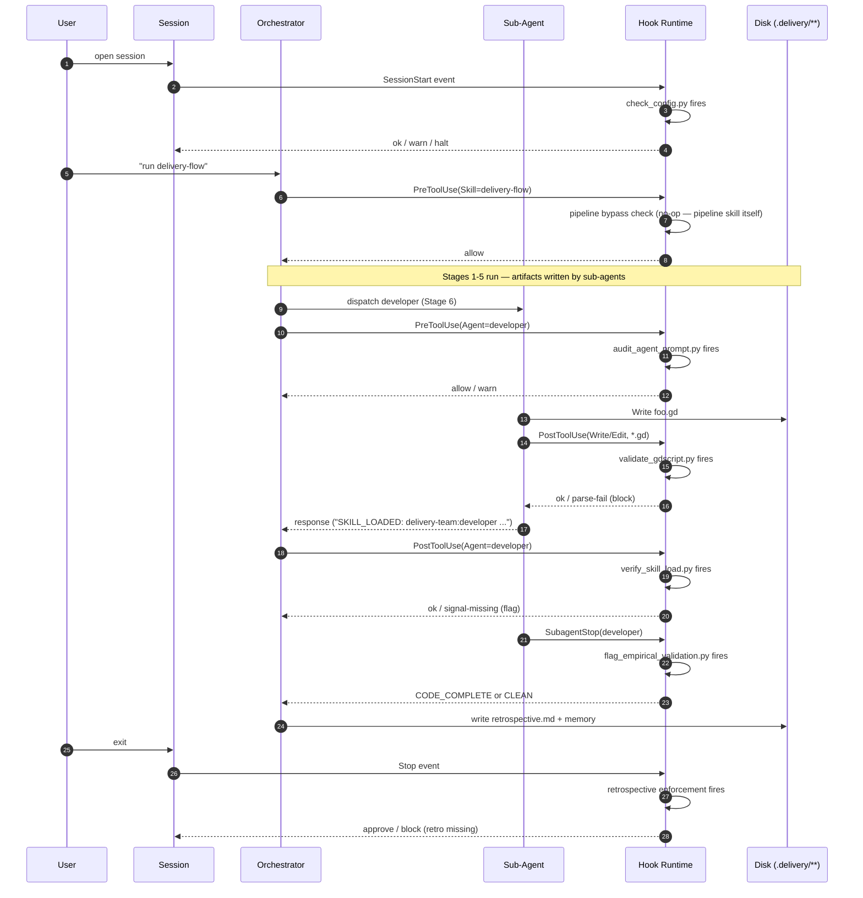
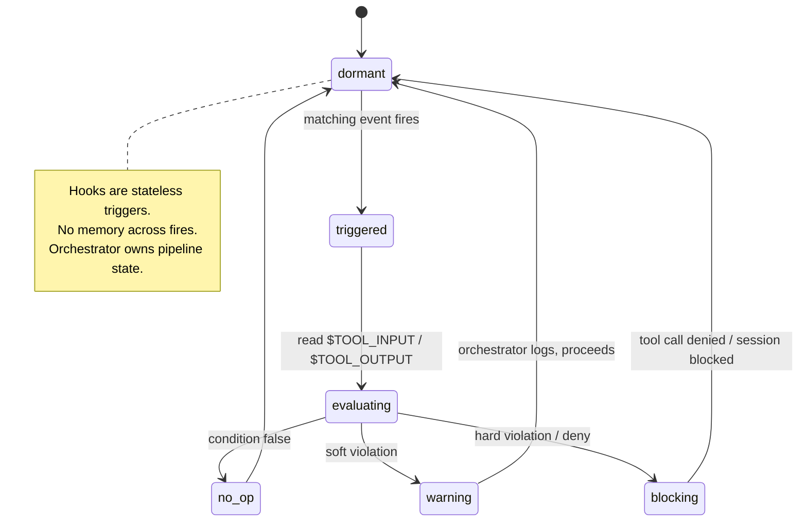

# Hook Firing Timeline

> *Celebrimbor of Eregion, master smith: I have forged this ring with Sam
> Gamgee's temporal lantern beside me — his swimlane vision of hook fires in a
> representative run merged with my own perimeter map. The pattern on the band
> is his; the settings are mine. Two hands, one work.*

**Audience:** plugin maintainers, hook authors, debuggers.
**Purpose:** delivery-team ships **7 hooks across 5 event types**. The high-level
`CLAUDE.md` table says what each hook does; this doc shows **when each fires,
in what order, during a typical pipeline run** — and what happens when they
do or do not trigger.

---

## 1. Hook Inventory

| # | Hook | Event | Implementation | Purpose |
|---|---|---|---|---|
| 1 | Config check | SessionStart | `hooks/check_config.py` | Validates `.delivery/config.yml` exists/current |
| 2 | Retrospective enforcement | Stop | `hooks.json` (prompt-type) | Blocks session end if pipeline work occurred without retro |
| 3 | Pipeline bypass detection | PreToolUse (Skill) | `hooks.json` (prompt-type) + `hooks/enforce_pipeline_scope.py` | Warns/denies when developer/godot/quality invoked outside pipeline |
| 4 | Agent prompt audit | PreToolUse (Agent) | `hooks/audit_agent_prompt.py` | Audits agent prompts for context-isolation compliance |
| 5 | GDScript validation | PostToolUse (Write/Edit) | `hooks/validate_gdscript.py` | Parse-validates `.gd` files via `godot --headless --check-only` |
| 6 | Skill load verification | PostToolUse (Agent) | `hooks/verify_skill_load.py` | Verifies `SKILL_LOADED: <name>` signal in agent response |
| 7 | Empirical validation | SubagentStop (developer\|godot) | `hooks/flag_empirical_validation.py` | Flags runtime-only ACs in dev/godot output |

Source of truth: `delivery-team/hooks/hooks.json` (event registrations,
matchers, timeouts) + the Python files above.

---

## 2. Diagram 1 — Timeline Sequence (representative FEATURE run)



---

## 3. Hook Fire Conditions (no-op vs. act)

| Hook | No-op when... | Acts when... | Effect |
|---|---|---|---|
| 1 Config check | `.delivery/config.yml` exists and fresh | File absent OR schema stale | Warns/halts session start |
| 2 Retro enforcement | No pipeline work OR retrospective.md written | Pipeline work + retro missing | **block** on Stop |
| 3 Pipeline bypass | Skill != developer/godot/quality OR `.delivery/config.yml` exists | Implementation skill invoked with no pipeline config | **deny** with escape-hatch message |
| 4 Agent prompt audit | Prompt is scoped, single-role, disk-based I/O | Prompt contains other-agent outputs, full pipeline state, or compound roles | Warn; log to audit trail |
| 5 GDScript validation | File is not `.gd` | `.gd` file written/edited | Runs `godot --headless --check-only`; **fails** on parse error |
| 6 Skill load verification | Agent response begins with `SKILL_LOADED: <expected-name>` | First line missing or wrong skill name | Flags response; orchestrator may re-dispatch |
| 7 Empirical validation | Output contains only analytically-verifiable ACs | Output contains "verifies at runtime", "tested manually", or runtime-only patterns | Marks artifact `CODE_COMPLETE` — carries to Stage 7 UAT |

---

## 4. Diagram 2 — Hook Lifecycle (state, from a single hook's view)



---

## 5. Hook-to-Stage Interactions

| Stage | Hooks active |
|---|---|
| (session boundary) | **Config check** (once at SessionStart), **Retro enforcement** (once at Stop) |
| Stages 1–5 | **Agent prompt audit**, **Skill load verification** (every sub-agent dispatch) |
| Stage 6 Dev | **Pipeline bypass** (if dev skill called outside flow), **Agent prompt audit**, **Skill load verification**, **GDScript validation** (any `.gd` write), **Empirical validation** (SubagentStop) |
| Stage 7 UAT | **Empirical validation** carries `CODE_COMPLETE` forward; QA validator converts to empirical verdict |

Hooks 1 and 2 are session-boundary guards. Hooks 3–7 fan out across stages;
Stage 6 sees the heaviest firing density.

---

## 6. Disabling Hooks (when needed)

Hooks can be suppressed per-session via `.claude/settings.local.json`. Pattern:

```json
{
  "hooks": {
    "disabled": ["delivery-team:pipeline-bypass"]
  }
}
```

**Legitimate use cases:**
- One-off developer work outside the pipeline (suppress bypass hook).
- Replaying a fixture session (suppress config check).
- Debugging a hook itself (suppress only that hook, never all of them).

Never disable the Retro enforcement hook silently — it is the self-learning
contract.

---

## 7. Adding a New Hook

1. Add Python implementation in `delivery-team/hooks/<name>.py`.
2. Register in `delivery-team/hooks/hooks.json` with event type, matcher, and
   command (use `${CLAUDE_PLUGIN_ROOT}` prefix).
3. Document in the `CLAUDE.md` hook table.
4. Add a row here (§1 inventory, §3 conditions, §5 stage map).
5. Test by triggering the event in a representative session; confirm
   no-op / warn / block paths.

Load the `plugin-dev:hook-development` skill before editing `hooks.json` —
it covers timeout rules, matcher syntax, and the command-vs-prompt hook
distinction.

---

## 8. See Also

- `delivery-team/architecture/dod-self-correction.md` — FLOW-4; empirical
  validation hook output flows into the Stage 6 → Stage 7 `CODE_COMPLETE`
  terminal.
- `delivery-team/architecture/agent-dispatch.md` — FLOW-6; agent prompt
  audit hook context (what "scoped prompt" means).
- `CLAUDE.md` — canonical 7-hooks × 5-events table.
- `delivery-team/hooks/hooks.json` — ground truth registrations.

*Sam held the light; I set the stones. The timeline belongs to both of us.*
— Celebrimbor
