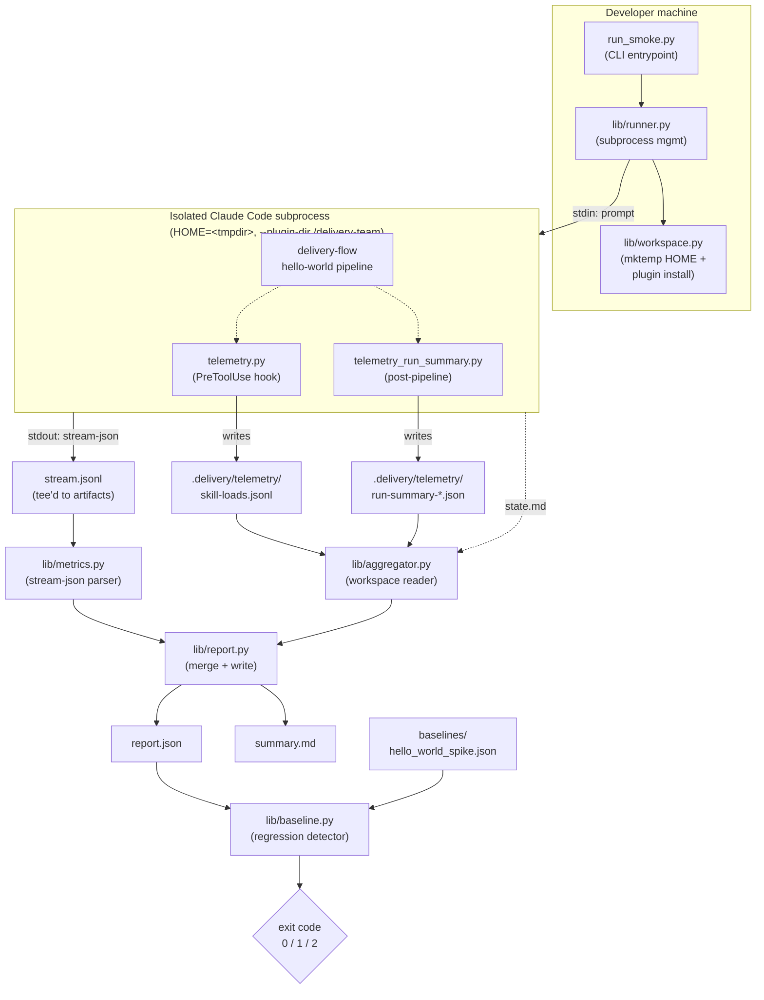

<!-- run: run-2026-05-13-tk5 -->
<!-- author: Celebrimbor (Solution Architect, Stage 4 light) -->
<!-- backlog: BACKLOG-106 -->
# Smoke-Test Runner — Architecture

> *"Let us forge something that will endure beyond the ages. The Rings were beautiful and powerful, but a flaw in their making brought ruin. We shall not repeat that error here."* — Celebrimbor

This document is the permanent architecture record for the delivery-team plugin smoke-test runner (BACKLOG-106). It lives in the plugin tree because the harness it describes lives in the plugin tree (`delivery-team/tests/smoke/`) and any future contributor changing the runner, the metrics shape, or the baseline format must update this file alongside the code.

## 1. Overview

The delivery-team plugin shipped five waves of the skill-token-economy initiative without an empirical end-to-end regression probe. Code review caught design defects but could not catch token-economy drift, model-routing drift, or prompt-template drift — the kinds of regressions that only surface when the team actually runs. The telemetry hooks emitted by `delivery-team/hooks/telemetry.py` and the per-run summary written by `delivery-team/hooks/telemetry_run_summary.py` capture the right data, but they only fire when a pipeline runs by hand. Nothing answers the question "is the team still building hello-world?" on the next plugin change.

The smoke-test runner is that probe. A single command — `python3 delivery-team/tests/smoke/run_smoke.py` — spawns an isolated Claude Code subprocess against a `mktemp` HOME, runs a tiny hello-world delivery-flow pipeline, captures metrics from the subprocess's stream-json output and its `.delivery/telemetry/` artifacts, and diffs the result against a committed five-sample baseline. Hard caps on cost, wall-clock, and dispatch breadth fail the run loudly. Token drift and skill-load drift warn but do not fail. The harness itself is testable in under five seconds via pytest meta-tests that consume fixture stream-json and never invoke Claude. The whole thing is local-only by binding directive — there is no CI surface for this runner and there never will be.

## 2. System Architecture (Mermaid)



## 3. Component Map

| Module | Responsibility | WI | Notes |
|---|---|---|---|
| `run_smoke.py` | CLI entrypoint: parse flags (`--cost-cap`, `--timeout`, `--init-baseline`, `--dry-run`), wire components, write exit code | W6-1 | Thin — delegates to `lib/runner.py`. |
| `lib/runner.py` | Spawn Claude Code subprocess; enforce `--cost-cap` + `--timeout`; tee stream-json to `stream.jsonl`; capture stderr; run capability probe to pick plugin-load path | W6-1 | Sequential only — `--init-baseline` enforces concurrency-of-1 here. |
| `lib/workspace.py` | Create `mktemp` HOME; install plugin (primary `--plugin-dir`, fallback copy-into-`<tmp>/.claude/plugins/delivery-team/`); install minimal `.delivery/config.yml`; verify scrub on exit | W6-1 | The mktemp HOME is the entire isolation boundary — must never resolve to `$HOME`. |
| `lib/metrics.py` | Pure functions: parse stream-json events into `Metrics` dataclass (`tokens.*`, `model_usage[]`, `cost_usd`, `wall_clock_seconds`, `dispatch_count`); malformed events warn, never crash | W6-2 | Producer side of producer-validator pair (BC-03). |
| `lib/aggregator.py` | Read subprocess workspace artifacts: `.delivery/telemetry/skill-loads.jsonl`, newest `run-summary-*.json`, `state.md`; fallback-invokes `telemetry_run_summary.py` if no summary exists; merges into a single dict | W6-3 | Reuse mandate (BC-02) — must NEVER re-implement telemetry. |
| `lib/report.py` | Write `report.json` + `summary.md` + `stream.jsonl` to `delivery-team/tests/smoke/artifacts/<utc-timestamp>/` | W6-4 | Schema in §5. |
| `lib/baseline.py` | Load `baselines/hello_world_spike.json`; compute hard-fail and advisory-warn deltas; emit exit code; mirror `scripts/check_skill_budgets.py` exit convention | W6-5 | Producer side of producer-validator pair (BC-03). |
| `tests/test_meta.py` + `tests/fixtures/` | Pytest meta-tests: malformed-stream fault injection, baseline-comparison demo, aggregator-fixture parsing; NO Claude calls; < 5 sec | W6-7 | Validator side of producer-validator pair (BC-03) — different Dev dispatch than W6-2 / W6-5. |

## 4. Plugin-Loading Strategy

Claude Code's `--plugin-dir` flag is the cleanest isolation primitive available, but its semantics are not yet stable enough to assume. The runner therefore implements both paths and picks at startup via a capability probe.

**Primary path** (`HOME=<tmpdir>` + `--plugin-dir <repo>/delivery-team`):
1. `workspace.py` creates `<tmpdir>` via `tempfile.mkdtemp(prefix="smoke-")`.
2. `<tmpdir>/.claude/` is created empty so the subprocess does not inherit the developer's real `~/.claude/`.
3. A minimal `<tmpdir>/<workdir>/.delivery/config.yml` is installed from `fixtures/delivery_config_minimal.yml`.
4. The subprocess is spawned with `env={"HOME": tmpdir, ...rest}` and command-line `claude --plugin-dir <repo>/delivery-team ...`.

**Fallback path** (copy plugin into `<tmpdir>/.claude/plugins/delivery-team/`):
1. Same `<tmpdir>` setup.
2. `workspace.py` recursively copies `<repo>/delivery-team` into `<tmpdir>/.claude/plugins/delivery-team/` (skipping `tests/smoke/` itself to avoid recursive inclusion).
3. The subprocess is spawned with `env={"HOME": tmpdir, ...rest}` and no `--plugin-dir` flag — plugin discovery falls back to the standard `~/.claude/plugins/` lookup, which resolves to the copied tree.

**Capability probe**:
1. `runner.py` runs `claude --help` (no HOME override) and `grep -q -- --plugin-dir` against the output.
2. If `--plugin-dir` appears in the help text, primary path is selected.
3. If it does not, fallback path is selected.
4. The selected path is logged to `report.json` under `plugin_load_strategy: "plugin-dir" | "copy-into-home"` so the maintainer can see which one ran.

The probe is intentionally a help-text grep rather than a feature flag — it stays correct across CLI versions without coupling the runner to a Claude Code version number.

## 5. Metrics Schema — `report.json`

```json
{
  "schema_version": "1",
  "run_id": "smoke-<utc-timestamp>",
  "git_sha": "<short sha of HEAD at run time>",
  "claude_cli_version": "<output of `claude --version`>",
  "plugin_load_strategy": "plugin-dir | copy-into-home",
  "outcome": {
    "success": true,
    "exit_code": 0,
    "reason": null
  },
  "wall_clock_seconds": 1234.5,
  "cost_usd": 1.42,
  "tokens": {
    "input": 12345,
    "output": 6789,
    "cache_creation": 4500,
    "cache_read": 32100
  },
  "model_usage": [
    {"model": "claude-opus-4-7", "dispatches": 3, "input_tokens": 8000, "output_tokens": 4200},
    {"model": "claude-sonnet-4-5", "dispatches": 5, "input_tokens": 4345, "output_tokens": 2589}
  ],
  "pipeline": {
    "stages_completed": 7,
    "stories_completed": 1,
    "dispatch_count": 8,
    "defects_logged": 0
  },
  "skill_loads": [
    {"skill": "delivery-team:product-delivery", "count": 1, "prose_tokens_mean": 1850.0},
    {"skill": "delivery-team:architect", "count": 1, "prose_tokens_mean": 2100.0}
  ],
  "advisory_warnings": [],
  "hard_failures": []
}
```

The `skill_loads[]` array is derived from `.delivery/telemetry/skill-loads.jsonl` (one row per Skill invocation; placeholder rows excluded per W3-18 semantics in `telemetry.py`). The `model_usage[]` array is derived from the stream-json `usage` events. The `pipeline.*` block is derived jointly from `state.md` (stages, stories, defects) and the run-summary JSON (dispatch count).

Fields that cannot be measured (e.g. `claude_cli_version` if `claude --version` fails) are emitted as `null` rather than omitted, so downstream tooling can rely on the schema shape.

## 6. Baseline Format — `baselines/hello_world_spike.json`

Shape mirrors `governance/skill-budgets.json` per BC-02. Each metric carries `mean`, `stddev`, `n` (sample count), an optional `hard_max` (only present for hard-class metrics), and an explicit `classification: "hard" | "advisory"` so the detector logic is data-driven rather than name-driven.

```json
{
  "schema_version": "1",
  "scenario": "hello_world_spike",
  "n_samples": 5,
  "last_captured_utc": "2026-05-13T15:42:00Z",
  "last_captured_git_sha": "<short sha at capture time>",
  "last_captured_cli_version": "<claude --version at capture time>",
  "metrics": {
    "wall_clock_seconds":   {"mean": 1150.0, "stddev":  80.0, "n": 5, "hard_max": 1800,    "classification": "hard"},
    "cost_usd":             {"mean":    1.45, "stddev":   0.15, "n": 5, "hard_max":    3.00, "classification": "hard"},
    "pipeline.dispatch_count":   {"mean": 8.0,  "stddev": 1.0, "n": 5, "hard_max": 16, "classification": "hard"},
    "pipeline.stories_completed":{"mean": 1.0,  "stddev": 0.0, "n": 5, "hard_max":  1, "classification": "hard"},
    "tokens.input":         {"mean": 12500.0, "stddev": 1200.0, "n": 5, "classification": "advisory"},
    "tokens.output":        {"mean":  6800.0, "stddev":  700.0, "n": 5, "classification": "advisory"},
    "tokens.cache_creation":{"mean":  4500.0, "stddev":  500.0, "n": 5, "classification": "advisory"},
    "tokens.cache_read":    {"mean": 32000.0, "stddev": 3500.0, "n": 5, "classification": "advisory"},
    "skill_loads.delivery-team:product-delivery": {"mean": 1.0, "stddev": 0.0, "n": 5, "classification": "advisory"},
    "skill_loads.delivery-team:architect":        {"mean": 1.0, "stddev": 0.0, "n": 5, "classification": "advisory"},
    "skill_loads.delivery-team:developer":        {"mean": 1.0, "stddev": 0.0, "n": 5, "classification": "advisory"}
  }
}
```

The `outcome.success` metric is not in this map because it is checked structurally (must equal `true`) rather than statistically. The detector treats `outcome.success == false` as hard-fail by definition.

## 7. Regression Detector Logic

Two classes, evaluated in this order. First class to trigger sets the exit code; the second class still runs for reporting but does not change exit code.

**HARD-FAIL (exit code 1)** — any of:
- `outcome.success == false`
- `cost_usd > metrics.cost_usd.hard_max`
- `wall_clock_seconds > metrics.wall_clock_seconds.hard_max`
- `pipeline.dispatch_count > metrics.pipeline.dispatch_count.hard_max`
- `pipeline.stories_completed != metrics.pipeline.stories_completed.mean` (strict equality — stories is integer-valued, stddev = 0)

**ADVISORY-WARN (exit code 0, but warning written to `summary.md` and `report.json.advisory_warnings[]`)** — any of:
- `tokens.input` outside `mean ± 2·stddev`
- `tokens.output` outside `mean ± 2·stddev`
- `tokens.cache_creation` outside `mean ± 2·stddev`
- `tokens.cache_read` outside `mean ± 2·stddev`
- any `skill_loads.<skill>` outside `mean ± 2·stddev`

Exit-code convention mirrors `scripts/check_skill_budgets.py`: `0` = pass, `1` = hard fail, `2` = config/usage error (e.g. baseline file missing, JSON malformed). Advisory warnings DO NOT change exit code — they are reporting-only for the first month per BC-05 / NFR-Reproducibility, tightening to 1.5σ after 20 accumulated production runs.

A metric not present in the baseline is logged as `unknown_metric` in `report.json` but does not fail the run. A metric present in the baseline but missing from the report is hard-failed only if `classification == "hard"`; advisory-class missing metrics warn.

## 8. Decision Log

- **Subprocess over SDK.** The harness invokes the `claude` CLI binary in a subprocess rather than calling the Anthropic SDK in-process. Rationale: plugin loading is a CLI surface — there is no in-process equivalent — and the goal is parity with the real maintainer's experience. SDK invocation would test a different code path than the one we ship.
- **mktemp HOME.** Isolation is achieved by overriding `HOME` to a `tempfile.mkdtemp` directory. This is the smallest possible blast radius: every Claude Code path that reads `~/.claude/` becomes scoped to the tempdir for the duration of the run. The runner asserts on exit that no writes landed in the real `~/.claude/` via a stat-based check.
- **Reuse telemetry hooks; do not re-implement.** The aggregator reads `.delivery/telemetry/skill-loads.jsonl` and the per-run summary JSON directly. BC-02 forbids re-implementation. If a contract gap is found, a follow-up BACKLOG is filed — the runner does not patch around it.
- **Producer-validator split.** `lib/metrics.py` (W6-2) and `lib/baseline.py` (W6-5) are authored by one Stage-6 Dev dispatch; `tests/test_meta.py` + fixtures (W6-7) are authored by a different dispatch. BC-03. The validator does not read the producer's source while authoring fixtures — fixtures come from the PRD/BACKLOG contract only.
- **Local-only.** No `.github/workflows/smoke-*.yml`. See §9.
- **Capability probe over version pinning.** The primary-vs-fallback plugin-loading decision is made by grepping `claude --help` for `--plugin-dir`, not by comparing CLI versions. Stays correct across CLI versions; does not require the runner to track Claude Code release notes.
- **Five-sample baseline, 2σ band.** Five samples is the smallest n that produces a meaningful stddev; the 2σ band is wide enough to absorb first-month noise without spurious warnings. PO commits to tightening to 1.5σ after 20 accumulated production runs (NFR-Reproducibility).
- **Sequential `--init-baseline` only.** Concurrency-of-1 enforced in `runner.py`. Parallel runs would share the developer's local Anthropic rate-limit budget and produce correlated samples — a worse baseline than five clean sequential runs.

## 9. Local-Only Constraint (BINDING)

This harness is local-only. There is no CI surface for it and there never will be. The binding directive is in `/home/meconnelly/.claude/projects/-var-home-meconnelly-Documents-GitHub-Claude-Plugins/memory/feedback_claude_code_local_only.md` (memory file: `feedback_claude_code_local_only`). The directive states that the `claude` CLI is only available on the developer's machine — CI runners have neither the binary nor the credentials, so any `.github/workflows/smoke-*.yml` would silently fail or never run.

This constraint is BINDING and CANNOT be bypassed via ADR. CI workflows in this repo are limited to lint/budget/metadata jobs (`workflow-injection-lint.yml`, `skill-line-budget.yml`, `fitness-review.yml`). The smoke-test runner is invoked exclusively via `python3 delivery-team/tests/smoke/run_smoke.py` or the root `Makefile` `smoke` target. The README (W6-8) points back to this section and to the memory file by full path.

## 10. Open Questions

1. **Skill-load count granularity.** The current report shape collapses `skill_loads[]` to `(skill, count, prose_tokens_mean)`. If a future regression requires per-invocation token detail to be diff'd, the aggregator and baseline shape will need to grow. **Deferral**: defer until a real regression hits that needs the detail; do not over-engineer the v1 baseline.
2. **State.md schema stability.** The aggregator parses `state.md` minimally (stage count, stories, defects). If the delivery-flow state-file format changes, the aggregator silently under-reports rather than failing loudly. **Deferral**: monitor the first 5 runs; if `state.md` parsing degrades, add a schema-version check at the top of the file in a follow-up BACKLOG.

---

*— Celebrimbor, Stage 4 Architect, run-2026-05-13-tk5. Forged with care; flaws documented openly so the next smith can mend them.*
