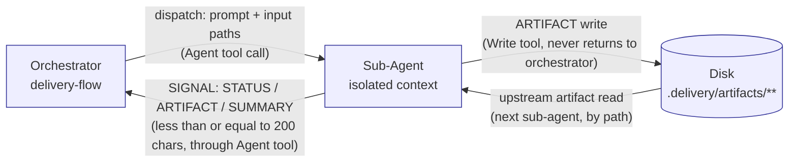
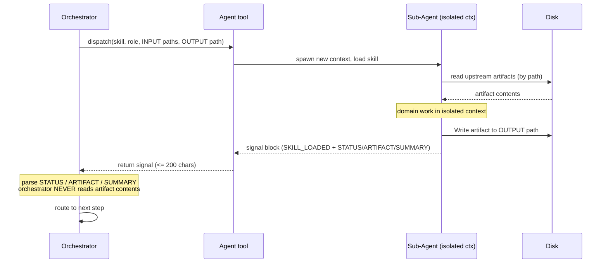

# Sub-Agent Dispatch & Two-Channel Communication

> *Celebrimbor of Eregion: of all the rings I have forged for this pipeline,
> this is the one that binds the rest. Break it and the others turn to slag.*

## Purpose

The `delivery-flow` orchestrator does not *do* domain work. It **dispatches**
each domain task to a sub-agent via the Agent tool. Each sub-agent runs in an
**isolated context** (its own conversation, its own tokens, its own skill
load). Communication runs on exactly **two channels**:

- a **signal channel** — small, structured, returns through the Agent tool
- an **artifact channel** — a file on disk, never returned through the Agent tool

This is the single most important architectural rule in `delivery-team`.
Adversarial review, DoD self-correction, memory, escalation — all assume it.

## Why Two Channels

- **Signal stays under 200 characters.** The orchestrator routes on every
  returned signal without its context ballooning across seven stages.
- **Artifact lives on disk.** Downstream agents read artifacts **by path**,
  not by inheriting the prior agent's chat output. The artifact is the
  source of truth; the signal only names it.
- **Context isolation.** Agent N+1 never sees Agent N's full output — only
  the file. A challenger reading a primary's artifact does not read the
  primary's reasoning trace. This is what makes adversarial review
  *adversarial*.
- **Bandwidth.** A pipeline dispatches dozens of agents (4 DoD validators ×
  7 stages + primaries + challengers + review boards) without context
  explosion, because artifact content never crosses the orchestrator.

## The Signal Format

Every dispatched sub-agent MUST return, verbatim, a signal block. The first
line is the skill-load receipt; the three fields are the routing payload:

```
SKILL_LOADED: <expected-skill-name>
...
STATUS: {DONE | NOT_DONE | CODE_COMPLETE}
ARTIFACT: <path>
SUMMARY: <one sentence, max 200 characters>
```

`SKILL_LOADED` is verified by the PostToolUse (Agent) **Skill load
verification** hook. The three fields are canonical in
`delivery-team/skills/delivery-flow/SKILL.md` Step 4 (lines 442-452).
`CODE_COMPLETE` is the third verdict for Stage 6 work whose empirical
validation must wait until UAT (SKILL.md line 699).

## Diagram 1 — Two-Channel Architecture



The orchestrator only ever touches the signal side; the disk only ever
touches the artifact side. They do not meet.

## Sub-Agent Dispatch — The Rule

- **MUST**: every domain task — primary, challenger, validator, reviewer —
  is delegated via the Agent tool. Each dispatch is a fresh Agent call with
  a freshly loaded skill.
- **NEVER**: the orchestrator does not write domain artifacts. SKILL.md Step
  4.5 (Delegation Self-Check, lines 454-469): if about to Write or Edit
  inside `.delivery/artifacts/`, stop and dispatch instead.
- **ENFORCED BY**: the **Sub-Agent Dispatch Guardrail** at the top of
  `mtg-commander/SKILL.md` (lines 18-36) — the most explicit version of the
  rule shipped in the repo. The same principle is load-bearing in
  `delivery-flow/SKILL.md`.

## Diagram 2 — Dispatch Sequence



The orchestrator never sees artifact contents. It sees a path and a summary.
All decisions are made on the signal.

## Anti-Pattern: Inlining

The most dangerous failure mode is the orchestrator "saving a round-trip"
and doing the sub-agent's work itself.

Real session evidence, verbatim in `mtg-commander/SKILL.md` line 32:

> "I'll run the agent roles inline to keep things moving..."

Result (session `0876a59e`, same file line 34): four agents collapsed into
one context window, adversarial independence destroyed, correction loop
never fired because there were no agent boundaries to trigger it, deck
shipped with 14 undetected color-identity violations.

Detection:

- **Agent prompt audit** (PreToolUse Agent) — flags compound-role prompts
  and anti-isolation tokens; catches the "paste prior findings in" variant.
- **Skill load verification** (PostToolUse Agent) — flags a missing
  `SKILL_LOADED` first line; catches sub-agents that never loaded a skill.

Prevention: SKILL.md uses the strongest possible language — **MUST**,
**NEVER**, **NON-NEGOTIABLE**, **GUARDRAIL VIOLATION**. The temptation to
inline is strong; the language must be stronger.

## Context Isolation — What the Sub-Agent Sees

Receives **only**: file **paths** to upstream artifacts (never content);
role-specific gate criteria (if validator); task description + **output
path**; memory and hot lessons.

Does **not** receive: other sub-agents' chat output; full pipeline state;
orchestrator's conversation history; other validators' same-round findings.

Memory/hot-lesson injection is not a leak — those are project-scoped, not
per-agent residue. The rule prevents agent-to-agent context bleed, not
agent knowledge.

## Performance & Scaling

- **Parallel dispatch.** When sub-agents are independent (4 DoD validators
  at a gate), the orchestrator issues multiple Agent calls in one message.
- `pipeline.max_parallel_agents` (default **3**) caps concurrent dispatches.
- `pipeline.parallel_validators: true` (default) batches the validator panel.
- Because artifacts never cross back, a 4-way fan-out costs 4 small signals,
  not 4 full artifacts.

## Hooks Supporting This Pattern

| Event | Hook | Role |
|-------|------|------|
| PreToolUse (Agent) | Agent prompt audit | detect compound-role / anti-isolation tokens before dispatch |
| PostToolUse (Agent) | Skill load verification | confirm `SKILL_LOADED` first line in sub-agent response |

Both hooks exist precisely because this pattern is load-bearing and its
violations are easy to commit and hard to see.

## See Also

- `delivery-team/architecture/hook-firing-timeline.md` — FLOW-3: supporting
  hook timeline
- `delivery-team/architecture/dod-self-correction.md` — FLOW-4: DoD loop
  reuses this dispatch pattern for re-validation
- `mtg-commander/ARCHITECTURE.md` — same pattern, different domain
- `delivery-team/skills/delivery-flow/SKILL.md` — *Two-Channel
  Communication* (line 346) and Step 4 / Step 4.5 (lines 424-469)

*Forge this ring true, and the others hold.* — Celebrimbor
