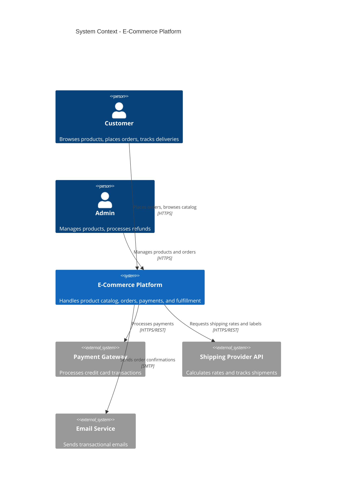
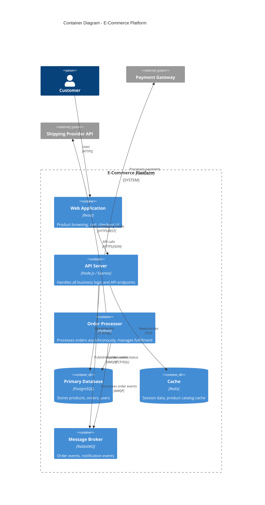
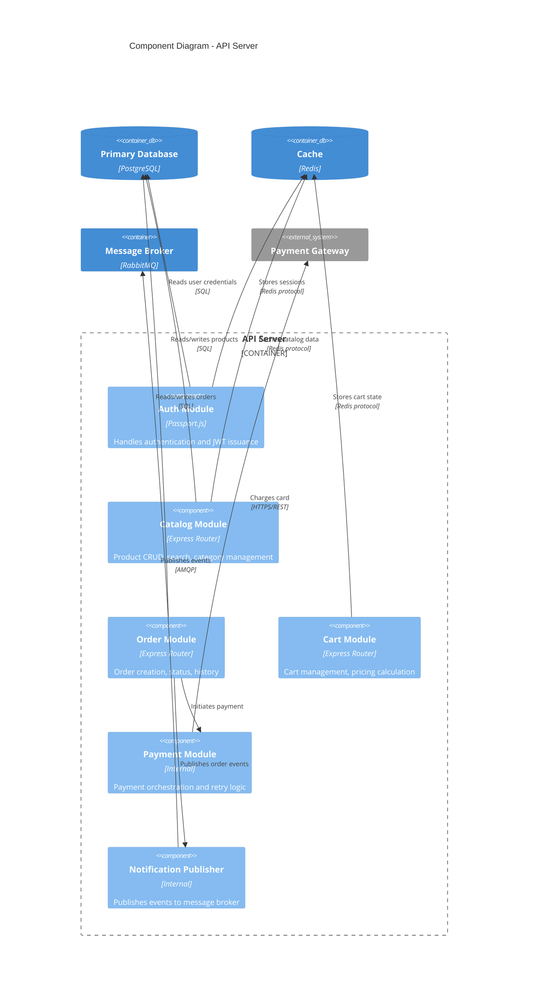
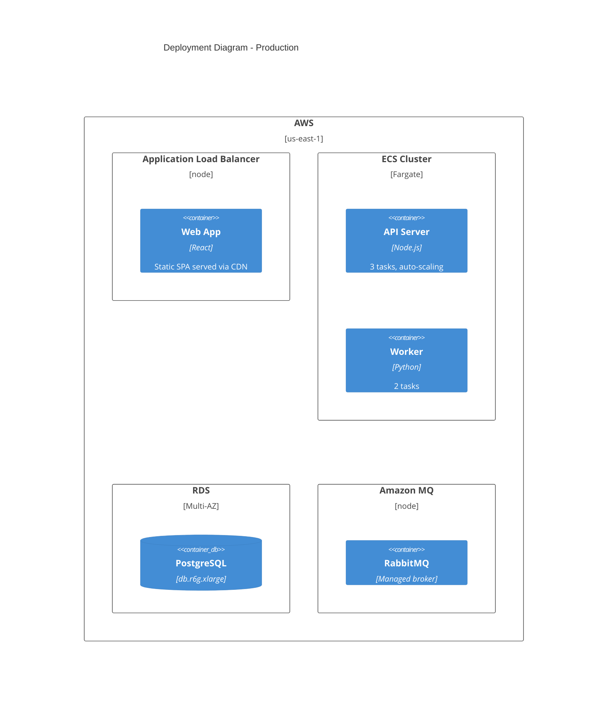
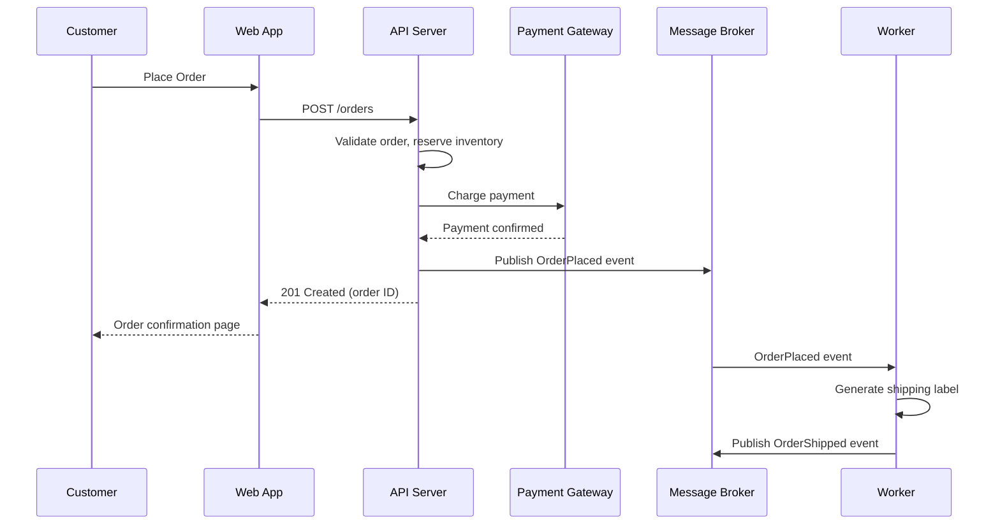

# C4 Model Reference

The C4 model provides four levels of abstraction for describing software architecture. Each level answers different questions for different audiences.

---

## Level 1: System Context Diagram

**What it shows:** Your system as a box in the center, surrounded by the people who use it and the other systems it interacts with.

**Audience:** Everyone -- developers, product managers, stakeholders, operations.

**How to identify boundaries:**
- Your system is what your team builds and maintains
- External systems are anything you integrate with but do not control
- Users are roles, not individual people ("Customer," "Admin," not "Alice")

**Rules:**
- One diagram per system context
- Show only systems, not internal structure
- Include all direct dependencies (databases you own are inside your system, third-party APIs are external)
- Label every relationship with its purpose and protocol ("Sends order events via Kafka," "Queries product catalog via REST")

### Mermaid Example



---

## Level 2: Container Diagram

**What it shows:** The high-level technology choices inside your system -- applications, data stores, message brokers, file systems.

**A "container" is:** A separately deployable/runnable unit. A web app, an API, a database, a message queue, a serverless function, a mobile app.

**A "container" is NOT:** A Docker container (unfortunate naming collision). A class or module.

**How to decompose:**
- Identify each independently deployable artifact
- Identify each data store (relational DB, document store, cache, search index)
- Identify message brokers or event buses
- Show how containers communicate (sync, async, protocols)

### Mermaid Example



---

## Level 3: Component Diagram

**What it shows:** The structural building blocks inside a single container -- the major components, their responsibilities, and interactions.

**When to go this deep:**
- The container is complex enough that its internals need explanation
- Onboarding new developers to a specific codebase
- Planning significant refactoring of a container's internals

**When to skip it:**
- The container is simple (a thin API proxy, a static site)
- The team is small and everyone already knows the internals
- The code itself is clear enough to be self-documenting at this level

**A "component" is:** A grouping of related functionality behind a well-defined interface. A module, a package, a service layer class. Not individual classes or functions.

### Mermaid Example



---

## Level 4: Code Diagram

**When to use:** Rarely. Auto-generate from code if needed. Manually maintained code-level diagrams go stale within days.

**Legitimate uses:**
- Documenting a particularly complex algorithm or state machine
- Onboarding material for a critical, intricate subsystem
- Regulatory requirements demanding code-level documentation

**If you must create one:** Use your IDE's tooling or code-generation to produce UML class diagrams. Do not hand-draw class diagrams for an entire codebase.

---

## PlantUML C4 Notation

PlantUML has a dedicated C4 library. Example of a container diagram:

```plantuml
@startuml
!include https://raw.githubusercontent.com/plantuml-stdlib/C4-PlantUML/master/C4_Container.puml

LAYOUT_WITH_LEGEND()

title Container Diagram - E-Commerce Platform

Person(customer, "Customer", "Browses and purchases products")

System_Boundary(ec, "E-Commerce Platform") {
    Container(web, "Web Application", "React", "Serves the storefront UI")
    Container(api, "API Server", "Node.js", "Business logic and REST endpoints")
    ContainerDb(db, "Database", "PostgreSQL", "Stores all domain data")
    ContainerQueue(mq, "Message Broker", "RabbitMQ", "Async event processing")
    Container(worker, "Worker", "Python", "Background order processing")
}

System_Ext(pay, "Payment Gateway", "Processes payments")

Rel(customer, web, "Uses", "HTTPS")
Rel(web, api, "Calls", "HTTPS/JSON")
Rel(api, db, "Reads/Writes", "SQL")
Rel(api, mq, "Publishes", "AMQP")
Rel(worker, mq, "Subscribes", "AMQP")
Rel(worker, db, "Updates", "SQL")
Rel(api, pay, "Charges", "HTTPS")

@enduml
```

---

## Supplementary Diagrams

### Deployment Diagram
Shows how containers map to infrastructure -- servers, cloud services, containers, regions, availability zones.



### Dynamic / Sequence Diagram
Shows how containers or components interact for a specific use case at runtime. Use standard Mermaid sequence diagram syntax.



---

## Common Mistakes and How to Avoid Them

**Mistake: Mixing abstraction levels.** A container diagram that also shows classes, or a context diagram that includes databases.
Fix: Each diagram belongs to exactly one level. If you need more detail, create a diagram at the next level down.

**Mistake: Missing relationship labels.** Lines between boxes with no description of what flows across them.
Fix: Every relationship line must state what is communicated and how ("Sends order events via Kafka," not just an unlabeled arrow).

**Mistake: Including every internal detail at Level 1.** The context diagram should show 5-15 elements. If it has 40 boxes, you are at the wrong level.
Fix: Aggregate related external systems. "Monitoring Stack" instead of separate boxes for Prometheus, Grafana, and Alertmanager.

**Mistake: Treating C4 as a one-time artifact.** Drawing diagrams during an architecture review and never updating them.
Fix: Keep diagrams in version control alongside code. Use text-based notation (Mermaid, PlantUML) so diffs are meaningful. Update diagrams when containers or major components change.

**Mistake: No legend or key.** Readers cannot distinguish between a database, a message broker, and an application.
Fix: Use standard C4 shapes or include a legend. Mermaid C4 macros handle this automatically.

**Mistake: Drawing Level 3 and 4 for everything.** Component and code diagrams for every container create a documentation burden that no team can maintain.
Fix: Reserve Level 3 for genuinely complex containers. Skip Level 4 unless mandated.

**Mistake: Confusing containers with Docker containers.** A C4 container is a runtime unit (process, app, data store), not a Docker image.
Fix: Use the term "C4 container" explicitly when there is ambiguity. Annotate with the actual technology.
