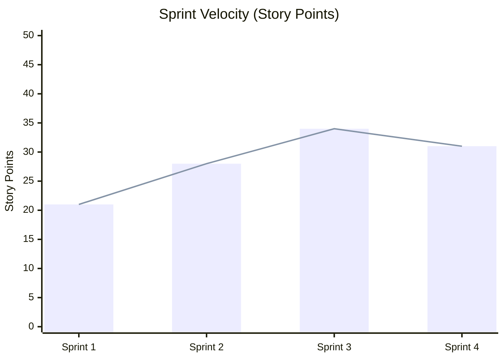
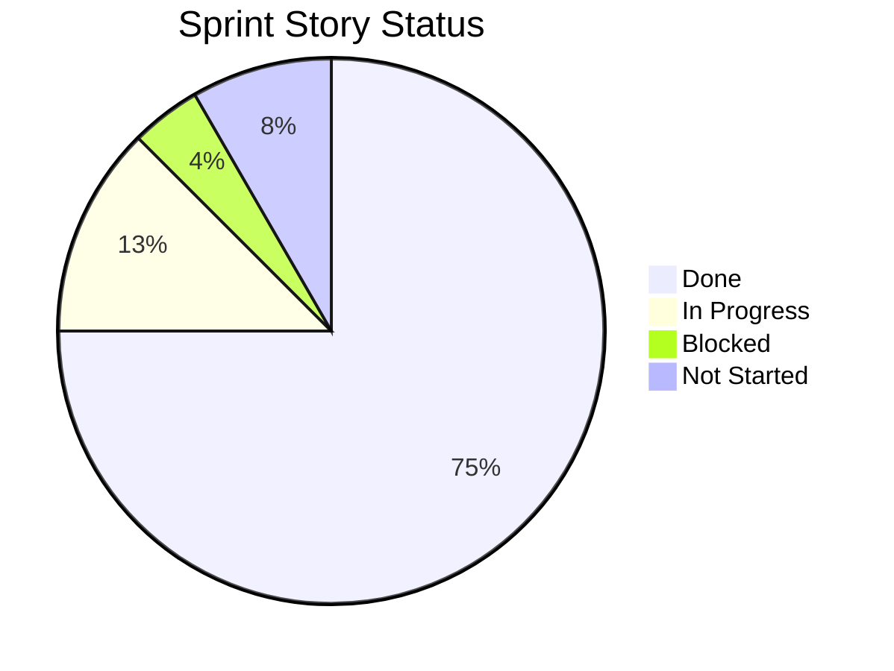
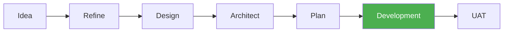
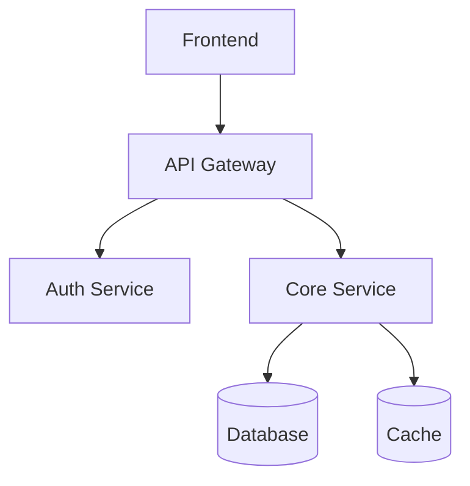
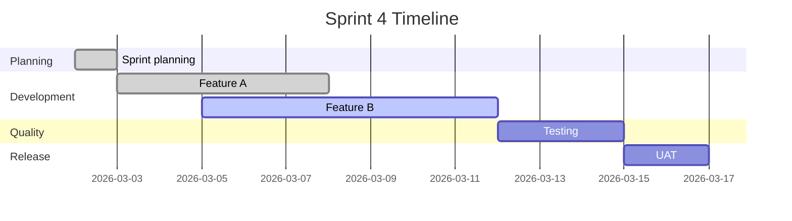

# Data Visualization Reference

Guidelines for selecting, building, and presenting data visualizations in presentation slides.

---

## Chart Type Selection

Decision matrix — match data to the right visualization.

| Data Pattern | Best Visualization | Mermaid Support |
|---|---|---|
| **Trend over time** (velocity, defect rate, burndown) | Line chart | `xychart-beta` |
| **Distribution** (story types, defect categories, effort split) | Pie chart | `pie` |
| **Comparison** (planned vs actual, sprint-over-sprint) | Bar chart or side-by-side table | `xychart-beta` (bar) |
| **Progress** (sprint completion, milestone) | Progress bar or percentage callout | Use metric highlight pattern |
| **Flow** (pipeline stages, process) | Flowchart | `graph LR` |
| **Architecture** (system overview, components) | Block diagram | `graph TD` |
| **Timeline** (roadmap, sprint milestones, release plan) | Gantt chart | `gantt` |
| **Relationship** (dependencies, team topology) | Graph | `graph TD` or `graph LR` |

**Selection rule**: Pick the simplest chart that answers the audience's question. If a single number with context is sufficient, use a metric highlight pattern instead of a chart.

---

## Mermaid Diagram Templates

Ready-to-use templates for common presentation scenarios.

### Sprint Velocity Trend



### Story Completion Pie Chart



### Pipeline Flow Diagram



Highlight the current stage with `style` to show progress.

### Architecture Component Diagram



### Sprint Timeline Gantt



---

## Metric Highlight Patterns

How to present key numbers on slides without charts.

### Big Number Callout

A single large metric with context. Use when one number tells the story.

```
**92%** completion rate — up 8% from last sprint
```

Format: **[number]** [metric name] — [context comparing to baseline]

### Trend Arrow

Metric with direction indicator. Use for dashboards or multi-metric slides.

| Indicator | Meaning |
|-----------|---------|
| ↑ | Improving (green) |
| ↓ | Declining (red) |
| → | Stable (neutral) |

Example: `Velocity: 34 pts ↑` &nbsp; `Defect rate: 3.2% ↓` &nbsp; `Coverage: 88% →`

### Traffic Light

Red/yellow/green status for multiple metrics at a glance.

| Metric | Status | Value |
|--------|--------|-------|
| Sprint completion | :green_circle: | 92% |
| Defect escape rate | :yellow_circle: | 4.1% |
| Test coverage | :red_circle: | 62% |

Use when the audience needs a quick health check across several dimensions.

### Comparison Pair

Side-by-side for this sprint vs last sprint (or planned vs actual).

| Metric | Last Sprint | This Sprint | Delta |
|--------|------------|-------------|-------|
| Velocity | 28 pts | 34 pts | +6 ↑ |
| Completion | 84% | 92% | +8% ↑ |
| Defects found | 7 | 4 | -3 ↑ |

---

## Table Formatting for Slides

Tables on slides must be scannable when projected.

- **Max 5 rows, 4 columns** per table on a slide. Split larger data across slides.
- **Bold headers**. Always use a header row.
- **Right-align numbers**. Left-align text.
- **Highlight key cells**: bold the best/worst values, or add ↑/↓ indicators.
- **No merged cells**. Keep structure flat.
- **Consistent units**: pick one unit per column (pts, %, count) and label it in the header.

---

## Data Accuracy Rules

Every number in a presentation must be traceable and honest.

1. **Cite the source**: Every data point must reference its source artifact (e.g., sprint plan, UAT report, defect log). Use the slide citation format from the output spec.
2. **Show formulas for calculated values**: If a metric is derived (e.g., `completion rate = done / total`), include the formula in speaker notes or a footnote.
3. **Rounding discipline**:
   - Rounding must not change the narrative. `89.9% → 90%` is acceptable. `89.1% → 90%` is not.
   - Use one decimal place for percentages unless whole numbers are clearer.
4. **Missing data**: Use `[TBD — requires: {artifact name}]` — never guess, estimate, or leave blank.
5. **Staleness warning**: If source data is older than the configured `staleness_warning_days` threshold, note it on the slide: `(data as of {date})`.
6. **Trend assertions require >= 3 data points**. Two sprints is a comparison, not a trend.
