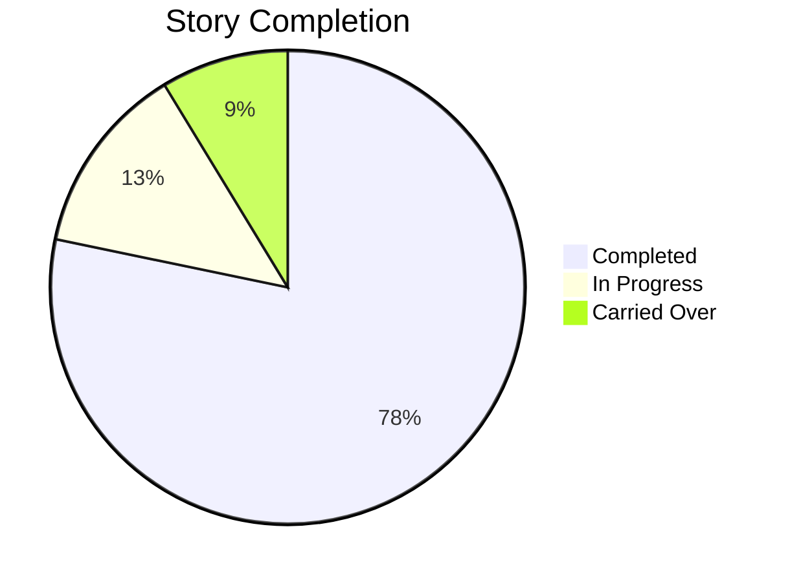

# Marp Templates Reference

Marp syntax, themes, directives, layouts, and diagram integration. Loaded when output format is Marp.

## Marp Basics

```yaml
---
marp: true
theme: default
paginate: true
header: "Project Name"
footer: "Team Name — 2026-Q1"
---
```

- `marp: true` — required, enables Marp rendering
- `theme` — global in frontmatter, per-slide via directive
- `paginate: true` — slide numbers (disable per-slide with `<!-- _paginate: false -->`)
- `header` / `footer` — repeated on every slide
- Slide separator: `---`
- Speaker notes: `<!-- notes: talking points here -->`

---

## Theme Configuration

| Theme | Best For | Character |
|-------|----------|-----------|
| `default` | Technical, developer audiences | Clean, minimal, high contrast |
| `gaia` | Executive, client-facing | Warm tones, polished feel |
| `uncover` | Casual, workshop, internal | Modern, understated |

Audience mapping: **technical** -> `default`, **executive/client-facing** -> `gaia`, **casual** -> `uncover`. Override via `presentation.marp_theme` in config.

Custom styling with a `<style>` block on the first slide:

```html
<style>
section { font-size: 24px; }
h1 { color: #2d5aa0; }
</style>
```

---

## Directives

Per-slide directives use HTML comments with underscore prefix:

| Directive | Effect |
|-----------|--------|
| `<!-- _class: lead -->` | Large centered title layout (title/section slides) |
| `<!-- _class: invert -->` | Dark background, light text (emphasis slides) |
| `<!-- _paginate: false -->` | Hide slide number (title/closing slides) |
| `<!-- _backgroundColor: #hex -->` | Custom background color |
| `<!-- _color: #hex -->` | Custom text color |
| `<!-- _header: "" -->` / `<!-- _footer: "" -->` | Clear header/footer for this slide |

Combine multiple directives on one slide as separate comments.

---

## Layout Patterns

**Two-column** using flex layout:

```html
<div style="display: flex; gap: 2em;">
<div style="flex: 1;">

**Column A**
- Item 1
- Item 2

</div>
<div style="flex: 1;">

**Column B**
- Item 1
- Item 2

</div>
</div>
```

**Image placement**:
- `` — image on right, 40% width
- `` — image on left, 50% width
- `` — full background image
- `` — fit without cropping

**Auto-fit**: `<!-- fit -->` before a heading auto-sizes it. Only use on headings.

---

## Mermaid Diagram Integration

Mermaid renders via marp-cli with `@marp-team/mermaid` plugin. Use fenced code blocks with `mermaid` tag.

| Diagram | Use Case |
|---------|----------|
| `flowchart TD` | Process flow, pipeline stages |
| `pie` | Distribution, completion ratios |
| `gantt` | Timeline, sprint schedule |
| `graph TD` | Architecture overview, dependencies |

Rules: max 8-10 nodes, short labels, prefer `TD` over `LR` for projection readability.

---

## Code and Speaker Notes

**Code**: Standard fenced blocks with language tags. Max 10 lines per slide.

**Speaker notes**: HTML comment block, 3-5 bullets. Visible via `marp --preview`.

```markdown
<!-- notes:
- Key message: velocity increased 20%
- Timing: ~90 seconds on this slide
- Ask: questions about methodology?
-->
```

---

## Complete Slide Examples

### Title Slide

```markdown
---
marp: true
theme: gaia
paginate: true
---

<!-- _class: lead -->
<!-- _paginate: false -->
<!-- _header: "" -->

# Sprint 12 Review
## Project Atlas — Q1 2026

**Team Horizon** | March 25, 2026

<!-- notes: Welcome. Today we cover sprint 12 delivery. -->
```

### Metrics Slide with Mermaid

```markdown
## Sprint Completion



- **Velocity**: 42 points (up from 38)
- **Completion rate**: 78%

> <!-- Generated from: sprint-metrics.md -->

<!-- notes: Velocity trending up for third sprint. Carry-overs blocked on external API. -->
```

### Two-Column Comparison

```markdown
## Architecture: Before and After

<div style="display: flex; gap: 2em;">
<div style="flex: 1;">

**Before (Monolith)**
- Single deployment unit
- 12-minute build time
- Coupled data layer

</div>
<div style="flex: 1;">

**After (Services)**
- 4 independent services
- 3-minute build per service
- Bounded contexts

</div>
</div>

> <!-- Generated from: adr-003-service-decomposition.md -->

<!-- notes: Migration reduced build time by 75%. Each service owns its data store. -->
```
