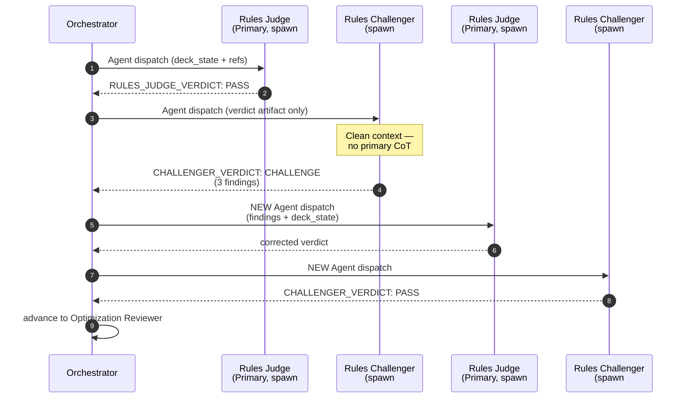
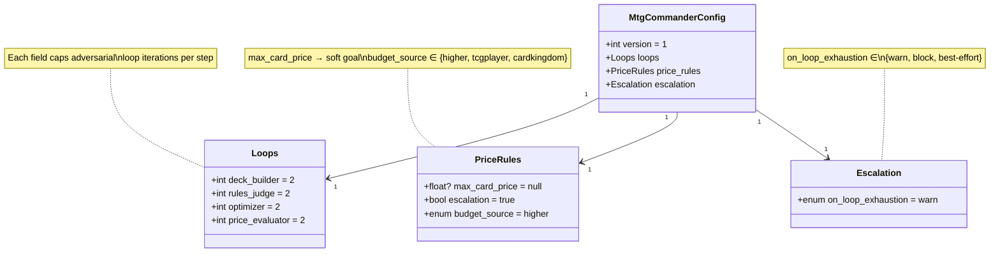

# mtg-commander — Architecture

> *Celebrimbor of Eregion writes: eight dispatches, four adversaries, one hundred cards. The forge of this ring is not a single hammer-stroke but a sequence of independent strikes, each tempered by a rival who never saw the first blow fall. So is synergy tested; so is drift caught.*

## Purpose

`mtg-commander/` builds synergy-dense, format-legal, budget-compliant 100-card Magic: The Gathering Commander decklists via a multi-agent pipeline. Four primary agents (Deck Builder, Rules Judge, Optimization Reviewer, Price Evaluator) run sequentially, each paired with an adversarial challenger that re-verifies the primary's work in a clean context. The pipeline self-corrects on failure, escalates on unresolvable conflict, and is tuned per-repo via `.mtg-commander.yml`. Synergy-first card selection is anchored by live Scryfall data; pricing is dual-vendor (TCGPlayer + Card Kingdom) to catch single-source drift.

Audience of this document: contributors extending the plugin. For user-facing guidance see [`README.md`](README.md).

---

## Components

- **[`SKILL.md`](SKILL.md)** — orchestrator instructions, intake flow, 4 primary agent prompt templates, 4 challenger agent specs, adversarial loop protocol, correction-cycle routing, and the `.mtg-commander.yml` schema (version 1).
- **[`references/`](references/)** — 10 knowledge documents loaded into agent prompts on demand: `archetype-patterns.md`, `synergy-taxonomy.md`, `structural-minimums.md`, `intake-questions.md`, `commander-rules.md`, `banned-list.md`, `rules-judge-guide.md`, `optimizer-guide.md`, `price-evaluator-guide.md`, `api-reference.md`, plus `config-walkthrough.md`.
- **[`scripts/card_lookup.py`](scripts/card_lookup.py)** — stdlib-only Python client for Scryfall (`api.scryfall.com`) and Archidekt (`archidekt.com/api/cards/v2/`); emits JSON for machine parsing.
- **[`.mtg-commander.yml.example`](.mtg-commander.yml.example)** — template for the user-repo config controlling loop caps, price rules, and escalation.

### Diagram 1 — Component view

```mermaid
flowchart TD
    User([User]) -->|intake: 7 params| Orch[Orchestrator<br/>SKILL.md]
    Cfg[(.mtg-commander.yml<br/>user repo)] -->|loops, price_rules,<br/>escalation| Orch
    Refs[(references/<br/>10 docs)] -.->|loaded on demand| Orch

    Orch --> P1[1. Deck Builder]
    P1 <-->|adversarial| C1[Deck Challenger]
    P1 --> P2[2. Rules Judge]
    P2 <-->|adversarial| C2[Rules Challenger]
    P2 --> P3[3. Optimization Reviewer]
    P3 <-->|adversarial| C3[Optimization Challenger]
    P3 --> P4[4. Price Evaluator]
    P4 <-->|adversarial| C4[Price Challenger]
    P4 --> Out([100-card deck<br/>+ pricing + rationale])

    P1 -. card_lookup.py .-> Scry[Scryfall API]
    P2 -. validate-deck .-> Scry
    P4 -. batch-price .-> Scry
    P4 -. ck-batch-price .-> Arch[Archidekt API]
    C4 -. ck-batch-price .-> Arch
```

---

## The 4-Agent Pipeline + Adversarial Loop

Pipeline order is strictly sequential: Deck Builder → Rules Judge → Optimization Reviewer → Price Evaluator. Each step is wrapped in a **primary-vs-challenger** loop. The challenger receives only the primary's output artifact + intake params — never the primary's chain-of-thought. If the challenger returns `CHALLENGE`, the orchestrator spawns a **new** primary with the challenger's findings, then a **new** challenger to re-verify. Loop cap defaults to 2 per step (configurable); exhaustion behaviour is governed by `escalation.on_loop_exhaustion`.

### Diagram 2 — One pipeline step (sequence)



The two primary dispatches (#1, #3) and two challenger dispatches (#2, #4) are **four distinct Agent tool invocations**. This is the anti-inlining guardrail made concrete.

---

## Sub-Agent Dispatch Guardrail

Every pipeline step — primary or challenger — MUST be dispatched as a separate sub-agent via the Agent tool. NEVER inline. This is NON-NEGOTIABLE per [`SKILL.md`](SKILL.md) L18-37.

**Why it matters:**

- **Context isolation** — each agent receives only its defined inputs. No prior-agent reasoning bleeds into the next.
- **Adversarial independence** — a challenger sharing context with the primary it reviews cannot meaningfully challenge.
- **Correction-loop integrity** — routing fails if agent boundaries are absent; the correction signal has nothing to travel between.

**Anti-pattern (real session `0876a59e`):** "I'll run the agent roles inline to keep things moving." This collapsed all four agents into a single context window, destroyed adversarial independence, and produced a deck with **14 undetected color identity violations**. The correction loop never fired — there were no boundaries to trigger it. This is the exact failure the guardrail exists to prevent.

---

## Configuration Model (`.mtg-commander.yml`)

User-repo config, placed at the working-directory root. Schema version 1. Missing file → all defaults. Invalid YAML → warn and use defaults (never blocks). Unknown keys → warn and ignore.

### Diagram 3 — Config schema (class)



Config flows into the orchestrator at pipeline start, after intake confirmation and before the pipeline banner. Each loop cap is applied to its corresponding step; `price_rules.max_card_price` becomes a Price Evaluator soft goal (separate from the 15%-of-budget hard cap); `escalation.on_loop_exhaustion` determines fail-mode when a loop exhausts without `PASS`.

---

## Pricing Model

Pricing is **dual-vendor** by design:

- **TCGPlayer** — fetched via Scryfall (`batch-price`).
- **Card Kingdom** — fetched independently via Archidekt (`ck-batch-price`).

**Budget-wins tiebreaker:** when the Price Evaluator fails, budget takes priority over synergy; replaced cards are tagged `[BUDGET_RELAXED]` and the Optimization Reviewer re-evaluates them at a relaxed synergy threshold of 2 (instead of 3).

**CK divergence escalation (DEFECT-002 fix):** the Price Challenger re-fetches CK prices independently and flags per-card divergence > 30% or total divergence > 20% between vendors. This caught a class of bugs where a single-vendor read silently underpriced the deck.

**Per-card goal vs per-card cap — distinct:**

- *Hard cap* — 15% of total budget, always applied.
- *Soft goal* — `price_rules.max_card_price` (optional). Over-goal cards attempt substitution; unsubstitutable cards escalate to the user (or auto-swap silently if `price_rules.escalation: false`).

A card can pass the soft goal but fail the hard cap, or vice versa.

---

## Format Legality Determinism (DEFECT-001 fix)

The Rules Judge MUST use the `validate-deck` programmatic command as the **sole** legality verification mechanism for color identity, banned list, and format legality. See [`scripts/card_lookup.py`](scripts/card_lookup.py) `validate-deck` subcommand.

LLM knowledge of card attributes is unreliable — training data is stale, partial, and prone to confident hallucination. Color identity, ban status, and format legality are deterministic properties of Scryfall records. Every check must go through the API. The Rules Challenger re-runs the same command independently (clean context) and cross-checks 3 random cards via individual `validate` calls to detect systematic drift.

---

## Closed Defects

- **DEFECT-001** — color identity determinism; Rules Judge previously allowed LLM-inferred legality calls. Fix: mandated `validate-deck` programmatic verification. Closed in run `e6f3`.
- **DEFECT-002** — CK divergence; single-vendor pricing allowed silent drift. Fix: independent Archidekt price fetch in the Price Challenger + divergence thresholds (30% per-card, 20% total). Closed in run `e6f3`.

---

## Extension Points

- **Add a new challenger persona** → extend the `## Challenger Agents` section of [`SKILL.md`](SKILL.md); preserve the `CHALLENGER_VERDICT: PASS | CHALLENGE` / `FINDINGS` / `SUMMARY` signal shape so the orchestrator loop can parse it.
- **Add a new pricing source** → add a subcommand to [`scripts/card_lookup.py`](scripts/card_lookup.py) (follow the `ck-batch-price` pattern, Archidekt-style JSON out); document the vendor in [`references/price-evaluator-guide.md`](references/price-evaluator-guide.md); extend `price_rules.budget_source` enum if the vendor should anchor budget checks.
- **Add a new strategy archetype** → extend [`references/archetype-patterns.md`](references/archetype-patterns.md) with the archetype's synergy taxonomy, typical commanders, structural tilts, and commander-recommendation filters.
- **Tune loops / escalation** → user-side only: edit `.mtg-commander.yml` in the invocation directory. No code change needed; the orchestrator reads on every run.

---

## See Also

- [`README.md`](README.md) — user-facing install, quick start, troubleshooting.
- [`references/config-walkthrough.md`](references/config-walkthrough.md) — authoring guide for `.mtg-commander.yml`.
- [`references/price-evaluator-guide.md`](references/price-evaluator-guide.md) — pricing policy, budget-wins rules, escalation formats.
- [`references/rules-judge-guide.md`](references/rules-judge-guide.md) — legality validation checklist and `validate-deck` usage.
