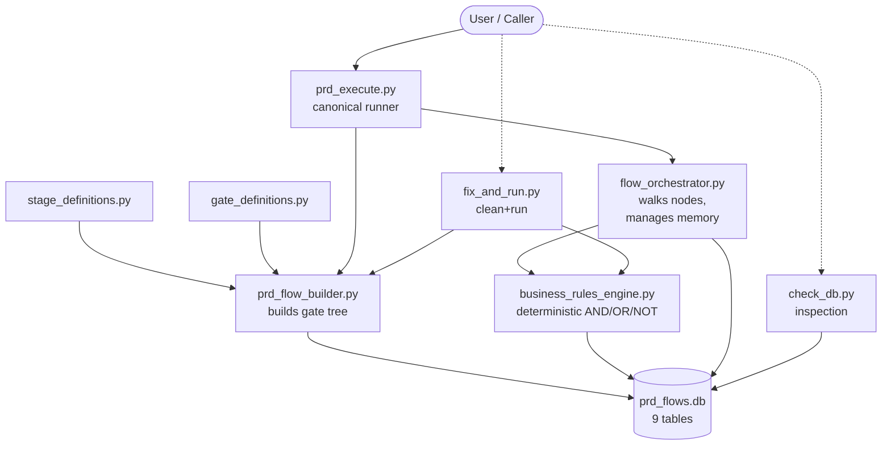
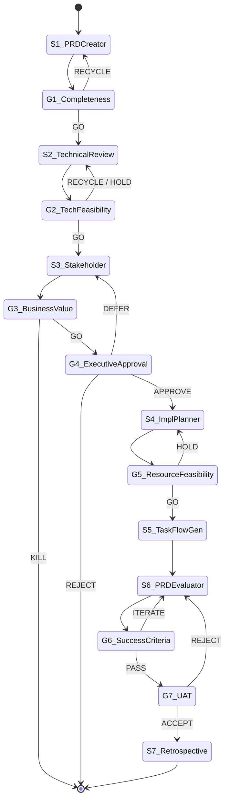

# prd-quality-gate-flow — Architecture

> *Celebrimbor, smith of Eregion, has inspected this gate-craft. What follows is the
> true reckoning of its seven rings — no ornament fabricated, every claim drawn from
> the scripts themselves.*

## 1. Purpose

A production-grade agentic workflow that guides a Product Requirements Document
through **seven quality gates** from idea to retrospective. Its three load-bearing
commitments are:

1. **Deterministic gates.** Decisions are rule-based, not AI-inferred — same input,
   same verdict, every time (`business_rules_engine.py`).
2. **SQLite persistence.** Flow definitions, nodes, rules, executions, gate
   evaluations, memory, and audit logs all live in `prd_flows.db` (`schema.py` —
   9 tables).
3. **Audit trail.** Every evaluation, every decision, every transition is logged for
   compliance and post-hoc learning.

## 2. The 7 Gates

Gate names and sequence are drawn verbatim from `gate_definitions.py` and the
`PIPELINE_SEQUENCE` in `prd_flow_builder.py`.

| # | Gate                         | Type       | Decisions                |
|---|------------------------------|------------|--------------------------|
| 1 | `gate1_completeness`         | Automated  | GO / RECYCLE             |
| 2 | `gate2_technical_feasibility`| Automated  | GO / HOLD / RECYCLE      |
| 3 | `gate3_business_value`       | Automated  | GO / HOLD / KILL         |
| 4 | `gate4_executive_approval`   | Human      | APPROVE / DEFER / REJECT |
| 5 | `gate5_resource_feasibility` | Automated  | GO / HOLD                |
| 6 | `gate6_success_criteria`     | Automated  | PASS / ITERATE           |
| 7 | `gate7_uat`                  | Human      | ACCEPT / REJECT          |

Rules per gate: `[4, 4, 3, 1, 4, 3, 1]` — 20 rules total. Gates 3→4 and 6→7 are
consecutive with no intervening stage; stages 5→6 are consecutive with no gate.

## 3. Component Overview

**Orchestration scripts (flat layout, no package):**
- `prd_flow_builder.py` — builds the flow tree from `STAGE_DEFINITIONS` +
  `GATE_DEFINITIONS` into SQLite. Thin orchestrator over the data modules.
- `prd_execute.py` — canonical executor. Loads or builds the flow, instantiates
  the BRE and orchestrator, runs a product idea through all seven gates.
- `flow_orchestrator.py` — walks the node tree, evaluates gates via BRE, manages
  working + episodic memory, writes audit rows.
- `business_rules_engine.py` — deterministic AND/OR/NOT evaluator. Produces
  `GateEvaluationResult` with decision, score, reasons, and recommendations.

**Data modules (pure definitions):**
- `stage_definitions.py` — the 7 agent/control-flow stages.
- `gate_definitions.py` — the 7 gates and their 20 rules.
- `schema.py` — idempotent `ensure_schema()` for 9 tables + 7 indexes.
- `shared.py` — `DB_PATH`, connection helper, id generator, UTF-8 shim.

**Utilities:**
- `check_db.py` — DB inspection (flows, nodes, rules, executions, audit).
- `fix_and_run.py` — end-to-end clean-and-run demonstration.

**Persistence:** `prd_flows.db` (SQLite), plus `prd_flow_diagram.txt` as ASCII
reference.

### Diagram 1 — Component Flow



## 4. The 7-Gate Sequence

A PRD enters, runs its seven agent stages, and is arbitrated at each gate. A
failing gate recycles to its configured `recycle_target` (e.g. gate 1 recycles to
`stage1_prd_creator`) or escalates to HOLD / KILL / REJECT per
`decision_options`.

### Diagram 2 — Gate State Machine



## 5. Deterministic Business Rules Engine

Gate decisions are **rule-based, not AI-inferred.** `business_rules_engine.py`
evaluates conditions expressed as JSON trees of `AND` / `OR` / `NOT` combinators
over field comparisons (`==`, `!=`, `>`, `<`, `>=`, `<=`), null checks, pattern
matches (`MATCHES`), and collection operations (`IN`, `.length`). Same PRD
context in, same `GateEvaluationResult` out — no temperature, no drift, no
hallucination. This is the load-bearing property for auditability and compliance.

## 6. SQLite Persistence Model

`schema.py::ensure_schema()` creates 9 tables idempotently: `flows`, `nodes`,
`business_rules`, `executions`, `gate_evaluations`, `working_memory`,
`episodic_memory`, `audit_log`, and one more for node dependencies. Plus 7
indexes. `check_db.py` inspects state: lists flows, breaks down node types,
counts rules, dumps execution history. The file `prd_flows.db` is the single
source of runtime truth.

## 7. Memory Model

Two complementary stores, both managed by `flow_orchestrator.py`:

- **Working memory** — `working_memory` table — carries the current PRD state
  between nodes within a single execution.
- **Episodic memory** — `episodic_memory` table — preserves past gate outcomes
  and decisions so future executions can retrieve analogous precedents and learn
  from prior PRDs (the auditable counterpart to "experience").

## 8. Relationship to `agentic-flow-builder`

`agentic-flow-builder/` is the **general pattern guide** — ReAcTree hierarchical
decomposition, deterministic BRE, dual memory, SQLite audit — with a reference
implementation (`database.py`, `business_rules_engine.py`,
`flow_orchestrator.py`, `agent_registry.py`).

`prd-quality-gate-flow/` is the **concrete instance** — the same pattern applied
to the PRD lifecycle with seven named gates and eight specialized agents. Note
this plugin ships *without* an `agent_registry.py`: agent identities live
directly inside `stage_definitions.py`, so registry-level dynamism is traded for
a fixed, auditable cast.

## 9. Running It

```bash
python prd-quality-gate-flow/prd_flow_builder.py   # build the flow (idempotent)
python prd-quality-gate-flow/prd_execute.py        # run a PRD through 7 gates
python prd-quality-gate-flow/check_db.py           # inspect DB state
python prd-quality-gate-flow/fix_and_run.py        # clean + automated end-to-end
```

## 10. Extension Points

- **New gate.** Append an entry to `GATE_DEFINITIONS` in `gate_definitions.py`,
  insert its `(type, index)` into `PIPELINE_SEQUENCE` in `prd_flow_builder.py`.
  Rules travel with the gate — BRE needs no change to support new combinators.
- **New BRE operator.** Extend `business_rules_engine.py` — add the operator to
  the evaluator dispatch, keep it deterministic.
- **New audit query.** Add a listing function to `check_db.py` beside
  `list_flows` / `list_nodes` / `list_rules` and call it from `main()`.
- **Different flow domain.** Mirror this plugin's flat structure — new
  `<domain>_flow_builder.py`, new `stage_definitions.py` +
  `gate_definitions.py`, reuse `business_rules_engine.py` +
  `flow_orchestrator.py` + `schema.py` unchanged.

## 11. See Also

- `agentic-flow-builder/` — abstract pattern, reference implementation, worked example.
- `README.md`, `QUICKSTART.md`, `IMPLEMENTATION_SUMMARY.md`, `DEMONSTRATION_RESULTS.md`.
- `prd_flow_diagram.txt` — ASCII rendering of the same sequence.
