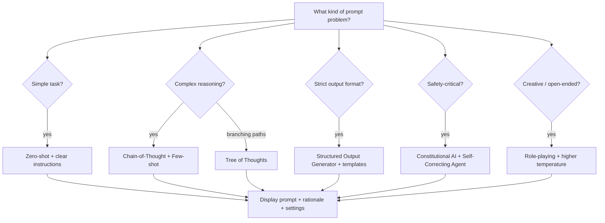

# prompt-engineer — Architecture

> *Celebrimbor speaks:* "Not every ring is One. Some are plainer bands — yet
> their inscriptions teach the hands that forge others. So it is here: a
> single scroll, a catalogue of runes for shaping words that shape minds."

## 1. Purpose

Expert prompt optimization for LLMs and AI systems. The skill analyses a use
case, selects proven techniques, **displays the complete prompt text**, and
iterates. Its motto: *always show, never just describe.*

## 2. Component Overview — Honest Accounting

The plugin is deliberately sparse. No hooks, no scripts, no sub-skills, no
references directory. The "architecture" **is** the pattern catalogue
encoded within `SKILL.md` itself.

| File | Purpose |
|------|---------|
| `SKILL.md` | The entire plugin surface — router, catalogue, patterns, rubric |
| `README.md` | User-facing blurb |
| `LICENSE.txt` | Licensing |

Do not look for machinery that is not here.

## 3. Pattern Library (extracted from SKILL.md)

- **Core techniques** (L25–51): Few-shot vs Zero-shot, Chain-of-Thought,
  Role-playing, Output Format Specification, Constraint & Boundary Setting.
- **Advanced** (L53–77): Constitutional AI, Recursive Prompting, Tree of
  Thoughts, Self-Consistency, Prompt Chaining.
- **Model-specific** (L79–104): Claude (XML, thinking tags), GPT (roles,
  function calls), Open Source (format sensitivity), Specialised (code,
  embeddings, vision, audio).
- **Named patterns** (L237–342): Expert System, Step-by-Step Analyzer,
  Structured Output Generator, Self-Correcting Agent, Multi-Perspective
  Analyzer.
- **Evaluation rubric** (L344–372): Clarity, Completeness, Consistency,
  Efficiency, Safety — scored 1–10.

### Diagram 1 — Technique Selection Flowchart

## 4. Invocation Triggers

Per SKILL.md frontmatter and §"Proactive Usage": building AI features,
creating agent workflows or prompt chains, optimising existing AI
interactions, designing system prompts, troubleshooting output quality,
establishing prompt libraries. Invoke **proactively** whenever LLM usage
surfaces in conversation.

## 5. Relationship to Other Plugins

- **Used BY** any artificer building agentic systems — `delivery-team`
  workers crafting sub-agent prompts, `mtg-commander` challenger agents,
  `agentic-flow-builder` flow definitions, `research-agent` phased
  protocols. Wherever an LLM prompt is authored, this skill refines it.
- **Meta-application.** Skill authors may invoke `prompt-engineer` to
  refine their own `SKILL.md` descriptions — the smith sharpening the
  smith's own tools.

## 6. Extension Points

- **New technique** — append to the catalogue in `SKILL.md` under Core /
  Advanced / Model-Specific.
- **New named pattern** — add to §"Common Prompt Patterns" with template,
  when-to-use, and example.
- **Deep treatment** — grow a `references/` directory (currently absent)
  when a technique warrants more than a SKILL.md section.
- **Evaluation dimension** — extend the 5-axis rubric.

## 7. Honest Limitations

This plugin does **not**:

- Evaluate prompts automatically (no scripts, no test harness).
- Version-control prompts beyond what host-repo git provides.
- A/B test prompts (no experiment framework, no metrics collection).
- Integrate with provider APIs — it teaches design, it does not call
  Claude, GPT, or any endpoint.
- Persist a prompt library — outputs are session artefacts.

These absences are by design; the plugin is a knowledge asset, not a
runtime system.

## 8. See Also

- `delivery-team/developer/` — mirrors the "foundational standards
  always-on" philosophy for code rather than prompts.
- `delivery-team/delivery-flow/` — heavy consumer of prompt-engineering
  patterns in its agent orchestration.

---

*Plain scroll, sharp runes — sufficient unto its purpose.* — Celebrimbor
