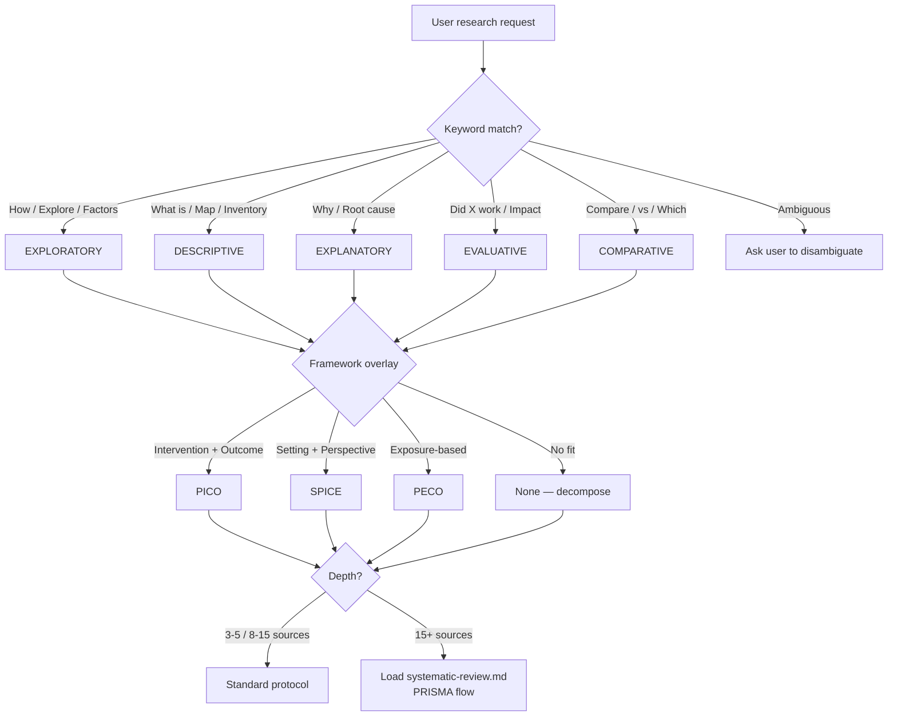
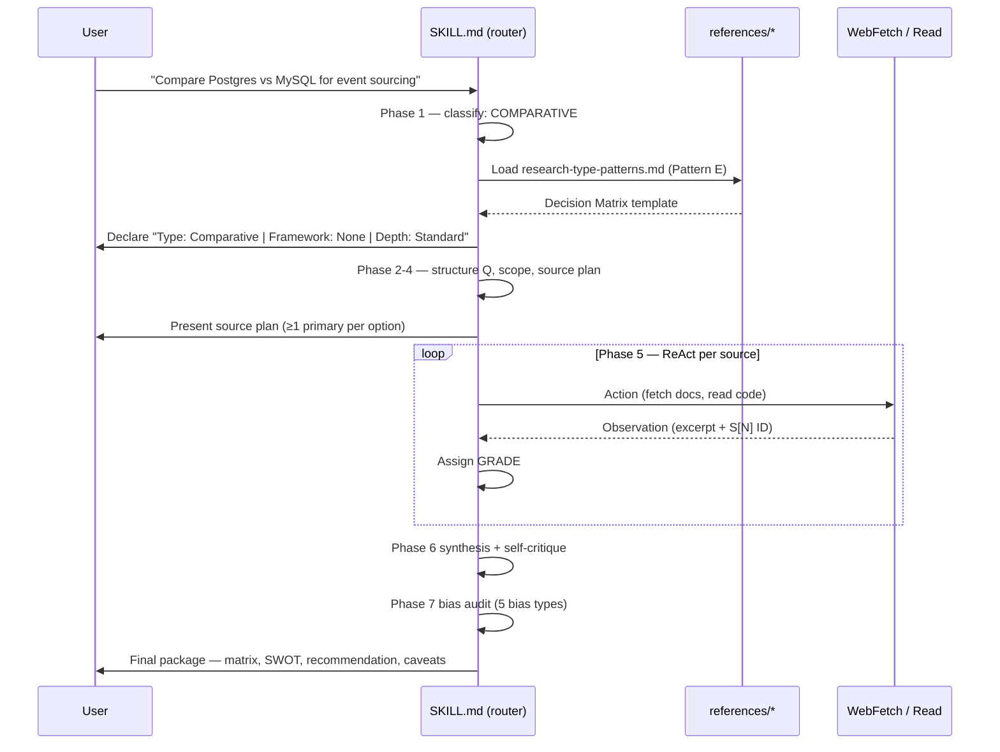

# research-agent — Architecture

> *Celebrimbor, Master-Smith of Eregion:* "A tool for true-seeking, not for
> conjuring. What this plugin cannot reach, it will not pretend to hold."

## Purpose

A **skill-only** plugin for systematic, academically-grounded investigation.
Auto-classifies the user's question into one of **five research types**,
overlays an academic framework (PICO / SPICE / PECO / None), and produces
source-backed, bias-audited findings with GRADE confidence ratings
(`SKILL.md` Phases 1–8). No pipeline, no sub-agents, no SQLite — one SKILL.md
with four reference scrolls.

## The Five Research Types

From `SKILL.md` Phase 1 decision tree (L29–35):

| Type | Trigger Language | Output Pattern |
|------|------------------|----------------|
| **Exploratory** | "How does / Explore / Discover / Factors" | Discovery Report (themes, saturation, provisional model) |
| **Descriptive** | "What is / Map / Inventory / Survey" | Landscape Map (entity inventory, relationships) |
| **Explanatory** | "Why / Root cause / What led to" | Causal Analysis (5 Whys, Ishikawa, hypothesis map) |
| **Evaluative** | "Did X work / Impact / Effective" | Impact Assessment (outcome synthesis, risk of bias) |
| **Comparative** | "Compare / Which is better / vs." | Decision Matrix (weighted criteria, SWOT, recommendation) |

## Component Overview

- **`SKILL.md`** — router + phased protocol (Detect → Structure → Scope → Plan → Gather → Synthesize → Bias Audit → Next Actions).
- **`references/research-type-patterns.md`** — routing cheat sheet, worked examples.
- **`references/systematic-review.md`** — 8-step Cochrane-adapted protocol, PRISMA flow.
- **`references/api-research.md`** — API/SDK evaluation, PICO for APIs.
- **`references/prompt-library.md`** — rationale for embedded prompts.
- **No `scripts/`, no `hooks/`** — skill-only per inventory.

### Diagram 1 — Router Decision Tree

## Academic Frameworks

- **PICO** — Population, Intervention, Comparison, Outcome.
- **SPICE** — Setting, Perspective, Intervention, Comparison, Evaluation.
- **PECO** — Population, Exposure, Comparison, Outcome.
- **GRADE** — ⊕⊕⊕⊕ to ⊕◯◯◯ evidence grading on every claim.
- **Cochrane-adapted systematic review** — 8 steps (`systematic-review.md`).
- **PRISMA** — flow diagram for systematic reviews.
- **ReAct** — Reason → Act → Observe cycles in Phase 5.
- **5 Whys + Ishikawa fishbone** — root-cause scaffolds for Explanatory type.

## Invocation Flow

### Diagram 2 — Research Session Sequence

## Output Artifacts

Per `SKILL.md` Mandatory Output Sequence (L411–424) and Final Package (L428–462):
Type declaration → structured question → scope → source plan → sources table
with GRADE → findings by dimension (Pattern A-E) → bias audit (5 types) →
GRADE summary per claim → ranked open questions → recommended next actions.
On `accept`: executive summary, source appendix, explicit limitations.
Speculation labeled `[HYPOTHESIS]`/`[INFERENCE]`; unverifiable claims
`[UNVERIFIED]`; single-source claims flagged.

## Extension Points

- **New research type** — add branch to Phase 1 tree, add Pattern F template, document routing in `research-type-patterns.md`.
- **New framework** — add to Phase 2 structuring + Phase 1 overlay; add worked example.
- **Field-specific methodology** — add a new reference file (e.g. `clinical-trials.md`) and cite from the matching type branch. Keep SKILL.md lean; push detail to references.

## Honest Limitations

- **No live database access.** Scopus, PubMed, Web of Science, IEEE Xplore, arXiv not reached directly — relies on `WebFetch`/`WebSearch` against the public web.
- **No citation manager integration.** No Zotero, Mendeley, BibTeX, RIS export. Sources tracked in-session as `S[N]` only.
- **No paywalled-PDF parsing** beyond what the host tool provides.
- **Source quality ceiling.** GRADE ratings reflect what is *findable*, not what *exists*. ⊕⊕⊕⊕ here means "best reachable," not "best in the literature."
- **No meta-analysis computation.** No statistical pooling, forest plots, or $I^2$ heterogeneity — this is a synthesis skill, not a biostatistics toolkit.
- **Bias audit is self-report.** The skill audits its own output; pair with delivery-team adversarial review for high-stakes work.

## See Also

- `delivery-team/product-delivery` — PO consumes Final Package as input to prioritization and PRD drafting when research feeds product decisions.
- `delivery-team/architect` — Comparative decision matrices feed ADRs for technology-selection work.
- `prompt-engineer` — for tuning embedded research prompts when quality drifts on a particular domain.

---

STATUS: DONE
ARTIFACT: research-agent/ARCHITECTURE.md
SUMMARY: Celebrimbor forged research-agent architecture — 5 types, PICO/SPICE/PECO/GRADE, 2 diagrams (router tree, ReAct sequence), honest WebFetch-only limits.
